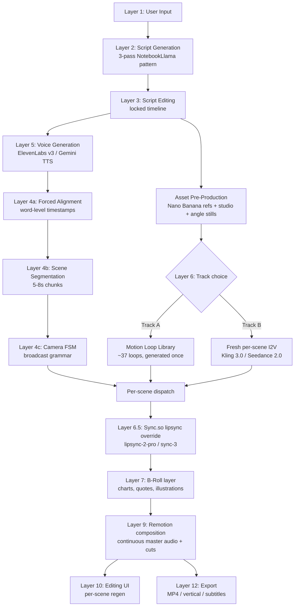

# Podcast / Conversation Video Generation Pipeline — Deep Architecture

> Build-level architecture for a SaaS that generates two-host video podcasts from a user idea, with three camera angles and broadcast-grade realism. Synthesizes three deep research reports and refines the original 12-layer outline with two parallel implementation tracks for empirical A/B validation.

---

## TL;DR

The pipeline is composite-first with **two interchangeable avatar engines that share all other infrastructure**. Layer 6 (Avatar/Host Visual Generation) is the only A/B point — every other layer is invariant across tracks:

- **Track A — Motion Loop Library + Sync.so override.** Pre-generate ~37 silent talking-head loops per project (12 speaking × 2 length variants × 2 hosts + 12 listener loops + 1 wide). At runtime, select the matching loop and overlay correct lip motion via Sync.so lipsync-2-pro. Same architecture JoggAI uses, but with AI-generated reference-locked loops and modern lip-sync. Cost: ~$15–25/10-min episode. Quality: 8/10.

- **Track B — Fresh per-scene image-to-video + Sync.so override.** Per scene (5–8 s), generate a new clip via Kling 3.0 Subject Binding or Seedance 2.0 reference-to-video, conditioned on the angle still + character ref. Sync.so corrects mouth. Cost: ~$35–50/10-min episode. Quality: 9/10.

The shared infrastructure — script generation, voice rendering, forced alignment, camera FSM, lip-sync override, Remotion composition, editing, consistency engine, orchestration — represents ~85% of the code surface and is identical across tracks. The provider-abstracted `Renderer` interface makes the swap a single dispatch line.

---

## Architecture Philosophy

JoggAI's perceived realism is misleading. Across all three reverse-engineering passes the same conclusion emerges: JoggAI does not generate fresh video. They use pre-recorded body-motion loops per stock avatar, overlay a 2D lip-sync model on top of those loops, and composite the result over baked studio backgrounds. The "three camera angles" are template crops over the same composited output. This architecture is why JoggAI renders fast — and also why their output looks stiff in the listener host, drifts on side-profile angles, and "screams FAKE" on non-English audio.

The strategic implication: the cheapest path to "looking like JoggAI" is to clone their architecture, which means inheriting their flaws. The path to **looking real** is to keep the composite-first architecture but execute three things JoggAI does not:

1. **Motion loops are AI-generated and reference-locked**, not a fixed library of stock avatars.
2. **Lip-sync is post-hoc Sync.so**, not 2D wav2lip-class models.
3. **Camera language follows broadcast grammar via an FSM**, not random cuts every 8 seconds.

The two tracks below differ only in *how* the avatar visuals are produced. Everything else is shared.

---

## High-Level Flow



---

## Layer 1 — User Input

### Purpose

Capture structured intent without requiring the user to write a script or specify technical parameters.

### Inputs

| Field | Required | Notes |
|---|---|---|
| Topic / thesis | yes | Free-form text |
| Style preset | yes | educational-deep-dive, interview, debate, therapy, banter, classroom, technical-explainer |
| Hosts | yes | Picked from a library or defined fresh (name, role, persona, voice_id, reference image upload OR generate-from-prompt) |
| Roles / dynamic | yes | Explicit assignment (teacher/student, expert/skeptic, etc.) |
| Reference materials | optional | PDFs, URLs, YouTube, notes, images, audio — combined into a "corpus" |
| Format | yes | 16:9, 9:16, 1:1 |
| Target duration | yes | 3/5/10/15/20/30 min — internally clamped to script-token-budget |
| Pacing preference | yes | relaxed / standard / energetic |
| Emotional style | yes | analytical / warm / playful / serious |

### Frontend

Single-page Next.js 15 / shadcn/ui form. ≤7 fields above the fold; the rest collapsed under "Advanced." Submitting returns a `job_id` immediately — all ingestion is async.

### Corpus Ingestion (background)

| Source | Tool | Notes |
|---|---|---|
| PDF | Docling (primary), LlamaParse (fallback) | Layout-aware extraction |
| YouTube | youtube-transcript-api + yt-dlp | Transcript + metadata |
| Web URL | Firecrawl / Reader API / trafilatura | Clean markdown |
| Audio | Whisper via Groq | Cheap + fast |
| Images | Gemini 2.5 vision | Generates captions, appended to corpus |

All sources are normalized to markdown and stored as `corpora.extracted_md`. The corpus hash is used as a memoization key — identical corpus → reuse all downstream artifacts.

---

## Layer 2 — Script Generation

The single biggest quality lever in the entire pipeline. Most OSS clones ship sitcom-transcript scripts because they skip the structural analysis step. We don't.

### Three-Pass Architecture

#### Pass 0 — Structural Analysis (Gemini 2.5 Pro, 2M-token context)

Reads the full corpus and emits the editorial intelligence:

```json
{
  "title": "...",
  "thesis": "...",
  "audience_persona": "curious time-pressed listener who values efficiency",
  "topic_map": [
    {
      "topic": "...",
      "key_facts": ["...", "..."],
      "tensions": ["...", "..."],
      "analogies": ["...", "..."]
    }
  ],
  "narrative_arc": ["hook", "context", "deep_dive_1", "deep_dive_2", "tension", "synthesis", "takeaway"],
  "pacing_seconds": [20, 60, 180, 180, 90, 60, 30]
}
```

Cost: ~$0.10 per project. Time: 30–60s. **This is the most non-obvious quality lever.** Most open-source clones omit it entirely; that's the reason their output reads as "AI-generated."

#### Pass 1 — Draft Generation (Gemini 2.5 Pro primary, Claude Sonnet 4.5 fallback)

System prompt (battle-tested across Podcastfy, NotebookLlama, Open NotebookLM):

```
You are a world-class podcast producer creating a "{style_preset}" episode 
for {audience_persona}. Two hosts ({host_a_name}: {host_a_role}; 
{host_b_name}: {host_b_role}) discuss the source material.

CRITICAL RULES:
1. Open with a hook within the first 10 seconds. State what the episode is about.
2. Hosts MUST disagree at least twice. Tension is the engine.
3. Hosts MUST use at least 3 analogies / hypotheticals to make complex topics concrete.
4. Include natural disfluencies: [laughs], [sighs], "oh wow", "wait, really?", "hmm".
5. Use [interrupting] tags when one host cuts the other off — sparingly, for emphasis.
6. Never break character. Never reference being AI.
7. End with a single concrete takeaway, then sign off.
8. Target duration: {target_min} minutes. Do NOT exceed it.
9. Output ONLY valid JSON matching the Script schema.
10. Brainstorm in <scratchpad> first — analogies, hypotheticals. This block is discarded.
```

Output schema (Pydantic — strict validation):

```python
class DialogueTurn(BaseModel):
    speaker: Literal["host_a", "host_b"]
    text: str
    audio_tags: list[str] = []   # [laughs], [pauses], [interrupting], etc.
    emotion: Literal["neutral","enthusiastic","thoughtful","agreeing",
                     "analytical","amused","surprised"]
    duration_hint_sec: Optional[float] = None
    is_hook: bool = False         # marks key moments for Track B hero allocation
    b_roll: Optional[BRollSpec] = None

class Script(BaseModel):
    title: str
    intro_runtime_sec: float
    turns: list[DialogueTurn]
    outro_runtime_sec: float
    total_estimated_seconds: float
```

Drafted at ~1.5× target length — Pass 2 will compress and shape.

#### Pass 2 — Dramatic Rewriter (Gemini 2.5 Flash)

A second LLM pass with a different prompt: inject conversational color, break the ABABAB sitcom pattern (allow multi-turn streaks from one speaker), insert audio tags at natural moments, ensure mix of long monologue turns + short reaction turns. Exactly the NotebookLlama Step-3 pattern.

#### Pass 3 — Validator (deterministic Python)

Pydantic schema validation. Length check. Audio-tag whitelist check against the active TTS provider's supported set. Returns 422 on failure with a regenerate option.

### Storage

Scripts persist with `version` integer. Every regeneration creates a new row — never mutates in place. The "locked timeline" downstream is just a chosen `script_version`.

---

## Layer 3 — Script Editing

### UI

Two-column editor: linearized script on the left (speaker chips, transcript, emotion tag, audio-tag pills inline); per-turn detail panel on the right with "regenerate this turn" / "split" / "merge" / "change emotion" / "swap speaker" actions.

### Editable atoms

Each `DialogueTurn` is independently editable. Edit types and their re-run cost:

| Edit | Re-runs |
|---|---|
| Manually rewrite text | Validator only (cheap) |
| Regenerate one turn with hint | Single-turn LLM call (cheap) |
| Change pacing / emotional preset | Whole-script Pass 2 (medium) |
| Change host assignment | Whole-script Pass 1 + 2 (medium) |
| Change corpus | Whole pipeline incl. Pass 0 (expensive) |

Pass 0 is never re-run on script edits — its output is corpus-deterministic.

### Lock semantics

"Approve & Generate Video" freezes `script_version` as the **locked timeline**. From this point all downstream stages are deterministic given the locked script (up to provider non-determinism, bounded by locked seeds — see Layer 11).

---

## Layer 4 — Scene Segmentation & Camera Planning

Three tightly coupled sub-stages.

### 4a — Forced Alignment

**API:** ElevenLabs Forced Alignment (primary), WhisperX (fallback for non-ElevenLabs audio).
**Input:** master audio file (Layer 5 output) + locked script transcript.
**Output:** per-word and per-character timestamps in seconds. 29 languages including Hebrew, Arabic, English variants.

Why ElevenLabs: single round-trip from existing TTS credits, sub-50ms word-boundary accuracy on clean TTS audio, no additional service to manage.

### 4b — Scene Segmentation

The script's speaker turns are too long to be production atoms. Track A's loop selection and Track B's image-to-video both operate on 5–8s clips. Slicing rules:

1. **First split**: speaker-turn boundaries (already in script).
2. **Second split**: sentence boundaries within a turn (punctuation + alignment gaps ≥250ms).
3. **Merge until 5–8s per chunk.** <4s → merge with neighbor. >9s → split at next sentence boundary.

Each scene is persisted with:

```json
{
  "scene_id": "sc_0001",
  "order": 1,
  "speaker": "host_a",
  "start_ms": 0,
  "end_ms": 6412,
  "transcript": "Welcome back, today we're diving into how the immune system actually decides what's dangerous.",
  "aligned_words": [{"w": "Welcome", "t0": 0.05, "t1": 0.42}, "..."],
  "emotion": "warm",
  "audio_tags": [],
  "is_hook": true
}
```

### 4c — Camera Plan (FSM + LLM refinement)

The broadcast-grammar layer. Without it, even perfect avatars look unprofessional.

Five shot states: `wide`, `closeup_a`, `closeup_b`, `reaction_a`, `reaction_b`.

**FSM rules (non-negotiable):**

1. **Open & close on Wide** for the first/last 4–8 seconds.
2. **Default**: cut to the active speaker's MCU on speaker change, with **200–350 ms lead-in** before their first word.
3. **Minimum hold**: 3 seconds in any shot before re-cut. Prevents ping-pong.
4. **Wide reset**: every 45–60 seconds, force a 4–8 s Wide.
5. **Reaction insert**: on any inter-word gap ≥ 800 ms, cut to the non-speaker's `reaction_*` for the gap duration. Especially after "?" and "!".
6. **Wide on collective beats**: laughter, mutual agreement, overlap. Detected via `audio_tags` + audio energy delta.
7. **Anti-jump**: never `closeup_a → closeup_b` directly without ≥ 1 s of Wide between them at high emotional energy.

**Implementation**: deterministic Python pass over scenes[] producing initial cuts[], then a Gemini 2.5 Pro pass refines the cut list given full script context (e.g., "this is a setup-payoff — hold Wide longer here"). The LLM cannot violate rules 1–7, only optimize within them.

**Output:**

```json
{
  "fps": 30,
  "cuts": [
    {"frame_start": 0,    "frame_end": 180,  "shot": "wide"},
    {"frame_start": 180,  "frame_end": 540,  "shot": "closeup_a"},
    {"frame_start": 540,  "frame_end": 600,  "shot": "reaction_b"},
    {"frame_start": 600,  "frame_end": 1020, "shot": "closeup_b"},
    {"frame_start": 1020, "frame_end": 1140, "shot": "wide"}
  ]
}
```

Each cut maps 1:1 to one scene. The cut's `shot` field is what Layer 6 dispatches on — same in both tracks.

### Pacing preset → FSM constants

| Preset | Min hold | Wide reset | Reaction threshold |
|---|---|---|---|
| Relaxed | 4s | 60s | 1000ms |
| Standard | 3s | 50s | 800ms |
| Energetic | 2.5s | 40s | 600ms |

---

## Layer 5 — Voice Generation & Master Audio Assembly

### Primary path — ElevenLabs v3 (best expressiveness)

For each `DialogueTurn`:
- **Endpoint**: `text-to-speech/{voice_id}/with-timestamps`
- **Settings**: `stability=0.5, similarity_boost=0.75, style=0.4` (tunable per emotion tag).
- **Audio tags inlined**: `"[excited] Wait, so they actually... [laughs]"`
- **Output**: 44.1kHz MP3 + word-level timestamps in the same response (saves a forced-alignment round-trip for ElevenLabs paths).

Why v3 over Flash v2.5: v3 (GA since March 2026) supports audio tags `[laughs]`, `[sighs]`, `[interrupting]`, `[hesitates]`, `[whispers]` — the single biggest realism lever short of switching to native multi-speaker.

### Alternative path — Gemini 2.5 multi-speaker TTS (best cost + joint prosody)

Single API call renders the entire conversation with two voices, native joint prosody, and disfluencies emitted by the audio model (not the transcript). ~15–20× cheaper than ElevenLabs v3. Cap: ~32K tokens (≈15-min episode); chunk longer episodes at 5–8-min boundaries with overlapping context.

```python
from google import genai
from google.genai import types

client = genai.Client()
response = client.models.generate_content(
    model="gemini-2.5-pro-preview-tts",
    contents=flatten_script(script),
    config=types.GenerateContentConfig(
        response_modalities=["AUDIO"],
        speech_config=types.SpeechConfig(
            multi_speaker_voice_config=types.MultiSpeakerVoiceConfig(
                speaker_voice_configs=[
                    types.SpeakerVoiceConfig(speaker="host_a", voice_config=...),
                    types.SpeakerVoiceConfig(speaker="host_b", voice_config=...),
                ]
            )
        )
    )
)
```

Both are wired behind a `TTSProvider` interface — choice is per-project.

### Master audio assembly

Per-turn audio segments are concatenated with **80–150 ms crossfades** between turns (more natural than hard cuts), normalized to **-16 LUFS** (podcast standard):

```bash
ffmpeg -i in.wav -af loudnorm=I=-16:TP=-1.5:LRA=11 master.wav
```

The result is `master_audio.wav` — a **single continuous file** played from episode start to end. This is the architectural foundation: video cuts happen over continuous audio, never the reverse.

---

## Layer 6 — Avatar / Host Visual Generation

**This is the A/B point.** Asset pre-production is shared; the track choice happens at runtime per scene.

### Shared Asset Pre-Production (once per project)

Via **Nano Banana Pro** (~$0.03/image):

1. **Host character refs** — 3 per host: frontal portrait, 3/4 profile, full-body composition. Prompt includes locked elements: `"{age}yo {ethnicity} {gender}, {wardrobe}, {hair}, neutral expression, 35mm portrait, soft key from camera left."`

2. **Studio plate** — 1 single 1080p still. Sample prompt:

> "modern podcast studio, walnut acoustic wall panels, warm amber backlight strip behind hosts, two black walnut desks 60cm apart, two Shure SM7B microphones on boom arms, single warm tungsten key light from camera left, soft blue rim light, shallow depth of field, cinematic 35mm, 1.85:1"

3. **Angle stills** — 3 stills positioning the hosts: `wide_still`, `mcu_a_still`, `mcu_b_still`. **These are critical**: they anchor lighting, framing, and positioning across all video generation. Without them, lighting drifts between angles.

Total: ~6 images, ~$0.30, ~60s wall clock. Cached forever in `assets` table.

---

### Track A — Motion Loop Library (recommended default)

**Concept**: pre-generate a small curated library of silent talking-head loops per project, then at runtime select the matching loop and run Sync.so lip-sync.

#### Library spec per project

| Asset type | Count per host | Total per project |
|---|---|---|
| Speaking loops (6 emotional × 2 length) | 12 | 24 |
| Listener loops (6 states × 1 length) | 6 | 12 |
| Wide-shot loop | (shared) | 1 |
| **Total** |  | **37 loops** |

Emotional states: `neutral`, `enthusiastic`, `thoughtful`, `analytical`, `amused`, `agreeing` — these match the `emotion` enum in the script schema.

Listener states: `attentive`, `slight_nod`, `mild_amused`, `furrowed_thinking`, `looking_away_processing`, `engaged_lean_in`.

Length variants: 5s and 8s. The shorter variant handles sentences ≤5s without padding; the longer covers most chunks. FILM frame interpolation or boomerang handles edge cases.

#### Generation

**Primary model**: Kling 3.0 Subject Binding (best character lock, 4 ref images, "Visual DNA").
**Fallback**: Seedance 2.0 reference-to-video via fal.ai (12-input refs, cheaper, faster).

Prompt skeleton for a speaking loop:

```
{character_ref} in {mcu_a_still}, speaking with {emotion} energy, 
subtle hand gestures, micro head nods, soft eye contact with camera, 
natural blinks, soft breathing. {prompt_lock}. duration {len}s.

Negative: morphing features, changing clothes, identity drift, 
inconsistent lighting, hand artifacts.
```

Prompt skeleton for a listener loop:

```
{character_ref} in {mcu_a_still}, listening to off-screen speaker 
(camera-right), {listener_state}, lips closed, natural blink rate, 
neutral-to-warm expression. {prompt_lock}. duration 5s.
```

Generation cost per project: ~37 × $0.50 = **~$18 one-time**. Wall clock: ~5–8 minutes at 20-way concurrency. Stored forever in `assets` table; reused across every regeneration of the same project.

#### Runtime per scene (Track A)

```python
def render_scene_track_a(scene, project):
    # 1. Select loop from library
    loop_key = f"{scene.speaker}_{scene.shot}_{scene.emotion}_{length_bucket(scene.duration)}"
    loop_url = project.assets[loop_key]
    
    # 2. Extend if scene > loop duration
    if scene.duration_s > loop.duration_s:
        loop_url = extend_loop_film_interpolation(loop_url, scene.duration_s)
    
    # 3. Hand to Sync.so for lipsync override
    return sync_so_lipsync(
        video_url=loop_url,
        audio_url=scene.audio_chunk_url,
        model="lipsync-2-pro" if scene.shot in ("closeup_a","closeup_b") else "sync-3",
        temperature=temperature_for_emotion(scene.emotion)
    )
```

**Why this works with Sync.so**: the model requires visible mouth movement in the source — pre-generated loops with generic "speaking" motion satisfy this exactly. Sync.so replaces the generic motion with correct phonemes for the audio.

---

### Track B — Fresh Per-Scene Image-to-Video (premium tier)

**Concept**: for each scene, generate a brand-new 5–8s clip via image-to-video conditioned on the matching angle still + character ref.

#### Per-scene generation

- **Primary model**: Kling 3.0 Subject Binding
- **Fallback**: Seedance 2.0 reference-to-video
- **Premium override** (for `is_hook=true` scenes): Veo 3.1 Standard at 4K

Inputs:
- Scene's matching angle still (`wide_still` / `mcu_a_still` / `mcu_b_still`)
- Character reference (locked per project)
- Locked seed per character (locked once at project creation)
- Prompt: scene-specific emotion + micro-behavior + locked `prompt_suffix`
- Negative prompts: identity-drift and wardrobe-change avoidance

Per-scene cost: ~$0.50–$1. ~80 scenes per 10-min episode → **$40–$80 per episode**.

#### Runtime per scene (Track B)

```python
def render_scene_track_b(scene, project):
    angle_still = project.assets[f"{scene.shot}_still"]
    char_ref = project.hosts[scene.speaker].refs
    
    # 1. Fresh image-to-video generation
    raw_clip_url = video_provider.generate_i2v(
        start_image=angle_still,
        ref_images=char_ref,
        prompt=f"{micro_behavior_for(scene.emotion)} {project.prompt_lock}",
        negative_prompt="morphing features, changing clothes, identity drift",
        seed=project.hosts[scene.speaker].seed,
        duration_s=scene.duration_s,
        model_version=project.locked_model_version,  # consistency lock
    )
    
    # 2. Sync.so lipsync override (same call as Track A)
    return sync_so_lipsync(
        video_url=raw_clip_url,
        audio_url=scene.audio_chunk_url,
        model="lipsync-2-pro" if scene.shot in ("closeup_a","closeup_b") else "sync-3",
        temperature=temperature_for_emotion(scene.emotion)
    )
```

---

### Shared Lip-Sync Override (Sync.so)

Both tracks pipe through Sync.so:

| Shot type | Model | Why |
|---|---|---|
| `closeup_a`, `closeup_b` | lipsync-2-pro | Diffusion super-res preserves teeth and beard detail at MCU resolution |
| `wide` | sync-3 | Only Sync.so model that handles multiple faces + obstructions + profiles in one pass |
| `reaction_a`, `reaction_b` | **none** | Lips already closed; lip-sync would introduce artifacts |

Sync.so processes each scene independently; 20-way fan-out is standard.

### Track decision logic

```python
def select_track(project: Project, scene: Scene) -> str:
    if project.tier == "premium":
        return "B"
    if project.tier == "hybrid" and scene.is_hook:
        return "B"  # hero moments get fresh generation
    return "A"
```

The `Renderer` abstraction hides the choice from downstream layers entirely.

---

## Layer 7 — B-Roll & Supporting Visuals

~15–25% of a podcast's runtime is well-served by supporting visuals: charts, quotes, illustrations. These cost a small fraction of host video and dramatically lift perceived production value.

### Types and generation paths

| Type | Generator | Trigger |
|---|---|---|
| Statistics / numbers | Remotion data-viz components | Transcript contains a number with a unit |
| Pull-quote | Remotion text-on-image | LLM marks line as "quotable beat" |
| Concept illustration | Nano Banana Pro still + Ken Burns | LLM scene description requests illustration |
| Cinematic illustration | Wan 2.6 Flash (5s) | LLM marks "high-impact moment" |
| Diagrammatic explainer | LLM-generated SVG → animated React | LLM identifies multi-step process |
| User-uploaded reference | Direct insert with Ken Burns | User uploaded relevant images in Layer 1 |

The LLM Pass 2 (dramatic rewriter) is responsible for marking which turns should have b-roll overlays via the optional `b_roll: BRollSpec` field on `DialogueTurn`.

### Composition in Remotion

The Camera FSM treats b-roll overlays as **picture-in-picture or full-frame inserts**: the host video stays underneath (audio continues), b-roll occupies 60–80% of frame for 2–4 seconds, then dissolves out. The lip-sync is unaffected — the host's audio runs through the master track regardless of what's on screen.

---

## Layer 8 — Orchestration & Parallel Rendering

### Queue: Trigger.dev v3

Each pipeline stage is a separate Trigger.dev task with built-in idempotency, retries with exponential backoff, and observability.

```
intake.process              (single,   ~10s)
corpus.ingest               (single,   ~30–60s — Docling/Firecrawl/Whisper)
script.structural_pass      (single,   ~30–60s — Gemini 2.5 Pro Pass 0)
script.draft                (single,   ~30–60s — Pass 1)
script.rewrite              (single,   ~20–40s — Pass 2)
script.validate             (single,   ~1s)
                              ── user approves ──
audio.tts                   (fan-out N turns, concurrency 10)
audio.master_assemble       (single,   ~10s — ffmpeg concat + loudnorm)
audio.align                 (single,   ~10–20s — ElevenLabs Forced Alignment)
scene.segment               (single,   ~5s — Python)
camera.plan                 (single,   ~20–40s — FSM + Gemini refine)
                              ── parallel ──
assets.host_refs            (fan-out 6, concurrency 6)
assets.studio_plate         (single)
assets.angle_stills         (fan-out 3)
[Track A only]
assets.motion_loops         (fan-out ~37, concurrency 20, ~5–8min)
                              ── per-scene fan-out ──
scene.render                (fan-out N scenes, concurrency 20)
  ├── Track A: loop selection from library (~5s/scene)
  └── Track B: image-to-video generation (~60–120s/scene)
scene.lipsync               (fan-out N, concurrency 20 — Sync.so)
                              ── join ──
composition.render          (single — Remotion Lambda)
delivery.notify             (single)
```

**Idempotency key per task**: `(project_id, script_version, scene_id, provider, version)`. Re-running with the same key returns cached results.

### Concurrency strategy

The single biggest UX trap is the JoggAI failure mode ("scheduled 3 minutes, actual 3 days" when priority queues exhaust). Four defenses:

1. **Provider abstraction with fallback chain** (see cross-cutting section).
2. **20-way fan-out floor from day one** on all per-scene tasks.
3. **Per-tenant fair scheduling** — no single user saturates the queue.
4. **Hard per-task timeouts** — exceed 4× P50 → killed, re-queued on next provider.

### Storage

- **Cloudflare R2** for all video/audio. Zero egress fees critical when serving final MP4s.
- **Supabase Postgres** for metadata, scene history, version graphs.
- **24h signed URLs** for delivery.

### Wall-clock budget (10-min episode, ~80 scenes)

| Stage | Track A | Track B |
|---|---|---|
| Corpus ingest | 30–60s | 30–60s |
| Script (3 passes) | 90–180s | 90–180s |
| TTS + assembly + alignment | 90–150s | 90–150s |
| Camera plan | 20–40s | 20–40s |
| Asset pre-production | 60s | 60s |
| Motion loops generation | ~5–8 min (one-time) | (skip) |
| Per-scene render | ~2–3 min (loop select + lipsync) | ~8–12 min (i2v + lipsync) |
| Remotion composition | 1–2 min | 1–2 min |
| **Total wall clock** | **~13–18 min** | **~15–25 min** |

---

## Layer 9 — Timeline Assembly (Remotion)

### Why Remotion

The composition is a React component. The video is a `<Composition>`. Cuts between camera angles are `<Sequence>` switches. The camera FSM's output JSON is directly executable as a Remotion render plan — no intermediate translation.

### Composition structure

```tsx
<Composition id="podcast" durationInFrames={totalFrames} fps={30}>
  {/* Continuous master audio - never cut */}
  <Audio src={master_audio_url} />

  {/* Studio plate - always visible */}
  

  {/* Camera cuts - one Sequence per FSM cut */}
  {cuts.map((cut, i) => (
    <Sequence 
      key={i}
      from={cut.frame_start} 
      durationInFrames={cut.frame_end - cut.frame_start}
    >
      <ShotRenderer shot={cut.shot} scene={scenesAt(cut)} />
    </Sequence>
  ))}

  {/* Subtitles from forced alignment, always on */}
  <SubtitleLayer alignment={alignment_json} />

  {/* B-roll overlays, lower-thirds */}
  {overlays.map(o => <Overlay key={o.id} {...o} />)}
  
  {/* Color grade applied at root */}
  <LUTFilter href={project.lut_url} />
</Composition>
```

`<ShotRenderer>` reads the shot type and positions one or two `<Video>` elements over the studio plate. Wide → both hosts side-by-side. Closeup → one host fills ~70% of frame.

### Lambda execution

Remotion Lambda splits the timeline into ~30-second chunks across many concurrent Lambdas. Cost: $0.05–$0.20 per minute of rendered video. At 1080p30, a 10-minute episode renders in ~1–2 min wall clock with warm Lambdas.

### Color grade

A single LUT applied at composition root keeps all per-scene clips visually unified — important when Track A loops and Track B fresh clips may have slight lighting variance.

---

## Layer 10 — Editing & Regeneration

### Per-scene regeneration

User clicks a scene → backend creates `scene_versions` row with `version=N+1` → triggers `scene.render` and `scene.lipsync` for just that scene → on completion, `scenes.active_version` updates → Remotion re-renders only the affected chunk(s) of the final video.

**Wall clock: < 60s for one scene regeneration.**

### Edits supported and their re-run cost

| Edit | Re-runs | Cost class |
|---|---|---|
| Trim scene duration | Camera plan refresh + Remotion | Cheap |
| Regenerate visual only | Track A: re-select loop. Track B: new scene.render. Then lipsync + Remotion. | Cheap (A) / Medium (B) |
| Change camera angle (MCU_A → Wide) | Renderer call with new shot + Remotion | Cheap (A) / Medium (B) |
| Rewrite scene transcript | TTS for that turn + forced-align refresh + scene.render + scene.lipsync + Remotion | Medium |
| Change voice for one host | All TTS + all forced-align + all scene.lipsync (visuals stay!) | Heavy |
| Swap host identity | All assets + all loops + all scene.render + all scene.lipsync | Heaviest — ~new project |
| Reorder scenes | Camera plan refresh + Remotion only | Cheap |
| Add/remove music bed | Remotion only | Trivial |
| Change subtitles styling | Remotion only | Trivial |

### Version graph

Each `scene_versions` row stores: `video_url, lipsync_url, model, seed, prompt_hash, cost_usd, created_by, reason`. Final renders reference a specific `scene_versions` row per scene, so any past render is reproducible.

---

## Layer 11 — Consistency Engine (the single most important layer)

Without aggressive consistency discipline, output is fragmented even with perfect per-scene quality. Six hard rules enforced at codebase level:

### 1. Identity Lock

- **Seed per character is fixed** at project creation; never changes within a project.
- **Prompt suffix is locked** in `characters.prompt_lock` — a frozen string appended to every generation prompt: `"32yo Latina woman, navy blazer over white tee, warm 3200K key from camera left, soft blue rim light, shallow depth of field, 35mm lens."`
- **Wardrobe is reference-locked, not text-locked** — relies on Kling/Seedance reference-image conditioning, not prompt strings.
- **Negative prompts** on every call: `"morphing features, changing clothes, different person, identity drift."`

### 2. Model Version Lock

- `scene_versions.model` stores exact model + version string (`"kling-3.0-subject-binding-v2025-04-12"`). Providers silently bumping models mid-project break consistency.
- **Forbidden**: mixing Kling on MCU_A with Seedance on MCU_B in the same project — the lighting models differ.

### 3. Lighting & Color Lock

- All Nano Banana prompts (refs, studio, angle stills) share the same lighting suffix.
- A single LUT at Remotion composition root normalizes any residual variance.
- Color temperature, key direction, and rim color are part of the locked `prompt_suffix`.

### 4. Camera Grammar Lock

- The FSM rules from Layer 4c are not user-overridable. Users can request a different angle on a specific scene, but cannot disable minimum-hold or wide-reset rules.
- Pacing preset tunes FSM constants but does not break the grammar.

### 5. CLIP Similarity Gate

After each scene render, a deterministic CLIP-similarity check compares a representative frame against the locked character ref. Threshold: 0.85.

```python
def clip_gate(rendered_clip_url, character_ref_url, threshold=0.85):
    frame = extract_middle_frame(rendered_clip_url)
    similarity = clip_similarity(frame, character_ref_url)
    if similarity < threshold:
        return "REJECT"
    return "ACCEPT"
```

On reject: retry with the same seed (often a re-run lands a better generation). After 2 retries, fall back to the next provider via the abstraction layer.

### 6. Audio Continuity Lock

- Master audio is **never cut** in composition — only crossfaded at TTS-turn boundaries during Layer 5 assembly.
- Per-scene audio chunks (used as lip-sync input) are **subclips of the master via ffmpeg time ranges**, not concatenated reconstructions. Zero seam artifacts.

---

## Layer 12 — Export & Publishing

### Output formats

| Format | Use case | Generation |
|---|---|---|
| MP4 1080p H.264 | Default, universal | Default Remotion output |
| MP4 1080p H.265 | Smaller files | Lambda post-encode |
| MP4 9:16 vertical | TikTok/Reels/Shorts | Remotion re-composition with vertical layout |
| MP4 1:1 square | Instagram feed, LinkedIn | Remotion re-composition |
| MP3 audio only | Spotify/Apple Podcasts | ffmpeg extract from master_audio |
| Short clips (15–60s) | Social teasers | "Highlight detection" pass on script → vertical re-cut |

### Subtitles

- SRT and VTT generated directly from the forced-alignment JSON.
- Optional burn-in via Remotion (multiple style presets).
- **70+ language dubbing path**: re-run TTS (ElevenLabs multilingual) → re-run forced alignment → re-run lip-sync on existing visuals. **Visuals don't need re-generation.** This is the architectural payoff of the post-hoc lip-sync decision.

### Thumbnails

Extract 6 candidate keyframes from high-energy moments (audio energy + emotion tags), score them via Gemini 2.5 vision for "thumbnail quality," present top 3 to the user.

### Chapter markers

Generated from Layer 2 Pass 0 `narrative_arc` with timestamps from forced alignment. Become YouTube chapter markers.

### Provenance metadata

- C2PA-compatible signed metadata embedded in MP4.
- SynthID watermark inherited from Gemini if Gemini TTS was used.
- Optional visible "Made with [Brand]" watermark (configurable per tier).

---

## Cross-Cutting: Database Schema

```sql
-- Multi-tenant: every row has org_id
projects (
  id uuid pk, org_id uuid, title text,
  tier enum('standard','premium','hybrid'),
  host_a_id uuid, host_b_id uuid, studio_id uuid,
  fps int default 30, aspect enum('16:9','9:16','1:1'),
  status enum('draft','generating','ready','failed'),
  prompt_lock_json jsonb,
  locked_model_version text,
  lut_url text,
  version int default 1,
  created_at timestamptz
)

corpora (id, project_id, source_type, source_url, extracted_md, hash, created_at)

hosts (
  id, org_id, name, role, persona_text,
  portrait_ref_urls text[],
  voice_id text,
  seed bigint,
  prompt_lock text
)

studios (id, org_id, background_url, lighting_preset, prompt_lock text)

assets (
  id, project_id, 
  type enum('host_ref','studio','angle_still','motion_loop',
            'listener_loop','wide_loop','b_roll'),
  -- For Track A motion loops, additional metadata fields:
  speaker enum('host_a','host_b'),
  shot enum('wide','closeup_a','closeup_b','reaction_a','reaction_b'),
  emotion text,
  length_bucket enum('short','medium','long'),
  url, hash, metadata jsonb, created_at
)

scripts (id, project_id, version, structural_json jsonb, body_json jsonb, created_at)

audio_renders (
  id, project_id, script_version,
  master_audio_url, duration_ms, alignment_json_url,
  provider enum('elevenlabs','gemini'), cost_cents, created_at
)

scenes (
  id, project_id, script_version, idx,
  speaker, start_ms, end_ms, transcript, emotion,
  audio_chunk_url, audio_tags text[],
  shot enum('wide','closeup_a','closeup_b','reaction_a','reaction_b'),
  is_hook boolean,
  active_version int
)

scene_versions (
  id, scene_id, version,
  track enum('A','B'),
  video_url, lipsync_url,
  source_loop_id uuid,  -- Track A: reference to the loop used
  model text, model_version text, seed bigint, prompt_hash text,
  provider enum('kling','seedance','veo','sync'),
  clip_similarity float,
  cost_cents, status, error,
  created_at, created_by, reason
)

camera_plans (id, project_id, script_version, cuts_json jsonb, created_at)

renders (
  id, project_id, script_version, scene_version_set jsonb,
  output_url, format enum('mp4_1080p','mp4_9_16','mp3'),
  duration_ms, cost_cents_total, render_time_s,
  status, started_at, finished_at
)

jobs (
  id, type, project_id, scene_id, status,
  attempts, last_error, idempotency_key text unique
)

billing_events (id, org_id, project_id, provider, units, cents, occurred_at)
```

Row-level security on `org_id` for multi-tenant isolation.

---

## Cross-Cutting: API Provider Abstraction

The most important architectural decision after the composite-first philosophy. New video models ship every quarter; locking the pipeline to one provider is a death sentence.

```typescript
interface Renderer {
  // Track A: motion loop generation (pre-production)
  generateMotionLoop(input: MotionLoopInput): Promise<{ jobId: string }>;
  
  // Track B: fresh per-scene image-to-video
  generateScene(input: SceneRenderInput): Promise<{ jobId: string }>;
  
  // Shared: lip-sync override
  applyLipSync(input: LipSyncInput): Promise<{ jobId: string }>;
  
  // Shared: status polling
  getStatus(jobId: string): Promise<RenderStatus>;
}

class KlingRenderer implements Renderer { ... }     // Subject Binding 3.0
class SeedanceRenderer implements Renderer { ... }  // 2.0 ref-to-video via fal.ai
class VeoRenderer implements Renderer { ... }       // 3.1 Ingredients (premium)
class SyncSoRenderer implements Renderer { ... }    // lipsync-2-pro / sync-3
class HedraRenderer implements Renderer { ... }     // Character-3 (fallback)
```

### Dispatcher

```typescript
function dispatch(scene: Scene, project: Project): Renderer {
  const overrides = project.provider_overrides;
  if (overrides?.[scene.shot]) return overrides[scene.shot];
  
  if (project.tier === 'premium' || 
      (project.tier === 'hybrid' && scene.is_hook)) {
    // Track B
    return scene.shot === 'wide' 
      ? new VeoRenderer() 
      : new KlingRenderer();
  }
  
  // Track A
  return new MotionLoopSelector(project.assets);
}
```

### Failover chain

Primary → secondary → tertiary, each tried with the same idempotency key. Cost **not re-billed to user** when failover triggers — provider failures absorbed as infrastructure cost.

---

## API Surface Summary

| Pipeline stage | Primary API | Fallback | Notes |
|---|---|---|---|
| PDF extraction | Docling | LlamaParse | Layout-aware |
| Web extraction | Firecrawl | Reader API / trafilatura | |
| YouTube transcripts | youtube-transcript-api + yt-dlp | — | |
| Audio transcript | Groq Whisper | Deepgram Nova-3 | Source materials |
| Image captioning | Gemini 2.5 vision | Claude Sonnet vision | |
| LLM (script Pass 0) | Gemini 2.5 Pro | Claude Sonnet 4.5 | 2M context for full corpus |
| LLM (script Pass 1) | Gemini 2.5 Pro | Claude Sonnet 4.5 | Pydantic JSON output |
| LLM (script Pass 2) | Gemini 2.5 Flash | Claude Haiku 4.5 | Dramatic rewriter |
| LLM (camera refine) | Gemini 2.5 Pro | Claude Sonnet 4.5 | Optimizes within FSM rules |
| TTS (primary path) | ElevenLabs v3 | Gemini 2.5 multi-speaker | Audio tags supported |
| TTS (cost-optimal) | Gemini 2.5 Flash TTS | OpenAI gpt-4o-mini-tts | |
| Forced alignment | ElevenLabs Forced Alignment | WhisperX | 29 languages |
| Image generation (refs) | Nano Banana Pro | Flux 2 Pro | $0.03/image |
| Video generation (Track A loops) | Kling 3.0 Subject Binding | Seedance 2.0 ref-to-video (fal.ai) | One-time per project |
| Video generation (Track B scenes) | Kling 3.0 Subject Binding | Seedance 2.0 ref-to-video | Per-scene |
| Video generation (Track B hero/wide) | Veo 3.1 Standard | Kling 3.0 | `is_hook` scenes only |
| Lip-sync (closeups) | Sync.so lipsync-2-pro | Sync.so lipsync-2 | $0.08/sec |
| Lip-sync (wides) | Sync.so sync-3 | Sync.so lipsync-2-pro | $0.133/sec, multi-face |
| B-roll cinematic | Wan 2.6 Flash | — | $0.05/sec |
| B-roll stills | Nano Banana Pro | — | + Ken Burns in Remotion |
| Composition | Remotion + AWS Lambda | — | $0.05–$0.20/min |
| Final encoding | ffmpeg in Lambda | — | |
| Queue | Trigger.dev v3 | Inngest | TS-native durable execution |
| Storage | Cloudflare R2 | S3 mirror | Zero egress fees |
| Database | Supabase Postgres | — | RLS for multi-tenant |
| Auth | Supabase Auth | — | |
| Frontend | Next.js 15 (App Router) | — | shadcn/ui |
| Realtime updates | Supabase Realtime | — | Project status |
| Billing | Stripe + internal credit ledger | — | |

---

## Failure Modes & Mitigations

| Failure | Likelihood | Mitigation |
|---|---|---|
| Video gen API timeout / 5xx | Common | Trigger.dev retry + provider failover via abstraction |
| Character drift on a scene | Common | Locked seed + refs + negative prompts + CLIP gate at 0.85 |
| Lip-sync misalignment | Occasional | Adjust Sync.so temperature; fallback to sync-3 |
| Audio/video desync after composition | Common bug | Frame timecodes only, never seconds; FFprobe re-measure |
| Cost overrun on regen-heavy project | Likely | Per-project budget cap; warn at 80% |
| Provider deprecates model mid-project | Inevitable | Pin `model_version` per scene_version; multi-provider |
| User changes audio, breaks visual timing | Common | Re-run forced alignment; flag affected scenes; auto-queue lipsync re-run on unchanged visuals |
| Queue saturation (the "JoggAI 3-day" failure) | Real risk | 20-way concurrency floor; per-tenant fair scheduling |
| Sync.so rejects static input | Track B only, if i2v output too static | Pair with Hedra for baseline motion |
| Audio tag misinterpreted by TTS | Occasional | Regenerate 1-in-3 takes; pick best by duration heuristic |
| Track A loop too short for long sentence | Common | FILM frame interpolation + loop-loop crossfade |
| Track A loop emotional mismatch | Possible | Library must cover 6 emotions × 2 lengths × 2 hosts minimum |

---

## Build Plan

### Phase 1 — MVP (4–6 weeks)

**Layers shipped:**
- Layers 1, 2 (single Pass — no structural analysis), 3, 4 (forced alignment + scene split, no LLM-refined camera plan), 5 (ElevenLabs v3 only)
- **Layer 6 Track A only** — motion loop library
- Layer 7 (text-only b-roll), Layer 8 (Trigger.dev + Seedance + Sync.so lipsync-2)
- Layer 9 (Remotion Lambda), Layer 10 (per-scene regen)
- Layer 11 (basic identity locks, no CLIP gate)
- Layer 12 (MP4 1080p only)

**Goal**: ship a working 5-min two-host video, ~$10–15/render, <8 min wall-clock.

### Phase 2 — V2 (next 6–8 weeks)

- Layer 2 Pass 0 (structural analysis) + Pass 2 (dramatic rewriter)
- Layer 4c (Gemini-refined camera plan)
- **Layer 6 Track B enabled** as a premium tier
- Layer 7 enriched b-roll (Nano Banana stills + Wan 2.6 transitions)
- Layer 11 full consistency engine including CLIP gate
- Layer 12 vertical/square exports + thumbnails

**Goal**: $4–6/min cost on Track A, $5–8/min on Track B, <3 min wall-clock for 5-min video.

### Phase 3 — Scale (3+ months)

- Direct enterprise contracts with ByteDance ModelArk, Google Vertex, Sync.so (expect 30–50% discount)
- Multi-language dubbing via re-TTS + re-align + re-lipsync (visuals reused — the architectural payoff)
- Team workspaces, comments, approvals
- Highlight detection for short-form social cuts
- Optionally: fine-tuned character LoRAs on Wan 2.6 for repeat-host scenarios

---

## A/B Testing Methodology

The A/B is on Layer 6 only. The infrastructure (Layers 1–5, 7–12) is shared 100%. To run a clean A/B:

1. **Cohort by feature flag** — half of opt-in users get Track A, half get Track B (or hybrid).
2. **Identical script + audio** between cohorts (deterministic up to LLM temperature).
3. **Same camera plan** between cohorts.
4. **Telemetry**: time-to-render, cost-per-render, user regeneration rate per scene, user-reported quality (1–5), retention to second project, completion rate of generated video on platform.
5. **Quality blind test**: a separate sample of users rates randomly-selected Track A and Track B videos without knowing which they're seeing.

Expected outcome (hypothesis):
- Track A wins on cost-per-render and time-to-render by ~2×.
- Track B wins on per-scene quality ratings by ~1 point on a 5-scale.
- User regeneration rate is similar (both produce few-enough flaws that users don't compulsively regenerate).
- Decision: Track A as default; Track B as opt-in premium and as automatic upgrade on `is_hook` scenes.

---

## Summary of Contrarian Decisions

1. **Composite over generation.** JoggAI's architecture, executed with AI-generated reference-locked loops and modern Sync.so lip-sync, beats fresh-per-scene on quality-per-dollar for ~85% of scenes. Reserve fresh generation for hooks and hero moments.

2. **Post-hoc lip-sync everywhere.** Decouple visual from audio so multi-language dubbing and audio edits don't require re-generating visuals.

3. **Broadcast camera grammar via FSM, refined by LLM.** Mechanical rules first; LLM optimization within those rules — never the reverse.

4. **Master audio is sacred.** Video cuts over a continuous audio track; audio is never cut, only crossfaded at TTS-turn boundaries.

5. **Provider abstraction is mandatory infrastructure, not a future refactor.** The pipeline is designed against the abstraction from day one — any future model swap is a one-line dispatch change.

6. **Identity is locked at six independent layers**: seed, prompt suffix, model version, reference image, negative prompt, CLIP similarity gate. Drift requires all six to fail simultaneously.

7. **The structural analysis Pass 0 is non-negotiable.** This is what separates "AI-generated podcast" from "interesting podcast that happens to be AI-generated."

---

## Closing Note

The pipeline produces 10-minute, two-host, three-angle podcasts that feel like broadcast in <20 minutes wall clock, with single-scene regeneration measured in seconds, and full multi-language dubbing without re-generating any visual content. The A/B between Track A and Track B is the empirical test of how much fresh-per-scene generation is actually worth to users — a question that cannot be answered from architecture diagrams alone.

The architecture is intentionally biased toward Track A as the default. Most quality lifts in this domain do not come from better avatar models — they come from better script, better camera grammar, better listener-reaction shots, and tighter identity locks. Track B is the option for users who want the absolute ceiling and are willing to pay for it.
