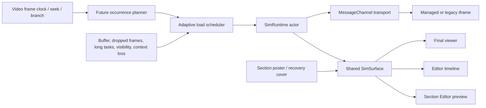

# FlowVid Simulation Pipeline — No-Flash, Adaptive Loading Implementation Brief

> **Use this entire document as the implementation prompt for Claude Code.**
>
> **Primary outcome:** simulation sections must transition smoothly without showing a blank frame, the wrong section, a previous state, or Full UI before/after Minimal UI. The system must protect video playback and degrade deliberately on constrained devices.

## 0. Audit context and evidence standard

- Repository reviewed: `/Users/admin/cebu/podcast-saas`
- Branch reviewed: `feat/replace-simulation`
- Commit reviewed: `1a29ce6`
- Review date: 2026-08-01
- Supplied architecture document: `/Users/admin/.codex/attachments/bde63ea4-e5de-46b6-9b91-9d1d36be3d5f/pasted-text.txt`
- The review traced the final viewer, editor timeline player, Section Editor preview, bridge generation, rAF gate, simulation serving, replacement flow, cache policy, and relevant tests.
- Targeted tests were run before this brief was written:
  - Client: 30/30 passed (`simPool`, `simCapability`, `simSectionDispatch`).
  - Backend: 119/119 passed (`rafGate`, `bridgeIntegration`, `simBridgeContract`, `simUiControls`).
- Those passing tests do **not** prove visual correctness. Most rAF tests assert generated strings, the in-process bridge test has no browser/compositor, and the pool Playwright suite is opt-in and trusts the same `SIM_PAINTED` signal being challenged here.
- The performance and memory measurements in the supplied document were not independently rerun during this source audit. Treat them as useful prior evidence, then establish a reproducible baseline in Phase 0.
- Browser claims in this brief are backed by standards, browser documentation, or open-source runtime documentation linked near the relevant recommendation.

Line numbers below refer to commit `1a29ce6`; re-resolve them before editing because they will drift.

---

## 1. Executive verdict

The package-resident pool and dynamic per-section dispatch are directionally correct. One document per simulation package is materially better than reloading a heavy WebGL package at every section boundary.

The current reveal guarantee, however, is not valid. `SIM_PAINTED` means only that **some wrapped `requestAnimationFrame` callback returned at some point in the document's lifetime**. It does not prove that:

- the simulation drew a canvas/WebGL/DOM frame;
- the requested section was applied;
- the requested Minimal/Full UI policy was applied;
- asynchronous assets, fonts, controls, or shaders are ready;
- the acknowledgement belongs to the current iframe document rather than a previous navigation; or
- the acknowledgement belongs to the current activation rather than the previous section in the same pooled document.

The most important deterministic failure chain is:

1. The combined bridge schedules `_fireReady` through `requestAnimationFrame` in `backend-api/src/services/simulation/SimulationService.ts:1221-1228`.
2. The global rAF gate wraps every rAF callback and posts `SIM_PAINTED` after the first callback returns at `SimulationService.ts:277-301`.
3. Therefore the bridge's own readiness callback can post `SIM_READY` and then cause `SIM_PAINTED` without the simulation drawing anything.
4. The parent may post `startScript`, but delivery to the child is asynchronous. The already-queued `SIM_PAINTED` can make the parent reveal before `startScript` and `applyHideUi` execute.
5. Later sections are even less protected: `painted` is a one-time document Boolean, so `useProjectPlayer.ts:800-807` posts the new section command and immediately reveals based on a paint that may have occurred minutes earlier for another section.

There is also a deterministic **fade-out** flash path:

1. Leaving a Minimal-UI section sends `stopScript` and starts a 200 ms opacity fade at `useProjectPlayer.ts:700-706`.
2. `stopScript` immediately removes `__simHideUi` and runs cleanup at `SimulationService.ts:1283-1287`.
3. Full controls can reappear while the iframe is still close to opacity 1.

Changing `SIM_PAINT_DEADLINE_MS`, `SIM_BOOT_STALLED_MS`, `SIM_WARM_MAX_MS`, `SIM_WINDOW_LEAD_SEC`, or `POOL_STAGGER_MS` cannot repair these causal races. The fix must change the presentation contract.

### Recommended architecture in one sentence

Build one shared, activation-scoped simulation runtime client; keep a section-specific poster/cover visible until the exact requested section and UI configuration explicitly acknowledge a submitted render; then schedule network, document boot, and GPU preparation through a single video-aware adaptive queue.

### What “optimal on every device” should mean

It cannot mean that every phone must keep several WebGL contexts live. It should mean:

- every supported device sees the **correct visual at the boundary**;
- capable devices usually reveal a prepared live simulation immediately;
- constrained devices see the correct section poster first and receive the live runtime only when safe;
- no device is forced into a blank, spinner-only, wrong-section, or Full-to-Minimal flash path;
- video playback remains the highest-priority workload; and
- the runtime can downgrade during the session based on measured behavior, not just unreliable device labels.

---

## 2. Non-negotiable UX and runtime invariants

Implement and test these as invariants, not aspirations.

1. **No unacknowledged live reveal**

   ```text
   iframe effective opacity > 0
     implies current packageRevision
       and current documentId
       and current activationId
       and current sectionKey
       and current configHash
       and matching SECTION_PRESENTED
   ```

2. **No incorrect transitional frame**

   At every simulation boundary, the visible layer is one of:

   - the outgoing valid content;
   - the target section's valid poster/cover; or
   - the target section's acknowledged live frame.

   Blank canvas, boot UI, previous-section UI, and an unconfigured iframe are never valid layers.

3. **Minimal UI is atomic in both directions**

   Hidden controls must never be visible while the iframe has non-zero effective opacity. Cleanup must not restore controls until the iframe is fully covered or fully transparent.

4. **Timeouts fail closed**

   A timeout may keep a poster, skip the live handoff, offer Retry, or trip a package circuit breaker. A timeout must never declare an unknown iframe “painted” and reveal it.

5. **Identity is explicit**

   Package identity is `simulationId + immutableRevisionId`. Section identity is an explicit `variantKey`. Neither is reverse-engineered from a mutable URL in the new protocol.

6. **All messages are activation-scoped**

   Lifecycle messages and domain events such as interaction, guidance, completion, or branching must carry `documentId` and `activationId`. A delayed event from section A must not affect section B merely because they share a `contentWindow`.

7. **Only one heavyweight background preparation job runs at a time**

   A fixed delay between iframe mounts is not serialization. Admission of job B must depend on completion, cancellation, or expiry of job A.

8. **Video wins contention**

   Background GPU/CPU preparation pauses when video buffer, dropped-frame, rebuffer, long-task, visibility, or context-loss signals become unhealthy.

9. **Suspended means cooperatively suspended**

   For managed packages, hidden steady state has no advancing rAF loop, timer automation, Worker work, CSS/Web Animation, HTML media, or WebAudio graph. Packages that cannot meet this contract are classified as legacy and receive conservative residency.

10. **Publication is immutable and atomic**

    A viewer receives one complete package revision. It must never observe old HTML with new CSS, a stale image under new JS, or a half-uploaded replacement.

---

## 3. Source-audited findings, ranked

### P0 — fix before tuning preload constants

| Finding | Verified evidence | User-visible consequence | Required direction |
|---|---|---|---|
| `SIM_PAINTED` is a false paint signal | Gate wraps every rAF at `SimulationService.ts:277-301`; bridge itself requests rAF at `1225-1228`; guidance also runs rAF | Blank, boot state, Full UI, or previous state can be revealed | Replace it as a reveal gate with activation-scoped `SECTION_APPLIED` and explicit `SECTION_PRESENTED` |
| Readiness is document-lifetime, not section-lifetime | `PoolMeta.painted` at `useProjectPlayer.ts:339-348`; reused at `800-807` | Section B can expose section A before B is configured | Every prepare/present request gets a new `activationId` and `configHash` |
| Minimal UI is not atomic on entry | First package occurrence supplies `bootHide` in `simPool.ts:72-83`; later activation uses asynchronous `postMessage` | Full UI can appear before later Minimal-UI variants | Keep iframe hidden/covered until target UI and render acknowledgement |
| Minimal UI is not atomic on exit | Parent stops script before/during fade at `useProjectPlayer.ts:700-706`; child removes hide at `SimulationService.ts:1283-1287` | Full UI can flash during the 200 ms fade-out | Freeze/mute and fade or cover first; clean up only after transition completion |
| Navigation is not document-epoch safe | `expectReload` is a Boolean at `useProjectPlayer.ts:346-349`; routing trusts stable `contentWindow` at `1539-1549` | A late old-document message can reveal a new blank document | Use `documentId` in every message; remount legacy iframe by epoch |
| Same-document domain events are not activation safe | Active routing compares only package key | A late interaction/guidance/branch event from A can act on B | Scope every event to the current activation and reject stale IDs |
| Viewer surfaces have divergent, unsafe policies | `VideoPlayer.tsx:160-175` reveals 50 ms after ready and `358-362` has an 800 ms blind fallback; `SectionEditor.tsx:518-535` configures only after ready | Fixing the final viewer alone leaves editor flashes and inconsistent behavior | Extract a shared `SimRuntimeClient`/`SimSurface` and migrate all primary surfaces |
| `pauseScript` is ignored by the modern combined bridge | Parent sends it at `useProjectPlayer.ts:1640-1648`; listener at `SimulationService.ts:1303-1309` does not handle it; generated automation uses intervals at `750-772` | Auto-demo continues fighting the viewer after manual input | Return lifecycle controls with `pauseAuto`/`resumeAuto`; pause locally on pointer interaction |
| Broken v4 activation can hold forever | The 1.2 s deadline changes to a waiting state; 5 s changes the affordance, but neither terminates the activation | Sim-first/post-roll can remain an indefinite spinner | Add terminal failure, poster retention, retry, skip/back, and a circuit breaker |
| Missing section silently falls back to another body | Client ignores advertised `sections`; dispatch at `SimulationService.ts:1297-1300` falls back to `main` | “Every section shows the same variation” can recur | Unknown modern section must emit a scoped error and never reveal a fallback variant |
| Cleanup can wedge all later sections | `_cancelFn()` is not guarded by `try/finally` at `SimulationService.ts:1283-1287` | One bad cleanup can break every later transition | Abort old activation, clean in `try/finally`, report error, continue safely |
| Dispatch is not fully prototype-safe | `SCRIPTS[name]` is read before the guarded map at `SimulationService.ts:1299` | Inherited names can resolve unexpectedly | Use null-prototype maps and explicit own-property checks everywhere |

### P1 — performance, residency, and timing

| Finding | Verified evidence | Consequence | Required direction |
|---|---|---|---|
| Fixed stagger does not serialize boot | Each iframe arms on its own timer in `SimPoolOverlay.tsx:35-42,86-105` | Fetch, parsing, context creation, and shader work overlap | One central staged queue; advance on milestone/budget, not elapsed 1.2 s |
| Idle viewers boot after 12 seconds | Unconditional fallback at `useProjectPlayer.ts:1764-1766` | Data/CPU/GPU consumed without play intent | Arm fallback only after an actual playback attempt stalls |
| Window tier begins with a distant first package | Initial cap is one at `useProjectPlayer.ts:255-258` | Weak devices can boot a sim minutes before use | Initial residency must come from next-use planning, not first occurrence |
| Window lookahead is incomplete | Only current and next segment at `useProjectPlayer.ts:1408-1418` | Sim in segment +2 can be missed despite being within 45 media seconds | Flatten the complete active timeline into absolute future occurrences |
| Window tier retains stale frames in empty gaps | Drop is guarded by `want.size > 0` at `useProjectPlayer.ts:1427-1429` | Memory/context remains occupied through long no-sim periods | Empty desired set must evict nonessential frames |
| Branch entry can be cold | Alternate sequence packages are not collected when the sequence loads | First branch sim mounts only on activation | Replan immediately on sequence/edge selection; prefetch posters for all choices |
| Device policy conflates interaction and performance | `canWarmUnpaused()` uses coarse pointer and falls through to aggressive on unknown data | High-end touch devices are penalized; unknown Safari/Firefox can be over-aggressive | Static hints are an initial prior only; separate network, document, context, DPR, and branch budgets |
| DPR is high and can trigger a boundary reload | URL is recomputed in `SimPoolOverlay.tsx:52-62`; it includes current DPR up to 3 in `simUrl.ts:61-64` | Zoom/monitor change can rewrite `src`; DPR 3 may multiply fill cost by 9 versus DPR 1 | Snapshot URL per document; change quality by message; cap pixels and adapt render scale |
| Package key can duplicate the same real resource | Key includes stored origin in `simPool.ts:27-33`; render rebases `/sim-public` URLs in `simUrl.ts:31-39` | Historic prod/staging/local rows can create duplicate frames | Primary key is `simulationId@revisionId`; canonical-path fallback only for legacy rows |
| Boundary clock is load-dependent | Final viewer updates on `timeupdate` at `useProjectPlayer.ts:1492` | Boundaries can be roughly 250 ms late under load | Use `requestVideoFrameCallback` media time for boundaries, with timer/rAF fallback |
| Hidden audio state is incorrect | Activation always un-mutes; deactivation does not mute; gate restores all media to false mute | Hidden audio/WebAudio can leak; viewer mute does not govern sims | Default muted, inherit viewer volume, restore author mute state, cooperatively suspend AudioContext |
| Full-screen blur adds work | `backdrop-filter: blur(2px)` at `viewer.css:296-300` | Extra full-frame filtering during a critical transition | Remove unless profiling proves value; use opacity-only cover transitions |
| Hidden frames remain keyboard/a11y reachable | Opacity and pointer-events are toggled, but not `inert`/`aria-hidden` | Focus can enter invisible iframe | Apply inertness, tab exclusion, aria state, and deterministic focus return |

### P1/P2 — serving and revisioning that affect smooth loads

| Finding | Verified evidence | Consequence | Required direction |
|---|---|---|---|
| Boot transform differs by storage adapter | Cloud HTML is transformed at `sim-public.controller.ts:183-189`; local returns earlier at `148-159`; R2 can return direct public URL | Local/editor and production can show different first-paint behavior | Bake a canonical versioned runtime into package output; keep adapter parity tests |
| Boot-snippet detection is unversioned | Any `data-simboot` substring skips injection at `sim-public.controller.ts:49` | User content or a persisted old snippet can suppress upgrades | Strip/replace exact versioned system markers; never substring-detect |
| Existing hash fragments are overwritten | `simUrl.ts:70-72` assigns `u.hash` | Hash-routed simulations can break | Preserve author fragment; move config into the protocol after bootstrap |
| Replacement overwrites immutable URLs in waves | `SimulationService.ts:1969-1985`; proxy marks many assets immutable at `sim-public.controller.ts:162-180,195-205` | Mixed old/new package and year-stale cached assets | Upload immutable revision prefix, verify, then atomically switch DB pointer |
| A 304 still performs storage read/hash work | Proxy reads full object before ETag comparison at `sim-public.controller.ts:183-217` | Client bandwidth improves, backend latency/CPU/storage traffic does not | Precompute manifest metadata and serve immutable text from CDN/dedicated sim origin |
| Source invalidation is not a full bundle hash | Source selection/truncation and reduced-map hash in `SimulationService.ts:1611-1669,2032-2079` | Asset/source changes may not change the revision signal | Hash every normalized path and complete final file bytes; keep LLM context hash separate |
| Replace compatibility is heuristic | `SimBridgeContract.ts` relies heavily on string evidence and can report unverifiable as pass | Candidate can publish but fail at runtime | Run a staged browser canary across every variant before activation |

### Claims in the supplied architecture document that must be revised

The supplied document is valuable and unusually well sourced, especially in documenting the rAF/timer/Worker/WebAudio gap and backward-seek trade-off. The following statements should nevertheless be corrected before it becomes the normative design document:

- “First real painted frame” is false. The signal is the first completed wrapped rAF callback; the bridge's own ready callback is sufficient to produce it.
- “Never blind reveal” is false for a bridge/guidance rAF false positive, every later dynamic section, a stale document message, unknown-section fallback, and legacy force reveal.
- “Serialized warming” is incomplete. The post-ready warm slot is serialized, but iframe download, parsing, initialization, context creation, and shader work begin from independent fixed timers and can overlap heavily.
- “Window tier mounts only near the 45-second window” is false. It initializes the first package regardless of distance, scans only the current/next segment, and does not evict when its desired set is empty.
- “Other branches pool on entry” is misleading. The all-tier pool is not rebuilt on sequence entry; an alternate-branch package may first mount when its simulation is already active.
- “`pauseScript` stops the auto-script” is false for the combined bridge. Guidance listens for it, but the generated section lifecycle does not, while the generation prompt explicitly recommends `setInterval` automation.
- “Generated sims are rAF-driven by construction” conflicts with that same `setInterval` generation instruction.
- “No indefinite hold” is false for a v4 frame that never emits an accepted paint; 1.2 seconds and 5 seconds change presentation state but do not terminate it.
- “Unknown device capability is conservative” is false. Missing memory/connection information plus a fine pointer falls through to aggressive warming.
- “Expected-reload epoch” is inaccurate; the implementation is a Boolean and does not isolate documents across a stable `WindowProxy`.
- “Every proxied entry HTML receives the boot snippet” is false on the current local-storage path, and direct R2/public paths need explicit parity verification.
- “Prototype-safe dispatch” is incomplete because `SCRIPTS[name]` is consulted before the guarded section map.
- “All active-path packages mount up front” means only the first four in current code; later packages can enter cold.
- The proxy ignoring the query string at storage lookup makes section entry responses byte-identical, but browsers normally cache different query-bearing request URIs separately. One pooled document should be justified by explicit package identity and dynamic dispatch, not assumed cross-query cache reuse.

---

## 4. Target system architecture

### 4.1 Keep the iframe/package model, but split the state correctly

Do not immediately rewrite arbitrary sandboxed simulations into a single renderer. Keep the useful package-level iframe boundary and separate two independent state machines.

```text
Document residency
UNMOUNTED -> QUEUED -> MOUNTING -> DOCUMENT_READY -> SUSPENDED -> DISPOSING -> EVICTED
                                    |                                  |
                                    +-------------- FAILED ------------+

Section activation
IDLE -> PREPARING -> APPLIED -> RENDERING -> PRESENTED -> VISIBLE -> COVERED -> RELEASED
          |                           |                         |
          +---------- FAILED ---------+-------------------------+
```

`DOCUMENT_READY` means only that the runtime can receive commands. It must never authorize reveal.

`SECTION_PRESENTED` means the exact requested activation has applied its UI/state and submitted its first target render through the managed lifecycle contract. It is the only live-reveal authorization.

### 4.2 Shared client architecture

Create one reusable implementation and make surfaces thin adapters:



Recommended new modules:

```text
shared/src/types/simulationRuntime.ts

client-web/lib/sim-runtime/protocol.ts
client-web/lib/sim-runtime/SimRuntimeActor.ts
client-web/lib/sim-runtime/SimTransport.ts
client-web/lib/sim-runtime/SimLoadScheduler.ts
client-web/lib/sim-runtime/SimPerformanceSignals.ts
client-web/lib/sim-runtime/SimTimelinePlanner.ts
client-web/components/simulation/SimSurface.tsx
client-web/components/simulation/SimPosterLayer.tsx

backend-api/src/services/simulation/SimRuntimeTemplate.ts
backend-api/src/services/simulation/SimPackageManifest.ts
backend-api/src/services/simulation/SimCanaryService.ts
```

Migrate these primary consumers to the shared surface:

```text
client-web/components/viewer/SimPoolOverlay.tsx
client-web/components/viewer/useProjectPlayer.ts
client-web/components/VideoPlayer.tsx
client-web/components/SectionEditor.tsx
```

Audit and migrate avatar simulation surfaces after the main three are correct. They currently have their own readiness-only behavior.

### 4.3 Explicit data identities

New player config should contain structured fields, not just a URL:

```ts
interface SimulationOccurrence {
  simulationId: string;
  revisionId: string;
  entryUrl: string;          // immutable revision URL
  variantKey: string;        // current ?section replacement
  sectionId: string;         // timeline row identity
  configHash: string;        // canonical hash of UI/script/presentation config
  simpleUi: boolean;
  hideControls: string[];
  autoScript: boolean;
  poster: {
    url: string;
    width: number;
    height: number;
    format: 'webp' | 'avif' | 'png';
  } | null;
  protocolVersion: number;
}
```

Pool key:

```text
packageKey = simulationId + '@' + revisionId
```

Do not strip a `?v=` query and assume revisions are identical. Do not let stored origin differences create multiple keys for a URL that the renderer later rebases to one origin.

---

## 5. New runtime protocol

### 5.1 Version it independently

Introduce a new namespace such as `flowvid.sim` with its own `SIM_RUNTIME_PROTOCOL_VERSION`. Do **not** equate it with `RAF_GATE_VERSION = 4` or dynamic bridge version 2.

Use an envelope on every command, acknowledgement, error, health report, and domain event:

```ts
interface SimEnvelope<TType extends string, TPayload> {
  namespace: 'flowvid.sim';
  protocolVersion: number;
  type: TType;
  playerSessionId: string;
  packageRevision: string;
  documentId: string;
  activationId?: string;
  seq: number;
  payload: TPayload;
}
```

The parent creates a new `documentId` for every iframe document epoch and a new `activationId` for every section entry, re-entry, seek, or configuration change.

### 5.2 Establish a reliable channel

1. Derive the exact target origin from the immutable iframe URL.
2. Bootstrap with `postMessage(INIT, targetOrigin, [messagePort])`.
3. In the child, require `event.source === window.parent`, validate the parent origin against the configured allowlist, validate the envelope schema, then accept the transferred `MessagePort`.
4. Use the port for ordered protocol traffic after bootstrap.
5. Close the port on dispose and reject all traffic for tombstoned document IDs.

The HTML messaging specification explicitly recommends checking origin and expected payload format and warns against indiscriminate `*` targets: [WHATWG Web Messaging](https://html.spec.whatwg.org/multipage/web-messaging.html).

### 5.3 Required commands and acknowledgements

| Direction | Message | Semantics |
|---|---|---|
| Parent -> child | `INIT_DOCUMENT` | Establish version, IDs, port, initial muted state, viewport, and quality profile |
| Child -> parent | `DOCUMENT_READY` | Runtime/bridge is available; include supported variants and capabilities; **not revealable** |
| Parent -> child | `PREPARE_SECTION` | Load/apply target section resources and UI under cover without starting public automation |
| Child -> parent | `SECTION_APPLIED` | Exact section/config is installed; async setup may still be rendering |
| Parent -> child | `PRESENT_SECTION` | Render the requested section at supplied section time and playback rate |
| Child -> parent | `SECTION_PRESENTED` | Managed code submitted the target render; echo all identities and `configHash` |
| Parent -> child | `ACTIVATE_SECTION` | Begin automation/interaction/audio after the presented state is safe |
| Parent -> child | `PAUSE_AUTOMATION` | Stop scripted demo only; preserve scene/UI and manual interactivity |
| Parent -> child | `RESUME_AUTOMATION` | Resume scripted demo when product behavior requires it |
| Parent -> child | `SUSPEND_DOCUMENT` | Suspend all managed animation, timers, workers, media, WebAudio, and rendering |
| Child -> parent | `DOCUMENT_SUSPENDED` | Report managed resource counts and confirm quiescence |
| Parent -> child | `SET_AUDIBLE` | Apply viewer mute/volume without destroying author mute state |
| Parent -> child | `SET_QUALITY` | Change render scale/effects/particle budget without navigating the iframe |
| Child -> parent | `QUALITY_APPLIED` | Confirm active profile and actual canvas pixel size |
| Parent -> child | `RELEASE_SECTION` | Dispose section-owned resources while keeping reusable document resources |
| Parent -> child | `DISPOSE_DOCUMENT` | Final release before eviction |
| Child -> parent | `DISPOSED` | No retained managed resources or open port |
| Child -> parent | `SECTION_ERROR` | Scoped failure with phase and recoverability |
| Child -> parent | `CONTEXT_LOST` / `CONTEXT_RESTORED` | Invalidate presentation and force a fresh prepare/present cycle |
| Child -> parent | `DOMAIN_EVENT` | Interaction, guidance, completion, or branching event carrying current activation IDs |

### 5.4 Exact acknowledgement rule

The parent may accept `SECTION_PRESENTED` only when all fields match current state:

```ts
ack.packageRevision === current.packageRevision &&
ack.documentId       === current.documentId &&
ack.activationId     === current.activationId &&
ack.variantKey       === current.variantKey &&
ack.configHash       === current.configHash
```

Everything else is telemetry-only and ignored for state transitions.

### 5.5 What “presented” can honestly guarantee

A generic rAF monkeypatch cannot prove compositor pixels. For managed simulations:

- The lifecycle adapter must call `ctx.markPresented()` immediately after the target DOM/canvas/WebGL render is submitted.
- Three.js packages call it after `renderer.render(scene, camera)` for the target activation.
- DOM packages apply target state, wait for the next rendering opportunity, verify required controls/state, then call it.
- The parent keeps the poster for at least one parent rendering opportunity after the acknowledgement before fading it.
- Do not call `gl.finish()` on the transition path; forcing a synchronous GPU drain can create the very stall being removed.

For legacy arbitrary HTML, no generic mechanism can provide the same proof. Legacy packages remain behind the poster until a compatibility adapter produces bounded evidence; if evidence is unavailable, use poster-only or active-only mode rather than blind reveal.

---

## 6. The no-flash presentation policy

### 6.1 Layering

Use three logical layers:

```text
top:    target section poster / transition cover / recovery UI
middle: incoming live iframe (hidden or covered until matching PRESENTED)
bottom: outgoing simulation or current video frame
```

The target poster may contain alpha so the underlying video remains visible for intentionally transparent simulations. The incoming iframe itself remains opacity 0 until acknowledged, so old/default UI cannot leak through transparent poster pixels.

Google's open-source `<model-viewer>` uses the same product-level pattern: a poster remains until loading and rendering complete, and manual reveal is supported. See the [loading API](https://modelviewer.dev/docs/index.html) and [open-source repository](https://github.com/google/model-viewer).

### 6.2 Natural video -> simulation boundary

Before the boundary:

1. Preload the target poster.
2. Prepare the package/section only if the scheduler admits it.
3. Keep the live iframe non-interactive, inert, muted, and covered.

At the boundary:

- If the exact activation is already `PRESENTED`, reveal/crossfade the live frame.
- Otherwise show the target poster on the first boundary frame and continue preparing behind it.
- Never show a normal-path spinner instead of known target artwork.
- If live readiness arrives late, crossfade only when the section has enough remaining time for a useful live dwell. Start with a remotely configurable `MIN_LIVE_DWELL_MS` of 1000 ms; otherwise retain the poster to the section end and record a miss.

### 6.3 Simulation -> video exit

Required order:

1. Disable iframe pointer events and pause automation/audio.
2. Freeze the valid current visual; do **not** restore hidden controls yet.
3. Fade the simulation/cover out.
4. Wait for `transitionend`, with a short defensive timeout for zero-duration/reduced-motion cases.
5. Only when effective opacity is zero send `RELEASE_SECTION`, restore UI state, and suspend/evict as planned.

Do not send current `stopScript` before the fade completes.

### 6.4 Simulation A -> simulation B, same package

One document cannot safely display A while mutating its scene into B. Use the target B poster as the atomic handoff buffer:

1. Put B poster above A.
2. Make the iframe non-interactive and fully hidden under the poster.
3. Release A and prepare/present B with a new activation ID.
4. Put acknowledged B live under its matching poster.
5. Fade the poster away.

This preserves the one-context-per-package benefit without exposing intermediate state.

### 6.5 Simulation A -> simulation B, different package

- If both documents are healthy and within the context budget, prepare B while A remains visible, then crossfade after B is presented.
- On constrained devices, show B's poster, suspend/evict A, then prepare B. Visual continuity remains correct even when the live handoff is later.
- Temporarily allowing two contexts during a boundary is different from keeping four to six resident indefinitely.

### 6.6 Cold seek and failure policy

- Direct seek: show the exact target poster immediately, prepare at highest priority, and cancel obsolete background jobs.
- Mid-roll failure: keep poster and timeline continuity; do not late-flash an iframe near section end.
- Post-roll/sim-first failure: show poster plus meaningful `Retry` and `Back to video` controls.
- After repeated failures for the same revision/device session, trip a circuit breaker to poster-only or legacy single mode and emit one structured reason.

### 6.7 Transition CSS

- Use opacity and transform only where needed.
- Remove the full-screen `backdrop-filter: blur(2px)` unless profiling demonstrates a required benefit.
- Do not keep `will-change` permanently on every layer; enable it just before a transition and clear it after `transitionend`.
- Start with a 120–180 ms poster/live fade behind configuration; tune from filmstrips, not preference.
- Honor `prefers-reduced-motion` with an immediate atomic swap.
- Set inactive frames/container to `inert`, `aria-hidden="true"`, and `tabIndex={-1}`; return focus deterministically.

### 6.8 Minimal-UI controller

For managed packages, stop treating arbitrary CSS selector strings as the primary UI contract. Prefer system-recognizable control annotations such as:

```html
<section data-flowvid-controls>
  <label data-flowvid-control="speed">...</label>
  <button data-flowvid-control="reset">...</button>
</section>
```

The runtime applies one atomic UI policy keyed by `configHash`, and `SECTION_APPLIED` is impossible until that policy is active. Keep the policy alive through fade-out; release it only after the iframe is covered/transparent.

For existing packages that still need selector-based hiding:

- validate every selector by parsing/querying it rather than concatenating unchecked strings into a stylesheet;
- CSS-escape generated IDs/names;
- require requested hide/show selectors to be subsets of the scanned control manifest;
- cap and deduplicate the set;
- preserve exact original inline display value and priority;
- apply `display:none !important` through a system-owned controller;
- observe asynchronously inserted controls until the activation is applied/presented;
- restore state only during release under cover; and
- keep one controller from boot through runtime instead of removing `__simBootHide` and creating `__simHideUi` in a separate message race.

As an interim compatibility improvement, compute the package-wide union of Minimal-UI selectors for the initial cloak and update the legacy navigation's cloak for its target section. This reduces first-paint risk but is **not** a replacement for activation-scoped presentation.

The editor timeline's current fading layer includes a solid black background at `client-web/components/VideoPlayer.tsx:483-499`. Replace that blind black reveal with the same target poster/cover policy used by the final viewer.

---

## 7. Managed simulation lifecycle

### 7.1 Replace cleanup-function-only bodies

Normalize a generated section body to a lifecycle controller:

```ts
interface ManagedSectionLifecycle {
  ready?: Promise<void>;
  present(ctx: PresentContext): void | Promise<void>;
  activate?(ctx: ActivationContext): void;
  pauseAuto?(): void;
  resumeAuto?(): void;
  setAudible?(state: { muted: boolean; volume: number }): void;
  setQuality?(profile: SimQualityProfile): void | Promise<void>;
  suspend?(): void | Promise<void>;
  dispose(): void | Promise<void>;
}
```

For backward-compatible bodies that return a cleanup function, wrap it as `{ dispose: cleanup }`, but classify the package as legacy unless it also provides explicit presentation readiness.

### 7.2 System-owned resource scope

Provide the generated body a scope that registers and releases:

- `requestAnimationFrame` handles;
- `setTimeout` and `setInterval` handles;
- event listeners;
- `AbortController`s and fetches;
- Web Workers and MessagePorts;
- HTML media;
- Web Animations and CSS animation state where managed;
- AudioContexts, AudioNodes, and a master gain;
- object URLs and `ImageBitmap`s;
- Three.js geometry, materials, textures, render targets, controls, post-processing passes, and renderer ownership.

The current gate's rAF pause remains a compatibility aid, not the managed lifecycle contract. The Web Audio specification provides `AudioContext.suspend()` specifically to suspend time progression and release system resources: [Web Audio](https://www.w3.org/TR/webaudio-1.0/).

### 7.3 Interaction semantics

On the first local pointer/key interaction inside a running auto-demo:

1. Pause automation **inside the child synchronously**.
2. Preserve current UI and manual interactivity.
3. Emit activation-scoped `DOMAIN_EVENT { kind: 'userInteraction' }` to the parent.
4. The parent may pause video/stop HLS load according to product behavior.

Do not rely on a parent round-trip to stop a 30–150 ms `setInterval` loop.

### 7.4 Three.js/WebGL preparation and disposal

- Use `renderer.compileAsync(scene, camera)` when available to reduce first-use shader compilation stutter; it uses parallel compilation where supported. See [Three.js Renderer.compileAsync](https://threejs.org/docs/pages/Renderer.html).
- Render one explicit target frame before `markPresented()`.
- Avoid hidden continuous 60 fps warm loops; render on demand while prepared/frozen.
- Dispose resources explicitly. Removing a mesh from a scene does not release its geometry/material/texture GPU allocations. See the [Three.js disposal guide](https://threejs.org/manual/en/how-to-dispose-of-objects.html).
- Observe `webglcontextlost`/`webglcontextrestored`; a lost context invalidates `PRESENTED` and requires a fresh cycle.
- Treat iOS conservatively. WebKit bug 218305 concerning WebGL memory release remains open and includes recent iOS reproduction reports: [WebKit bug 218305](https://bugs.webkit.org/show_bug.cgi?id=218305).

### 7.5 Legacy classification

Classify packages during staged canary:

```text
managed-presentable  explicit activation/render/lifecycle contract
managed-partial      explicit present ack, incomplete suspension/disposal
legacy-cooperative   old bridge/rAF behavior only
legacy-opaque        arbitrary timers/workers/audio or unverifiable behavior
failed               cannot reliably load/activate
```

Only `managed-presentable` packages qualify for aggressive preparation. `legacy-opaque` should be active-only or poster-first with prompt eviction.

---

## 8. Adaptive scheduling and device policy

### 8.1 Separate four stages

Do not equate iframe mount with warm completion.

1. **Poster fetch** — tiny, highest visual-continuity value.
2. **Package byte prefetch** — network/cache only; no iframe or WebGL context.
3. **Document boot** — HTML/JS parse and runtime handshake.
4. **Section/GPU prepare** — assets, scene setup, shader compile, one target render.

Each stage has its own budget and cancellation signal. Active cold activation always preempts speculative work.

Browser iframe guidance notes that an iframe is a complete document whose JS/subresources can contend with the parent and affect responsiveness: [web.dev iframe loading](https://web.dev/learn/performance/lazy-load-images-and-iframe-elements). Use fetch-priority hints only as hints, not correctness controls: [Fetch Priority guidance](https://web.dev/articles/fetch-priority).

### 8.2 Build a complete future-occurrence index

Flatten the active sequence into absolute media-time occurrences:

```ts
interface FutureSimOccurrence {
  absoluteStartSec: number;
  absoluteEndSec: number;
  packageKey: string;
  variantKey: string;
  probability: number;       // 1 on linear path; branch estimate otherwise
  posterReady: boolean;
  predictedPrepareMs: number;
}
```

Recompute after seek, playback-rate change, branch selection, sequence entry, package failure, or quality downgrade. Search across as many segments as fall inside the planning horizon; do not stop at segment +1. Select the next **distinct package**, not merely the next simulation row.

### 8.3 Predictive lead instead of fixed 45 seconds

Use per-revision/device-class observed latency:

```text
leadMediaSec = clamp(
  p95PrepareWallSec * playbackRate + safetyMarginSec,
  configuredMinimum,
  configuredMaximum
)
```

At 2x playback, a fixed 45 media seconds provides half the wall-clock preparation time. Include playback rate.

Use the existing 45 seconds only as a cold-start default until enough observations exist. Store stage durations separately: poster, bytes, document, assets, shader, present.

### 8.4 Admission signals

Static hints are initial vetoes/priors:

- `Save-Data` true: poster only unless user explicitly activates.
- Media decode reported not smooth/power-efficient: conservative GPU policy where `MediaCapabilities.decodingInfo()` is available. The API exposes `supported`, `smooth`, and `powerEfficient`: [W3C Media Capabilities](https://www.w3.org/TR/media-capabilities/).
- `deviceMemory`, `hardwareConcurrency`, connection type, and coarse pointer must never be treated as proof of GPU capability. Device Memory is rounded/clamped and not universally available: [Device Memory](https://www.w3.org/TR/device-memory/).
- Coarse pointer describes interaction hardware, not performance.

Dynamic session signals decide expansion/downgrade:

- video buffered-ahead seconds;
- rebuffer/stall events;
- `getVideoPlaybackQuality()` dropped/total frames;
- `requestVideoFrameCallback` timing and presented frame count;
- parent and child long-task duration;
- recent package stage P50/P95;
- WebGL context loss;
- current live context/resource weights;
- document visibility/page lifecycle;
- repeated poster-only misses.

The Long Tasks API defines observable tasks of at least 50 ms and is suitable for feedback, with the usual cross-origin attribution limits: [W3C Long Tasks](https://w3c.github.io/longtasks/).

### 8.5 Initial budget states

Replace `all | window | single` as the primary policy with explicit independent budgets:

```ts
interface SimRuntimeBudget {
  allowPosterPrefetch: boolean;
  allowPackagePrefetch: boolean;
  maxBootingDocuments: 0 | 1;
  maxResidentDocuments: number;
  maxLiveGpuContexts: number;
  allowGpuPrepare: boolean;
  qualityProfile: 'constrained' | 'balanced' | 'high';
  allowSpeculativeBranchPrepare: boolean;
}
```

Recommended safe starting policy, behind remote configuration:

- Hidden page or Save-Data: no speculative document/GPU work.
- Unknown/mobile/constrained: one steady live GPU context; allow a second only briefly for a measured healthy cross-package handoff.
- Balanced/desktop: up to two live GPU contexts by default.
- One document boot and one GPU prepare at a time everywhere.
- Do not restore the current hard cap of six as a normal operating target.
- Expand only after healthy buffer/frame/long-task evidence; downgrade immediately on context loss, rebuffer, or repeated long tasks.

### 8.6 Quality profiles

The current `dpr <= 3` hint is not an enforced budget. Define a protocol-owned quality profile that controls:

- maximum canvas pixel count and maximum DPR;
- antialiasing and power preference;
- shadow resolution/enabled state;
- post-processing passes;
- texture tier;
- particle/instance count;
- target render frequency;
- on-demand rendering for static scenes.

Use hysteresis so quality does not oscillate. Downgrade quickly after sustained stress; upgrade only after a longer stable period. Update quality through `SET_QUALITY`, never iframe navigation.

React Three Fiber documents useful open-source patterns for on-demand rendering and adaptive DPR/performance scaling: [R3F scaling performance](https://r3f.docs.pmnd.rs/advanced/scaling-performance).

### 8.7 Media boundary clock

Keep `timeupdate` for low-frequency progress UI. Drive section boundary checks with `HTMLVideoElement.requestVideoFrameCallback()` using `metadata.mediaTime` and `expectedDisplayTime` when available. It fires when a video frame is submitted to the compositor and is broadly available in current browsers, but may be one vsync late and needs a fallback: [MDN requestVideoFrameCallback](https://developer.mozilla.org/en-US/docs/Web/API/HTMLVideoElement/requestVideoFrameCallback).

Fallback order:

1. `requestVideoFrameCallback` while video is advancing;
2. a scheduled boundary timer corrected by `currentTime` on wake;
3. `timeupdate`, `seeking`, `seeked`, `ratechange`, and `playing` reconciliation.

### 8.8 Page lifecycle

On `visibilitychange`, `pagehide`, and supported freeze/resume lifecycle events:

- cancel/pause speculative work;
- suspend all managed simulation documents;
- mute all sim audio;
- retain only lightweight metadata/posters;
- on resume, re-evaluate rather than blindly restarting the old queue.

Chrome's Page Lifecycle guidance recommends stopping UI/background work when hidden and handling freeze/resume explicitly: [Page Lifecycle API](https://developer.chrome.com/docs/web-platform/page-lifecycle-api).

---

## 9. Posters and publish-time canaries

### 9.1 Generate a poster for every presentation configuration

A poster is keyed by:

```text
revisionId + variantKey + configHash + aspectProfile
```

Generate it after the staged runtime successfully reaches `SECTION_PRESENTED`, with the exact:

- Minimal/Full UI policy;
- hidden-control set;
- initial/seek presentation state;
- aspect ratio and transparent background behavior;
- quality profile representative of the fallback.

Store at least a compact and standard player size, use a modern format with fallback, and preload only near-likely posters. Do not capture from the parent at runtime: cross-origin/canvas taint and GPU timing make publish-time browser capture more reliable.

### 9.2 Canary every revision before activation

For each variant:

1. Load the staged immutable entry in a real headless browser.
2. Complete the protocol handshake.
3. Prepare/present Full and Minimal configurations used by project sections.
4. Wait for the exact activation acknowledgement.
5. Capture poster and console/runtime/network errors.
6. Exercise `A -> B -> A` repeatedly and ensure cleanup exceptions do not wedge the document.
7. Verify pause automation, suspend, audio mute, and disposal counters.
8. Verify every manifest asset returns the expected bytes/MIME/hash.
9. Refuse activation or classify as legacy when proof is incomplete.

Static `SimBridgeContract` checks remain useful diagnostics, but they are not a substitute for this runtime canary.

---

## 10. Immutable package revisions and serving

### 10.1 Storage layout

Replace in-place mutation with:

```text
simulations/<projectId>/<simulationId>/revisions/<revisionId>/index.html
simulations/<projectId>/<simulationId>/revisions/<revisionId>/bridge.js
simulations/<projectId>/<simulationId>/revisions/<revisionId>/manifest.json
simulations/<projectId>/<simulationId>/revisions/<revisionId>/assets/...
```

Build the canonical runtime, bridge, guidance, and relative references first. Compute `revisionId` from every normalized final path and complete final file bytes. Do not use the truncated LLM prompt context hash as the bundle revision.

Every URL within a revision is immutable. Long-lived immutable caching is correct only when the URL changes with content; this is the design assumed by `Cache-Control: immutable`: [RFC 8246](https://www.rfc-editor.org/rfc/rfc8246.html) and [MDN HTTP caching](https://developer.mozilla.org/en-US/docs/Web/HTTP/Guides/Caching).

### 10.2 Atomic publish

1. Create durable replace/ingest operation ID.
2. Upload the complete candidate revision to a new prefix.
3. Verify hashes, MIME types, reserved artifact namespace, and manifest.
4. Run browser canary and generate posters.
5. In one DB transaction/CAS, mark revision ready and switch `simulations.active_revision_id` plus any explicitly migrated section pins.
6. Keep previous revision for already-loaded sessions, rollback, and a safe GC period.
7. Garbage-collect only revisions with no active references after TTL.

A failed upload or canary leaves the old revision fully playable.

Use the existing durable job infrastructure rather than an unawaited in-process promise. Completion must be conditional on the same operation/revision that started it so an old worker cannot overwrite newer state.

### 10.3 Suggested schema direction

Inspect the current migration sequence before naming the migration, then add the equivalent of:

```text
simulation_revisions
  id
  simulation_id
  revision_hash
  storage_prefix
  entry_path
  manifest_json
  protocol_version
  compatibility_class
  status
  canary_result
  created_at

simulations.active_revision_id

timeline_sections.simulation_revision_id
timeline_sections.simulation_variant_key
timeline_sections.simulation_config_hash
timeline_sections.simulation_poster_key
```

Keep `simulation_url` and `sim_script` only as legacy/backfill fields during migration. Build new player config from explicit references.

### 10.4 Serving path

- Prefer a dedicated cookieless simulation origin/CDN with the exact MIME and CSP behavior.
- Serve revisioned text and binary assets directly and immutably when possible.
- If a proxy remains, use manifest metadata for ETag/size/type and conditional object access; avoid downloading and hashing the complete object before every 304.
- Local, Supabase, and R2 paths must serve behaviorally equivalent canonical bytes.
- Browsers normally cache different query-bearing URIs separately even when bodies/ETags match. Do not make cross-query cache reuse a correctness or performance assumption; use one canonical revision entry URL and send variant/config through the runtime protocol.
- Preserve author URL fragments in the legacy resolver.

### 10.5 Package optimization

After the protocol and scheduler are correct:

- content-address identical shared vendor/assets so repeated Three.js bytes reuse one URL/cache entry;
- minify and tree-shake managed bundles;
- compress textures with KTX2/Basis where appropriate;
- use Meshopt/Draco for suitable glTF assets after measuring decode trade-offs;
- lazy-load noncritical models/audio;
- precompute manifest byte/decoded-memory estimates;
- self-host/version fonts to avoid late UI layout changes;
- remove unused post-processing and continuously running static loops.

Do not start with OffscreenCanvas. It can move selected CPU/render work into a Worker, but it does not remove GPU texture/context cost and requires input/DOM proxying. Treat it as an opt-in later optimization for managed packages.

MapLibre's open-source runtime is a useful lifecycle precedent: it exposes explicit `prewarm()` and `clearPrewarmedResources()` rather than assuming hidden instances are free. See [MapLibre prewarm](https://maplibre.org/maplibre-gl-js/docs/API/functions/prewarm/) and [clearPrewarmedResources](https://maplibre.org/maplibre-gl-js/docs/API/functions/clearPrewarmedResources/).

---

## 11. Telemetry and feedback control

### 11.1 Replace package-lifetime events with correlated stages

Every event needs:

```text
playerSessionId, packageRevision, documentId, activationId, sectionId,
variantKey, configHash, surface, qualityProfile, timestamp
```

Required events:

```text
poster_request / poster_ready / poster_visible / poster_hidden
package_prefetch_start / complete / abort / error
document_queue / mount / ready / suspend / dispose / evict
section_request / applied / presented / visible / released / error
transition_start / transition_end
stale_message_rejected
missing_variant
warm_preempted / warm_budget_expired
context_lost / context_restored
quality_requested / quality_applied / quality_downgraded
failure_circuit_open
```

At each relevant stage sample:

- video buffered-ahead;
- video dropped and total frames;
- recent rebuffer count/duration;
- recent long-task total/max;
- current resident documents and live contexts;
- child-reported resource counts;
- actual canvas dimensions/DPR;
- visibility and playback rate.

### 11.2 Production RUM

- Keep `?simdebug=1` for local detailed traces.
- Add sampled, privacy-reviewed production RUM for stage timings and failures.
- Use a ring buffer or record a dropped-event counter; do not silently stop at 5,000.
- Do not treat `performance.memory` as portable or authoritative. `measureUserAgentSpecificMemory()` is limited and may aggregate/omit cross-origin data; use it only in controlled compatible labs, alongside runtime resource counts and real-device observation.
- GPU memory is not directly observable. Manifest estimates, Three.js `renderer.info`, context-loss events, and physical device stability are the practical combination.

### 11.3 Initial success metrics

Hard correctness gates:

- **0** captured blank frames at all tested transitions.
- **0** Full-UI frames while Minimal UI is expected.
- **0** previous/wrong-section frames after a boundary.
- **0** accepted stale document/activation messages.
- **0** blind timeout reveals.

Performance SLOs to validate and tune:

- Correct poster or acknowledged live content visible within the first media boundary frame.
- Warm natural transitions reach `SECTION_PRESENTED` before the boundary in at least 99% of desktop/balanced sessions and 95% of constrained sessions; misses still show the correct poster.
- Prepared poster-to-live handoff P95: target <=250 ms desktop/balanced and <=750 ms constrained as initial rollout goals.
- Video time-to-first-playing P95 regression <=5% versus single/poster-only baseline.
- Dropped-video-frame rate regression during background preparation <=0.5 percentage points absolute versus baseline.
- One concurrent document boot/GPU preparation job.
- Default live context ceiling <=2; constrained steady-state target 1.
- No context-count growth and no monotonically growing managed resource counts after 100 A/B/seek/evict cycles.
- Cooperative hidden steady-state CPU is approximately zero.

Do not claim “optimal on iOS” until the physical-device matrix passes.

---

## 12. Test strategy

### 12.1 Pure actor/reducer tests

Extract orchestration from `useProjectPlayer` into a deterministic actor with an injectable clock and transport. Test:

- every valid document/activation state transition;
- duplicate/idempotent commands;
- old document acknowledgement after navigation;
- old activation acknowledgement/event after A -> B;
- missing/unknown variant;
- cleanup throw/non-lifecycle return;
- context loss invalidating presentation;
- late presented acknowledgement with insufficient section time;
- queue preemption on seek;
- full-timeline lookup across several short segments;
- next distinct package selection in `A1 -> A2 -> B`;
- empty desired residency evicting stale packages;
- branch entry replanning;
- URL identity across prod/staging/local stored origins;
- quality update without `src` mutation;
- page hide/freeze/resume.

### 12.2 Real browser fixture packages

Create deterministic local fixtures, not production-network-dependent sims:

1. DOM-only package with conspicuous red Full UI and green Minimal UI.
2. Canvas 2D package with delayed real render.
3. Three.js/WebGL package with delayed texture/shader preparation.
4. Package whose bridge rAF runs immediately but scene never renders.
5. Package that creates controls asynchronously after 200–500 ms.
6. Package with timer auto-demo and manual input.
7. Worker and WebAudio lifecycle fixture.
8. Cleanup-throws fixture.
9. Missing-section fixture.
10. Context-loss fixture using `WEBGL_lose_context` where available.

### 12.3 Frame-by-frame visual assertions

Run Chromium, Firefox, and WebKit Playwright projects and cover:

- video -> Full UI;
- video -> Minimal UI;
- Full -> Minimal in the same package;
- Minimal -> Full in the same package;
- Minimal -> video exit fade;
- different-package A -> B;
- direct cold seek;
- rapid `A -> B -> A` with deliberately delayed stale messages;
- sim-first and post-roll failures;
- playback rates 0.5x, 1x, and 2x;
- local serving and the production-equivalent serving adapter.

Use a sentinel plus screenshots/filmstrips. Assert on every sampled rendered frame:

```text
if effective iframe opacity > 0:
  target section marker is present
  target configHash marker is present
  no forbidden Full-UI control is visible
  no previous section marker is visible
```

For the Minimal-UI exit case, explicitly assert that controls do not reappear at opacity 0.99, 0.75, 0.5, or 0.01.

Make the deterministic fixture suite a normal CI job. The current `SIM_POOL_E2E_BASE_URL` gate and external seeded project can remain as an additional integration test, not the only browser coverage.

### 12.4 Scheduler/performance scenarios

Measure baseline, new shadow mode, and enabled mode under:

- no throttle;
- 4x CPU / moderate network;
- 6x CPU / slow network;
- Save-Data/poster-only;
- long HLS startup;
- rebuffer during a queued warm;
- hidden/background page;
- 1, 2, 3, and 5 package timelines;
- branch with two possible destinations;
- backward seek into an evicted package.

Record video start, dropped frames, long-task time, prepare stages, poster dwell, live contexts, and failures. Do not use emulation as a substitute for physical iPhone/iPad/Android validation.

### 12.5 Real-device release matrix

At minimum before broad rollout:

- recent iPhone Safari;
- older supported iPhone Safari with lower memory;
- iPad Safari;
- low/mid Android Chrome;
- desktop Safari, Chrome, Firefox, and Edge;
- high-DPR desktop and monitor/DPR change;
- reduced motion;
- Save-Data/low-bandwidth behavior where available.

Run 50–100 rapid transitions/seeks and background/foreground cycles, watching for context loss, reload, audio leakage, thermal slowdown, and memory growth.

---

## 13. Phased implementation plan

Each phase should be a reviewable change with tests and measured before/after evidence. Do not combine the database revision migration with the first client state-machine patch.

### Phase 0 — make the failure observable

- [ ] Add deterministic visual fixture packages.
- [ ] Add correlated activation/document telemetry in dev.
- [ ] Capture current Full -> Minimal, Minimal exit, cold seek, and A -> B filmstrips.
- [ ] Record current video startup/dropped-frame/long-task baseline.
- [ ] Add actor-model test scaffolding and CI browser projects.
- [ ] Document which supplied measurements were reproduced and which were not.

Exit criterion: the current false-paint and fade-out flashes can be made to fail deterministically in tests.

### Phase 1 — shared runtime actor and safe identities

- [ ] Add the typed protocol/envelope and schema validation.
- [ ] Implement `documentId`, `activationId`, `configHash`, sequence numbers, and tombstones.
- [ ] Bootstrap exact-origin `MessageChannel` transport.
- [ ] Extract shared `SimRuntimeActor` and `SimSurface`.
- [ ] Migrate final viewer, editor timeline, and Section Editor preview.
- [ ] Reject missing modern section keys instead of falling back.
- [ ] Scope guidance/interaction/branch events to activation IDs.
- [ ] Keep legacy bridge adapter behind the existing kill switch.

Exit criterion: stale document/activation messages cannot change presentation state in unit or browser tests.

### Phase 2 — activation-scoped presentation and no-flash cover

- [ ] Implement `PREPARE_SECTION`, `SECTION_APPLIED`, `PRESENT_SECTION`, and `SECTION_PRESENTED`.
- [ ] Add managed `markPresented()` integration to generated bodies.
- [ ] Add section/config-specific posters and `SimPosterLayer`.
- [ ] Remove the 50 ms, 800 ms, and blind/forced reveal paths.
- [ ] Implement exact transition ordering for entry, same-package switch, different-package switch, and exit cleanup.
- [ ] Remove/disable full-screen backdrop blur and add inert/focus handling.
- [ ] Add terminal error/retry/circuit-breaker states.
- [ ] Keep legacy frames covered instead of force-revealing on timeout.

Exit criterion: all visual filmstrips contain zero blank, wrong-section, or Full-UI frames.

### Phase 3 — cooperative lifecycle and audio correctness

- [ ] Replace cleanup-only return with the managed lifecycle controller.
- [ ] Fix `pauseScript` semantics and pause automation locally on interaction.
- [ ] Add system-owned timer/listener/worker/media/WebAudio/resource scopes.
- [ ] Default every hidden/booting frame muted; inherit viewer mute/volume only after reveal.
- [ ] Preserve author media mute state.
- [ ] Add suspend/dispose acknowledgements and resource counters.
- [ ] Wrap cleanup in `try/finally`; harden prototype-safe dispatch.
- [ ] Handle context lost/restored as presentation invalidation.

Exit criterion: suspended fixtures stop every managed counter/audio source and repeated activation does not leak resources.

### Phase 4 — centralized predictive scheduler

- [ ] Remove per-frame independent arm timers.
- [ ] Separate poster, byte, document, and GPU stages.
- [ ] Add complete active-sequence occurrence planner.
- [ ] Use observed per-revision P95 and playback rate for lead.
- [ ] Add video-buffer, dropped-frame, long-task, visibility, and context feedback.
- [ ] Implement preemption/cancellation on seek and branch.
- [ ] Replace coarse-pointer tiering with explicit independent budgets.
- [ ] Add enforced quality profiles and message-based quality changes.
- [ ] Drive boundaries from rVFC with robust fallback.

Exit criterion: exactly one heavyweight background job; video regressions remain within SLO; cold misses show poster rather than incorrect live content.

### Phase 5 — immutable revisions and canary publishing

- [ ] Add revision schema and explicit structured player config.
- [ ] Stage complete packages under immutable revision prefixes.
- [ ] Compute full bundle hash and canonical manifest.
- [ ] Make system runtime injection canonical/versioned and identical across adapters.
- [ ] Run every variant through browser canary and generate posters.
- [ ] Atomically switch active revision after success.
- [ ] Keep old revision for rollback and active sessions; add safe GC.
- [ ] Move replacement work to durable jobs with operation/revision CAS.
- [ ] Serve immutable revision content efficiently through the CDN/dedicated origin.

Exit criterion: failure at any upload/canary step leaves revision N fully live; revision N+1 appears atomically and no stale immutable asset survives under its URLs.

### Phase 6 — package-level performance work

- [ ] Deduplicate/content-address shared vendors and assets.
- [ ] Add `compileAsync`, explicit Three.js disposal, and on-demand rendering.
- [ ] Enforce adaptive pixel/effect/particle profiles.
- [ ] Optimize textures/models based on measured bottlenecks.
- [ ] Consider shared renderer only for trusted homogeneous packages.
- [ ] Consider OffscreenCanvas only for measured CPU/main-thread bottlenecks.

Exit criterion: improvements are demonstrated per package without weakening the presentation contract or video SLO.

---

## 14. Rollout and rollback

Keep `?simpool=single` and the existing administrative kill switch until the new path is stable. Add a separate runtime flag with modes similar to:

```text
legacy        current behavior for rollback
shadow        collect new protocol/ack/scheduler telemetry; presentation stays legacy
presented     activation-scoped cover/reveal enabled; conservative scheduler
adaptive      full scheduler and quality feedback enabled
poster-only   emergency/device/package circuit-breaker mode
```

Recommended rollout:

1. Deploy backward-compatible child runtime/protocol first.
2. Run client shadow mode and compare old reveal times with new activation acknowledgements.
3. Enable poster/presented mode for internal projects and deterministic fixtures.
4. Roll out by browser/device/package compatibility class at 1%, 10%, 50%, then 100% only if hard gates and video SLOs hold.
5. Enable adaptive scheduler separately from the correctness protocol.
6. Keep per-revision circuit breaker and immediate poster-only fallback.

Automatic rollback triggers should include:

- any wrong-section/config acknowledgement accepted;
- visual-sentinel Full-UI violation;
- context-loss increase;
- video TTFF/dropped-frame SLO breach;
- activation failure-rate spike;
- memory/reload regression on physical iOS cohort.

---

## 15. Claude Code execution rules

Follow these instructions while implementing:

1. **Read before editing.** Re-open every referenced file and current tests. The line numbers in this brief are evidence from commit `1a29ce6`, not permission to edit blindly.
2. **Preserve unrelated work.** Inspect `git status`; do not overwrite or revert user changes.
3. **Do not tune existing timers as the primary fix.** The first behavioral fix is activation-scoped presentation and atomic covering.
4. **Do not claim generic rAF equals paint.** Keep legacy `SIM_PAINTED` only as diagnostic/compatibility evidence; never use it to authorize a modern reveal.
5. **Build one implementation.** Final viewer, editor timeline, and Section Editor must consume the same state machine and presentation policy.
6. **Fail closed.** Unknown section, stale ID, cleanup error, context loss, or timeout keeps the poster/cover and emits a structured error.
7. **Keep legacy compatibility explicit.** Feature-detect it, classify it, test it, and give it conservative residency. Do not silently mix legacy and managed semantics in one Boolean.
8. **Use small phases.** Land tests/instrumentation, protocol/actor, presentation, lifecycle, scheduler, and revisioning separately.
9. **Measure each phase.** Report filmstrip correctness, activation stages, video startup, dropped frames, long tasks, context counts, and device results.
10. **No “all devices” claim from emulation.** Physical iOS/Android sign-off is required.
11. **No hidden broad rewrite.** A shared-renderer or OffscreenCanvas architecture requires a separate measured proposal after the core path is correct.
12. **Document changed invariants.** Update the original architecture document only after code/tests match the new contract; clearly mark legacy behavior and known gaps.

### Commands to run for each relevant phase

Adjust paths/test names as new suites are added, but at minimum run:

```bash
cd client-web
npm test
npm run typecheck
npm run lint
npx playwright test e2e/sim-runtime.spec.ts

cd ../backend-api
npm test
npm run typecheck
npm run lint
```

Also run the real local viewer fixture suite and record its exact start command/environment in the implementation report. Do not leave the only critical browser suite skipped behind an unset environment variable.

### Required implementation report after each phase

```text
Files changed
Behavioral contract changed
Tests added and exact commands/results
Before/after visual evidence
Before/after performance evidence
Known legacy gaps
Feature flags and rollback path
Next phase recommendation
```

---

## 16. What not to do

- Do not increase `SIM_POOL_CAP` or `SIM_POOL_HARD_CAP` to hide cold misses.
- Do not decrease the 1.2 s reveal deadline and call the flash fixed.
- Do not add another arbitrary post-`startScript` delay.
- Do not use `iframe.onload`, `DOMContentLoaded`, `SIM_READY`, or the first arbitrary rAF as live presentation proof.
- Do not reveal a legacy frame because a timeout expired.
- Do not restore Minimal-UI controls while the iframe is fading out.
- Do not classify a device by pointer type alone.
- Do not navigate an iframe to change DPR/quality.
- Do not treat `opacity:0` as resource suspension.
- Do not assume removing a Three.js scene or iframe immediately releases all GPU memory.
- Do not overwrite a URL advertised as immutable.
- Do not use the reduced LLM prompt source hash as the package revision.
- Do not implement storage revisioning before a browser canary can validate the staged candidate.
- Do not optimize arbitrary uploaded HTML as if it had a cooperative lifecycle contract.

---

## 17. Final recommendation

Retain package-identity pooling, but change its promise:

```text
Old promise:
  the package painted once, so every later section is safe to reveal

New promise:
  this immutable package document explicitly presented this exact activation,
  section, UI configuration, and quality profile; until then a matching poster
  guarantees the correct visual while the adaptive scheduler protects video
```

That shift solves the Full UI -> Minimal UI flash at its cause, makes same-package section reuse safe, gives weak devices a deliberate smooth fallback, and creates the telemetry boundaries needed to optimize rather than guess.
