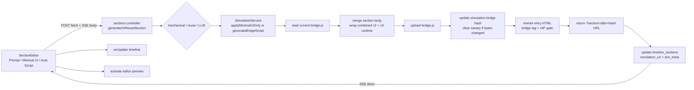
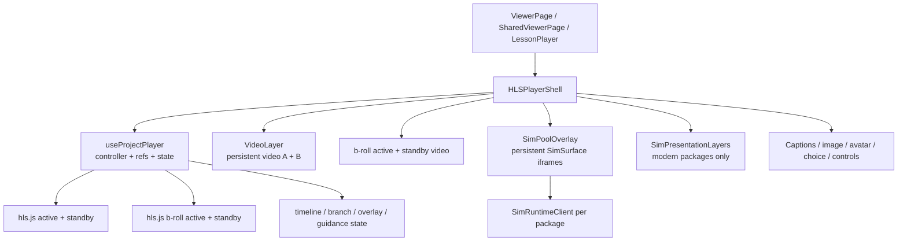
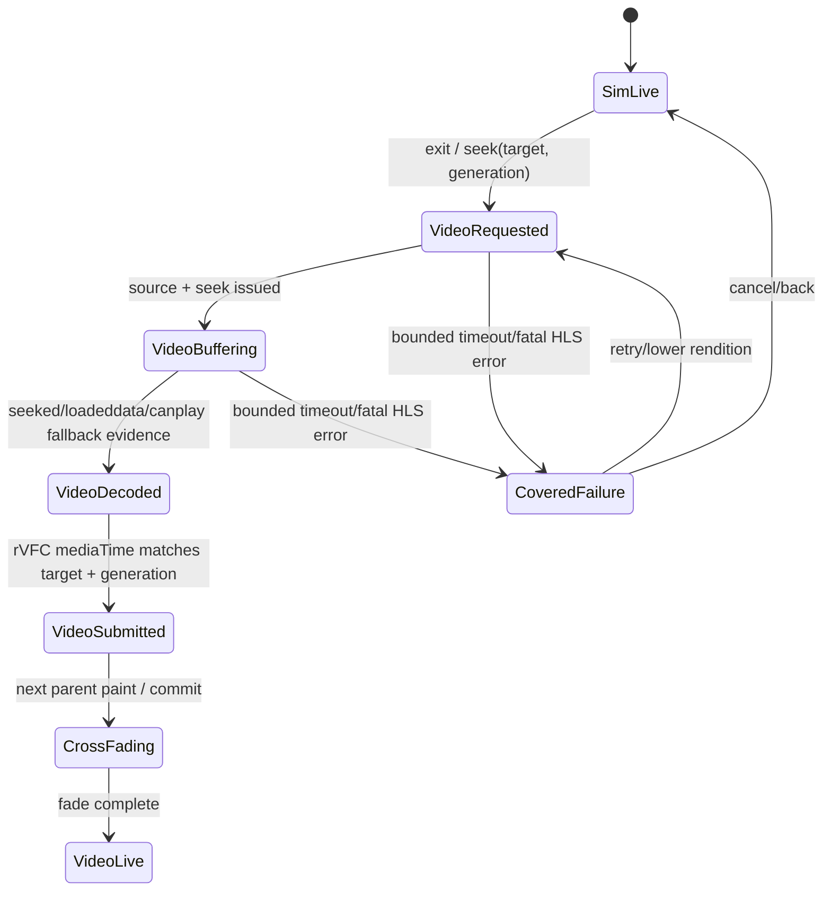
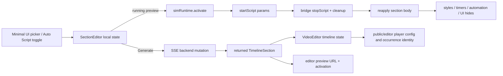

# Simulation + Video Pipeline Deep Audit

**Audit date:** 2026-08-07  
**Repository:** `/Users/ofeklevy/cebu/podcast-saas`  
**Audited checkout:** `feat/sim-immutable-revisions` at `31a6098c80d692a0a0ca18c8da759298869a49d7` (`docs(pr): PR body for Priorities 7-8`)  
**Known newer local ref used only for comparison:** `origin/feat/sim-immutable-revisions` at `1e06276188e9271feb3527431f886cc18dc7f010`, 50 commits ahead  
**Decision:** **B — keep the core design, but moderately restructure transition ownership, publication, scheduling, and measurement. Do not rewrite the simulation host.**

> Scope note: “current repository” in this report means the files actually checked out at `31a6098`. I did not switch branches. Where a finding is already wired or repaired in the newer locally fetched ref, the report says so. This is not a claim about what is deployed: the read-only public API attempt failed with `ECIRCUITBREAKER (too many authentication failures)`, so production package classes, feature switches, media and device performance were not verified.

**Evidence vocabulary and method**

- **[Measured-current]**: measured at the audited checkout. The report explicitly distinguishes lightweight generated fixtures from current-viewer runs using the real Desktop Three.js packages and local HLS.
- **[Measured-prior]**: a measurement preserved in the repository’s 2026-07-31 pool audit. It used a real 432-second “Edge of Chaos” project and heavy packages, but a prior branch/setup; it is trend evidence, not a current-checkout benchmark.
- **[Proven-code]**: follows deterministically from the executed or inspected code/API contract.
- **[Tested-invariant]**: tests establish ordering, identity or cleanup counters, not latency, GPU readiness or physical-device behavior.
- **[Inference]**: likely from architecture and primary-source behavior, but requires field or physical-device confirmation.

The audit used independent end-to-end architecture, React/editor, video, simulation-rendering, pool/residency, browser/mobile, lifecycle, scheduling, open-source research and adversarial-review passes. It traced production call paths, ran the local app with fake/local configuration, exercised Chromium/Firefox/WebKit, ran leak and transition suites, reproduced the production FFmpeg command locally, measured package sizes and browser timing, and inspected the representative `boids-3d` and `murmuration-knob` packages on the Desktop. No production storage, database, migration, package publication, or credential was used.

Local lab: arm64 Apple Silicon, macOS 14.8.8; Node 22.23.2; pnpm 11.4.0; Playwright 1.60.0 (Chrome for Testing 148, Firefox 150.0.2, desktop WebKit build 2251). **Desktop WebKit is not iOS Safari.** CPU throttling does not emulate mobile GPU, decoder, RAM pressure, radios, battery saver or thermal throttling.

---

## 1. Executive Summary

### Plain answer

The core architecture is fundamentally good. In particular, it already has the right expensive primitives: persistent double-buffered video elements, one iframe per **package** rather than per section, revision/activation identity, persistent resident documents, guarded message sources, a first-paint gate, generation guards, bounded residency, and an activation-scoped v3 protocol with explicit prepare/present/release concepts. Replacing iframe isolation or moving every simulation into one shared renderer is not justified.

The remaining problem is that the strongest abstractions are not yet the end-to-end authority:

1. **Video handoff is not frame-valid/compositor-submission-gated.** On simulation exit, the player hides the sim, then seeks/plays video. `readyState`, `seeked`, `canplay`, or a fulfilled `play()` do not establish that the target frame was submitted to the compositor. The existing three-layer policy even contains video-exit logic, but the component is unmounted when the active modern sim disappears, so it cannot cover the real exit.
2. **The dominant generated-package path is still v2.** Generation explicitly produces cleanup-closure bodies capped at `managed-partial`; therefore the richer v3 prepare/present path is normally declined. On a v2 document’s first activation, the apply gate deliberately reveals without a matching `SCRIPT_APPLIED`, which leaves a real wrong-section/boot-scene window.
3. **Prediction is time-based more than pressure-based at this checkout.** Hidden iframe mount staggering does not serialize HTML fetch, JavaScript parse, Three.js import, WebGL context creation or shader compile. The stronger occurrence planner and boundary clock exist in source but are not called by this checkout. The newer local ref wires them behind default-off switches, so that sequence should be reviewed/ported rather than reinvented.
4. **The video package itself can create cold returns.** The HLS command does not force segment-aligned GOPs; a production-equivalent 30 fps sample produced 8.333/8.333/3.333-second segments despite `-hls_time 4`. The ladder encodes all tiers as H.264 Baseline Level 3.1 while advertising `avc1.42e01e` (Baseline Level 3.0), including 1080p. Immutable run trees have weak cache metadata and the previous run is deleted immediately after a DB pointer flip.
5. **Editor “minimal” controls are not computationally minimal.** Minimal UI and Auto Script changes call full section activation; generated bridges tear down and reinstall the body. A 150 ms picker callback has stale-closure races. The editor’s preview and timeline simulations lack a persistent shared lease, so two WebGL workloads can resume together.
6. **Real device adaptation is mostly classification, not closed-loop control.** The representative packages ignore `lowend`, `__SIM_ENV`, and quality messages; fixed DPR clamps are their only adaptation. The checked-out adaptive-quality and RUM modules have no player caller. hls.js itself does use `MediaCapabilities`, but the product has no corresponding handoff or measured power/thermal telemetry policy.
7. **The code has strong correctness tests and useful current hardware traces, but still lacks field/mobile truth.** Current M1 hardware runs put cold real-package half-opacity at 1,185 ms for boids and 841 ms for a post-choice immediate cold seek into knob, and exposed sustained CPU sensitivity under 6× throttling. The prior weak profile took 4.5–7.2 seconds on cold seeks. None of those desktop runs establishes physical-phone, thermal or production tails.

### What probably causes perceptible lag

For a **warm** video → simulation entry, the remaining visible error is mainly boundary observation, React/composition scheduling, and section-identity gating. In two small local lightweight runs (n=14 each), programmatic seek to exact child-section report had sample maxima **125–130 ms** unthrottled; the 6× CPU run's maximum was **162 ms**. There were no ≥50 ms parent long tasks, so this fixture does not implicate React as the dominant cost. These tiny runs do not estimate a population p95.

For a **cold/heavy** entry, the cost is package fetch/cache status, unminified Three.js parse, iframe/bootstrap/bridge handshakes, WebGL context and resources, shader/post-processing compile, first update and first submitted frame. In the current M1 viewer trace, cold boids reached first-frame return at **1,043 ms** and half-opacity at **1,185 ms**; a direct cold knob seek immediately after branch selection reached them at **651 ms** and **841 ms** from the post-click seek T0. The prior real-heavy weak profile observed **+4.5 s and +7.2 s** cold entries. No opacity tweak can remove that work.

For **simulation → video**, the most important defect is not necessarily slow decoding; it is revealing and muting before target-frame proof. A synthetic fully buffered same-segment return reached rVFC in roughly **0.5 ms** normal / **1.1 ms** at 6× CPU. A separate actual post-roll click in the real-heavy viewer reached the target rVFC at **23.3 ms** and `playing` at **24.6 ms**, but its video was already buffered `[0,40]`; it therefore proves only a favorable lower-bound case. The current code hides/mutes the sim immediately and has no visual or audio continuity gate for a cold return.

### Is another major architecture change justified?

**No major redesign. Moderate restructuring is justified.** Keep iframes, package identity, the resident-pool concept, the dual video elements, the v3 protocol, immutable revision concepts and the pure presentation policy. Add one transition coordinator that owns both directions, make publication actually atomic/durable, connect the already-built scheduler/measurement pieces after review, and teach generated packages a managed lifecycle before enabling aggressive preparation.

### Highest-priority next actions

1. Hold a valid outgoing sim/poster until rVFC reports the **requested video frame submitted for composition**, then cross-fade on a parent paint; visibility-gate it and retain a bounded lower-confidence fallback.
2. Fix HLS profile/level, codec declaration, keyframe/segment alignment and conformance tests; retain old HLS trees for a session-safe grace period.
3. Close the first-activation v2 identity hole, or keep a valid cover until a matching section acknowledgement/first frame exists.
4. Make bridge generation a staged immutable revision plus durable serialization/CAS publication—not a mutable object-store read/modify/write followed by a separate timeline update.
5. Fix the editor’s stale activation races and add a page-wide simulation resource lease.
6. Review/port the newer local ref’s boundary, planner, RUM and adaptive wiring under default-off flags; do not create parallel implementations.
7. Establish a physical-device release matrix and field RUM before increasing pool aggressiveness or enabling quality mutation.

---

## 2. Current Architecture

### 2.1 Authoring and publication path



The user-facing path begins at `client-web/components/SectionEditor.tsx:688-820`. It first ensures the row is a simulation, then sends prompt/toggles/UI selection in a POST body to `/generate-sim-script/stream`; its local SSE parser applies the returned section and activates the preview (`:723-737`).

The backend validates at `backend-api/src/controllers/v1/sections.controller.ts:314-327`, selects mechanical/reuse/LLM at `:337-459`, mutates storage through `SimulationService`, then updates `timeline_sections` at `:461-469`. Two locks are **process-local**: `activeSimGenerations` in the controller (`:479-539`, `:648-672`) and `SimulationService.bridgeLocks` (`SimulationService.ts:1929-1950`). The storage write is a mutable read/modify/write at `SimulationService.ts:2449-2566`; bridge bytes, simulation metadata, entry HTML and the section row are not one atomic commit.

The repository contains `RevisionService` and revision tables, but this checked-out generation path still reaches the mutable bridge method. Its own comments say newly generated bodies cannot reach `managed-presentable`: `SimulationService.ts:2489-2502` leaves managed lifecycle/quality capabilities false, so the player uses v2 for these packages even though the bridge carries v3 code.

### 2.2 Viewer component hierarchy and ownership



`HLSPlayerShell.tsx:138-550` owns stable DOM refs, calls `useProjectPlayer`, and renders four possible media elements plus the resident simulation pool. `VideoLayer.tsx:11-35` always renders video A and B with `preload="auto"`; swapping changes z-index and refs, not React identity (`useProjectPlayer.ts:1529-1551`). This is already an effective front/back video buffer.

The simulation pool is also persistent. `lib/simPool.ts:1-25` correctly defines the resident unit as the package document, not a section URL. `collectSimPool()` selects active-path packages and caps the initial set at four (`:147-168`). `SimPoolOverlay` owns stable `SimSurface` nodes; `SimRuntimeClient` owns source-checked postMessage/v2 and activation-scoped v3 protocol state.

The pure three-layer policy is well-designed (`lib/sim/presentationPolicy.ts`), but integration is partial. `HLSPlayerShell.tsx:521-550` mounts it only while `state.simModern` and always passes `intent="sim"`. When leaving the sim, that component disappears; its `exit-to-video-no-frame` path is therefore not the actual exit authority. Generated packages normally never enter this path anyway because their class is `managed-partial`.

### 2.3 Runtime path: video → simulation

```mermaid
sequenceDiagram
  participant C as media clock / seek
  participant P as useProjectPlayer
  participant Pool as resident pool
  participant RT as SimRuntimeClient
  participant F as iframe bridge/runtime
  participant GPU as canvas/WebGL/compositor

  C->>P: timeupdate reaches sim interval
  P->>Pool: ensure package resident, choose active key
  alt resident and ready
    P->>RT: activate(section, Minimal UI, Auto Script)
  else cold/not ready
    P->>Pool: mount iframe; arm pending activation
    Pool->>F: HTML/JS/assets execute
    F-->>RT: SIM_READY / DOCUMENT_READY
    RT->>F: activate
  end
  alt v2 dominant path
    RT->>F: simResume, startScript, clearBootHide, relayout, unmute
    F->>F: stop old body; apply new body
    F-->>RT: SCRIPT_APPLIED (if capable)
    F-->>RT: SIM_PAINTED (document-level rAF gate)
  else canary-proven v3
    RT->>F: PREPARE_SECTION(identity, config)
    F-->>RT: SECTION_APPLIED
    RT->>F: PRESENT_SECTION
    F->>GPU: explicit render
    F-->>RT: SECTION_PRESENTED(identity)
  end
  RT-->>P: presentation permission
  P->>Pool: opacity reveal / remove cover
  GPU-->>C: browser composites frame
```

At this checkout, the controlling tick is the active video’s `timeupdate` listener (`useProjectPlayer.ts:1875-1878`). `lib/sim/boundaryClock.ts` implements a useful rVFC boundary sentinel, but the file has no production caller here. The newer local ref imports and arms it near its `useProjectPlayer.ts:1989`, behind a feature switch.

On sim entry, `updateSimOverlay` ensures the package, constructs params and sets desired identity (`useProjectPlayer.ts:1026-1061`). Post-roll sims pause video and call `stopLoad()` on the main HLS pair (`:1063-1072`). A ready v2 runtime sends `SIM_RESUME → startScript → CLEAR_BOOT_HIDE → SIM_RELAYOUT → SIM_UNMUTE` (`SimRuntimeClient.ts:691-696`). The first-paint fact is document-scoped; it proves the document once drew, not that the requested section/config is the frame now visible.

The v2 apply gate (`lib/simApplyGate.ts:40-49`) waits only when the document is already proven `ackCapable` and the requested body differs. It explicitly reveals immediately for an unknown first activation (`lastScript === null`). That legacy-compatibility decision is the first-activation identity hole.

### 2.4 Reverse path: simulation → video

```mermaid
sequenceDiagram
  participant U as user / timeline
  participant P as useProjectPlayer
  participant S as outgoing sim
  participant H as HLS/video
  participant GPU as compositor

  U->>P: resumeFromSim / seek / section exit
  P->>H: startLoad if previously stopped
  P->>S: freeze + mute; defer destructive cleanup
  P->>P: showSimOverlay=false immediately
  P->>H: set currentTime or load/swap segment
  P->>H: play()
  H-->>P: seeked/canplay/playing (varies)
  Note over P,GPU: no target-frame rVFC gate
  H->>GPU: eventually present requested video frame
  P->>S: deferred stop/reload/eviction
```

For the explicit post-roll return, `resumeFromSim()` restarts HLS, freezes/deactivates the sim, clears the overlay at `useProjectPlayer.ts:2638`, then sets `currentTime` and calls `play()` at `:2643-2649`. There is no check that a compositor-submitted frame corresponds to `targetGlobal`, no generation-scoped rVFC, and no persistent cover. Segment loads similarly use media events/ready state but no target-frame submission evidence. The asymmetry is the core handoff weakness.

### 2.5 State ownership and duplicated truth

| Concern | Current owner(s) | Assessment |
|---|---|---|
| Current media element/HLS instance | refs inside `useProjectPlayer` | Stable and appropriate; avoids high-frequency React churn. |
| Timeline/media time | mutable refs plus merged React `globalTime`; editor also lifts time into `VideoEditor` | Public viewer acceptable at `timeupdate` cadence; editor fans out more work than needed. |
| Simulation document | pool spec array, frame map, runtime map, metadata map | Correct concepts, but operations are spread across a very large hook. |
| Presentation permission | `SimRuntimeClient.visible`, `showSimOverlay`, `simPresented`, `simModern`, layered policy decision | Too many representations. Modern path has an authority; v2 and exit paths still use booleans/timers. |
| Resource ownership | HLS refs, iframe React nodes, runtime lifecycle, child cleanup closure | No single coordinator arbitrates editor preview vs timeline, or all video/sim budgets. |
| Branch future | active sequence plus on-demand pool growth | Avoids eager alternate branches, but selection does not pre-plan the newly chosen future before transition. |
| Quality | URL hints, package fixed DPR, dormant/current adaptive module, modern config hash | Not end-to-end; child packages do not apply the proposed quality. |
| Telemetry | console/local transition marks; RUM modules/config in shared/backend | Dominant current v2 path lacks complete stage data; current hook does not persist it. |

### 2.6 Checked-out HEAD versus newer local ref

This narrow comparison prevents recommending work that already exists locally. It is not a re-audit of the 50 newer commits.

| Item | Audited `31a6098` | Known ref `1e06276` | Report treatment |
|---|---|---|---|
| rVFC boundary sentinel | Module/tests exist; no player caller | Wired behind default-off switch | Review/port that implementation; still validate. |
| Occurrence planner | Pure module/tests exist; hook uses older `planWindowResidency` | Wired behind default-off switch; later fixes present | Do not build a second planner. |
| RUM/adaptive | modules/schema/config largely present; no viewer caller | Wired behind default-off switches | Treat production evidence as absent; review newer sequence. |
| sim → video frame gate | Absent | Still absent; newer code hides overlay then seeks/plays | Finding remains open. |
| `?simpool=adaptive` override | Can override server single mode | Still present | Finding remains open. |
| HLS transcoder/editor/VideoPlayer findings | Present | No relevant diff at known tip | Findings remain open. |
| Generated managed lifecycle | Generator says current bodies cannot be `managed-presentable` | Same inspected comments/path | Rollout blocker remains. |

---

## 3. Video → Simulation Critical Path

### 3.1 Current lab timing

The audit added temporary local-only instrumentation, ran it, then removed it. The fixture used the real Next viewer, real `useProjectPlayer`, real iframe pool and bridge, and a local 320×180 HLS asset. The simulation was deliberately lightweight; it did **not** include Three.js, network distance, model loads, shader compilation or a heavy solver.

The measured interval was programmatic seek/request → the exact child section report while its iframe opacity was >0.5:

| Profile | Samples (ms) | p50 | empirical p95 = sample max (n=14) | Parent long tasks ≥50 ms | Parent rAF-gap empirical p95 / max |
|---|---:|---:|---:|---:|---:|
| Unthrottled run 1 | 121, 130, 19, 64, 63, 58, 58, 55, 55, 46, 56, 19, 71, 69 | 58 | 130 | 0 | 16.8 / 18.2 ms |
| Unthrottled run 2 | 125, 123, 55, 75, 65, 57, 72, 18, 79, 64, 59, 48, 45, 66 | 64 | 125 | 0 | 16.6 / 17.7 ms |
| Chromium 6× CPU | 162, 149, 113, 81, 70, 87, 116, 68, 90, 73, 82, 90, 86, 86 | 86 | 162 | 0 | 24.1 / 33.3 ms |

These numbers show the parent control path can be small and stable when bytes, engine and GPU work are trivial. With only 14 observations per condition, the reported empirical p95 is the maximum and must not be interpreted as a stable tail estimate. They do **not** establish a heavy-simulation SLO. The absence of ≥50 ms long tasks also does not mean every frame met 16.67 ms: the throttled rAF-gap empirical p95 was 24.1 ms, and the Long Tasks API deliberately ignores sub-50 ms frame misses.

### 3.2 Heavy/cold evidence

The repository’s prior audit (`md-files/sim-pool-audit-report.md`) measured a 432-second project with 10 sim occurrences across two real packages. On its adaptive branch:

| Scenario | Desktop | Emulated weak profile | Status |
|---|---:|---:|---|
| Natural prepared entry | ≈0–55 ms in strong/mid runs | 315 / 449 ms | **[Measured-prior]**, earlier branch |
| Direct cold seek | 1,401 / 275 ms | +4.5 / +7.2 s | **[Measured-prior]**, earlier branch |
| Rapid boundary hops | ~boundary / 1,217 ms | not equivalent to physical device | **[Measured-prior]** |
| Time to initial video playing | 9.9 s desktop, 12.9 s mid | 46.5 s weak | Included network/fixture setup of that audit |
| Resident package documents | ≤2 | ≤2 | Earlier adaptive architecture |

That audit also estimated roughly 115–160 MB for two package-identity documents versus 300–400 MB for four URL-identity documents. Those are prior traced/observed trends, not memory measurements made against this checkout.

### 3.3 Current real-heavy stage traces

The final hardware-Chrome pass put the actual `boids-3d` and `murmuration-knob` source packages behind the real checked-out Next viewer, HLS player, pool and iframe surfaces. A temporary injected reporter supplied the `SIM_READY`/`SIM_PAINTED` messages that a published Cebu wrapper would supply and timestamped the untouched package's app/renderer/flock/`_frame` milestones. It did not change the solver, assets, renderer or post chain. Because these Desktop sources do not contain the generated section bridge, classify them as **legacy-cooperative integration fixtures**: cold boot/render timing is real; generated-v2 body-application timing is not represented.

Two cold paths were measured on the M1 Pro/ANGLE Metal lab:

| Stage from T0 | Cold post-roll boids, server `single` | Post-choice immediate cold seek to knob |
|---|---:|---:|
| transition request / post-choice seek request | 0 ms | 0 ms |
| iframe DOM added | 7.4 ms | 23.0 ms |
| child inline reporter begins | 37.6 ms child / 40.9 ms parent receipt | 51.9 / 52.3 ms |
| document `load` | 838.6 ms | 532.2 ms |
| module graph evaluated / app global exists | 838.9 ms child | 558.7 ms child |
| WebGL renderer exists | 839.0 ms child | 558.8 ms child |
| flock/assets ready | 930.5 ms child / 931.7 ms receipt | 605.7 ms child / 654.6 ms receipt |
| first `_frame()` begins | 954.0 ms child | 605.8 ms child |
| first `_frame()` returns | 1,043.1 ms child / 1,045.7 ms receipt | 650.9 ms child / 654.9 ms receipt |
| first-frame CPU/submission wall time | 89.0 ms | 45.1 ms |
| iframe reaches opacity ≥0.5 | **1,185.2 ms** | **840.7 ms** |

For the branch case, the harness clicked the knob branch, awaited the click, then captured T0 and immediately sought into the selected simulation. Thus 840.7 ms is **post-choice seek→half-opacity**: it excludes click handling and is a lower-bound cold-destination Flow G stress case, not branch-click latency or a natural-playback boundary.

This is the missing critical-path evidence: in these runs the dominant cold block was dependency/document/module work before the app global (~0.5–0.8 s), then engine/assets and a 45–89 ms first render, followed by roughly **140 ms for boids / 186 ms for knob** from parent first-frame receipt to half-opacity. Network transfer, module parse and evaluation are co-mingled inside the inline→app interval; claiming separate parse milliseconds would require a trace with source attribution.

Once both documents were prepared, request→half-opacity was **137.2 ms for boids** and **147.4 ms for knob** in one current-viewer run. A repeated boids occurrence with a different section URL took **388.9 ms** because this raw legacy-cooperative package lacks the generated dynamic bridge and reloaded; do not generalize that reload to the normal generated-v2 path.

The branch trace is useful scheduler stress evidence: only the entry sequence was pooled, so the newly chosen knob package did not exist at the immediate post-choice seek. The policy saved RAM/network on the unchosen path but paid 840.7 ms from that seek to half-opacity. It does not show what a natural branch with lead time would cost.

### 3.4 Stage-by-stage path and remaining measurement gaps

| Stage | Current mechanism | Evidence available | Remaining uncertainty/risk |
|---|---|---|---|
| T0 boundary | `timeupdate` invokes `onTick` | Code-proven; real fixture aggregate | UA cadence; later ref’s rVFC sentinel not active here. |
| planner decision | initial package collection; older window planner on weak tier | Unit tests; planner microbench | No field reason/decision telemetry; branch changes can arrive cold. |
| pool lookup | key is origin+path package URL | Tests/code | Historical origins can duplicate logically same revision after rebase. Prefer `simId@revision`. |
| iframe mount | React pool spec; 1.2 s arm staggering | Browser tests | Stagger delays node arming but does not serialize network/parse/context work. |
| HTML response | sim-public proxy/storage | Compression/header inspection | Production CDN/cache hit rate unknown. |
| JS/Three parse | package scripts + CDN Three import | Heavy child inline→app interval measured 0.50–0.80 s, but includes fetch/evaluation | Needs source-attributed trace to separate network, parse and execution. |
| bridge handshake | `SIM_READY` / optional MessagePort v3 | Extensive ordering tests | Generated package usually stays v2. |
| WebGL/resources | package load-time setup | Current hardware child milestones for renderer/flock plus exact counters/GPU samples | Asset decode versus shader work is not completely separated. |
| first update/render | package rAF loop | Current first-frame wall: boids 89.0 ms, knob 45.1 ms; `SIM_PAINTED` follows | Reporter packages are legacy-cooperative; not section/config-specific on generated v2. |
| apply requested body | `startScript(section, params)` | protocol tests | First activation can reveal without matching ack. |
| section acknowledgement | `SCRIPT_APPLIED` for capable v2; v3 activation identity | tests | v2 telemetry emitted no per-stage duration in the current fixture. |
| reveal | runtime permission then double-rAF/CSS opacity | aggregate timing | mark points occur before final React commit/CSS/browser composite. |
| actual composite | browser-owned | iframe half-opacity timestamp measured; child frame returned first | Half-opacity is not pixel/compositor proof; needs screenshot or child-render-submission + parent paint correlation. |

In the current local run, reveal telemetry contained no detailed stage durations because the generated fixture remained on the v2 path. That is itself a finding: the sophisticated v3 timing records cannot describe the dominant generated-package path.

### 3.5 Where “loading” can occur

| Category requested | Exists now? | Current protection | Audit verdict |
|---|---|---|---|
| 1. Network wait | Yes | resident preload, cacheable revision assets | Still dominant on cold package/HLS; cache-hit truth absent. |
| 2. Storage/server response | Yes | sim-public proxy, compression, object store | Public live check unavailable; proxy/auth hop can add delay. |
| 3. Browser parsing | Yes | pre-mounted iframe | Four mounts may parse concurrently; unminified Three adds material parse bytes. |
| 4. JavaScript startup | Yes | warm document | Generated bridge/runtime and package boot execute per document. |
| 5. React work | Yes | refs for hot media state, memoized surfaces | Not dominant in lightweight trace; editor fan-out and policy feedback need profiling. |
| 6. iframe initialization | Yes | resident pool | Cold seeks and package 5+ still mount on demand. |
| 7. bridge/runtime handshake | Yes | pending activation, deadlines | v2/v3 capability negotiation adds hops; current RUM incomplete. |
| 8. WebGL setup | Yes | hidden warm | Can overlap video/HLS and other sim boots. |
| 9. simulation warmup | Yes | allow hidden frames until first paint, then freeze | A first document paint is not exact section readiness. |
| 10. shader compilation | Yes for heavy Three/post FX | warm render should trigger much of it | No explicit compile timing; new variants/passes can compile at presentation. |
| 11. first GPU frame | Yes | rAF `SIM_PAINTED`; v3 `SECTION_PRESENTED` | v2 ack is document-scoped; browser composite still not measured. |
| 12. media buffering | Yes | dual videos, active/standby HLS | stopLoad during post-roll and destructive b-roll handoff can make return cold. |
| 13. video decoder startup | Yes | persistent video elements | Source switches/distant seeks still need decode; no target-frame gate. |
| 14. HLS initialization | Yes | dynamic import and persistent instances | Initial play can race async import/source attachment. |
| 15. compositing | Yes | opacity layers/double rAF | No universal frame-valid coordinator across both directions. |
| 16. fade timing | Yes | ~200–250 ms CSS/deferred stop | Can hide real readiness or reveal invalid underlying media. |
| 17. safety deadline | Yes | apply/warm/paint/stall timers | Deadlines must lead to cover/recovery, never wrong-frame reveal. |
| 18. planner late | Yes | fixed lead/window | Cold seek and new branch bypass prediction. |
| 19. preload pressure | Yes | caps and weak window tier | Capability hole can classify unknown fine-pointer devices as aggressive. |
| 20. garbage collection | Possible | typed arrays/low allocation in flagship loops | Multiple parse/boot jobs and teardown can induce GC; no field attribution. |
| 21. thermal/resource limits | Yes on devices | coarse static hints only | Requires physical soak and closed-loop signals. |

### 3.6 Flow coverage

| Requested flow | What was exercised | Result / limitation |
|---|---|---|
| A video → sim → video | Full local viewer + focused browser suites + real boids/post-roll trace | Correct fixture order; current cold boids entry and fully buffered return control timing measured, but audible/cold-return proof remains. |
| B video → expensive sim → video | Fresh current viewer + real boids hardware trace | Cold first frame 1,045.7 ms, half-opacity 1,185.2 ms; fully buffered return rVFC measured separately. |
| C sim A → video → sim B | Viewer transition suite | Correct fixture ordering; no real-GPU physical-device trace. |
| D video → A → video → A | Release-gate suite and pool tests | Re-entry invariants pass. |
| E early video → cold sim | Local fixture and prior heavy audit | Lightweight fast; prior weak heavy +4.5–7.2 s. |
| F sim → earlier video | Focused e2e, synthetic warm probe and actual real-heavy post-roll click | Fully buffered actual return reached target rVFC at 23.3 ms/playing 24.6 ms; current production path still has no visual/audio gate, cold return unmeasured. |
| G branch changes future sim | Fresh real knob destination followed by immediate post-choice seek | From post-click seek T0: first frame 654.9 ms, half-opacity 840.7 ms. This is a cold lower bound/stress case, not click latency or a natural lead-time result. |
| H rapid scrub | Viewer suites and prior rapid scenario | Generations prevent many stale callbacks; target-frame submission/visible-pixel evidence is still absent. |
| I long playback | Current two-minute real-heavy residency soak + prior 432 s project | 24 current heavy transitions, two resident frames, stable document/frame counts; still no 10–20 minute physical thermal run. |
| J 100 A→B→A | Current real-boids/video 100-cycle run plus cross-engine leak suite | 29.95 s current run retained two iframes; heap/DOM fell between raw snapshots as the page settled/naturally collected; synthetic 12/12 suite adds protocol counters. |

The actual browser verification included 33/33 Chromium release-gate cases and 16/16 focused Firefox/WebKit cases (cold entry, Minimal UI return, direct/rapid seeks, post-roll, hidden-visible, resize and unmount). Those are correctness results, not FPS claims.

---

## 4. Simulation → Video Critical Path

### 4.1 Current sequence and measured warm case

For an explicit post-roll exit, the real order is:

1. `resumeHlsAfterSim()` calls `startLoad()` only if the post-roll path stopped the two main loaders.
2. The sim runtime freezes/mutes immediately and schedules destructive `stopScript`/legacy reload after the fade.
3. React state sets `showSimOverlay: false` immediately.
4. The player maps global target to segment/local time.
5. Same segment: assign `currentTime`, update overlays, call `play()`; different segment: `loadSegment()` and its swap/media-event choreography.
6. The browser later seeks, buffers, decodes and composites a video frame.

The lightweight fully buffered, same-segment probe observed target rVFC after roughly 0.5 ms unthrottled and 1.1 ms at 6× CPU; the overlay reached half-hidden after 33.8 ms and 101 ms.

A second hardware-Chrome trace used the actual post-roll return button in the current real-heavy viewer. At click T0, video `waiting` arrived at 22.9 ms, a target rVFC with `mediaTime=0` at **23.3 ms**, and `seeked`/`canplay`/`playing` at **24.5–24.6 ms**. The video already reported `buffered=[0,40]`, so this was a favorable, fully buffered post-roll control path—not a cold or distant return. It found no parent ≥50 ms Long Task. The current ordering nevertheless muted/hid the outgoing simulation at T0, leaving a potential roughly 23–25 ms audio/visual handoff interval even in this best case; a cold return can be much longer and remains unmeasured.

### 4.2 Why the current gate is insufficient

- `HTMLMediaElement.readyState >= HAVE_CURRENT_DATA` says data for the current playback position exists; it does not prove the frame belongs to the new seek generation or reached the compositor.
- `seeked` says seeking ended, not that the target video pixels were submitted.
- `canplay` estimates continued playback, not presentation.
- `play()` resolving says playback began; it can resolve before the intended visual frame is visible, and this code’s `safePlay()` swallows rejection.
- CSS opacity starts changing immediately, so a stale/black video surface can be exposed before any of those events.

`requestVideoFrameCallback()` runs when a video frame is sent to the compositor and includes `mediaTime`; it is the strongest portable JavaScript evidence for the target frame ([MDN rVFC](https://developer.mozilla.org/en-US/docs/Web/API/HTMLVideoElement/requestVideoFrameCallback)). It does **not** prove photons reached the display, and callbacks may be delayed or absent for hidden/fully occluded video. It is main-thread and may be one vsync late, so it is not a universal clock or hard real-time guarantee. Keep the incoming video in a compositable layer behind the valid outgoing cover, arm only while the page is visible, and use a bounded labeled fallback; validate actual transition pixels with screenshots/video capture on physical devices.

### 4.3 Required handoff state machine



The transition coordinator should preserve, in priority order: (1) the outgoing frozen sim if its pixels remain valid; (2) the exact target poster/thumbnail if decoded; (3) a neutral recovery cover. On a visible/compositable surface, it should begin reveal only when a callback matches both the current **handoff generation** and a small tolerance around requested `mediaTime`, followed by a parent paint. If rVFC is unavailable or suppressed while hidden/occluded, use `seeked` + `readyState >= 2` + two visible animation frames as a labeled lower-confidence fallback, with a deadline that surfaces recovery rather than forcing reveal.

### 4.4 Initial play and other media surfaces

The same rule applies beyond sim exit:

- `useProjectPlayer` awaits `import('hls.js')` before source attachment, while the Play action can set `started`, remove the thumbnail and invoke `safePlay` on a source-less video. On slow hardware this is a real initialization race; preserve the poster and actionable control until initialization plus target-frame compositor-submission evidence and a parent paint.
- Main segment swaps use dual elements, which is good, but should swap z-order only after target-frame submission evidence from a compositable standby plus a parent paint/fallback.
- B-roll “prewarm” calls `detachMedia()` then `attachMedia()` (`useProjectPlayer.ts:1336-1341`). In hls.js 1.6.16, detach ends the MediaSource, removes the source buffers and resets the video source; the documented non-destructive API is `transferMedia()` ([exact hls.js 1.6.16 API](https://github.com/video-dev/hls.js/blob/v1.6.16/docs/API.md)). Therefore the current handoff destroys the buffer it meant to reuse. Swapping already-attached elements is even simpler and mirrors the main path.
- The thumbnail currently depends on `!state.started`, not target-frame submission/paint evidence (`HLSPlayerShell.tsx:399-407`).

### 4.5 Audio ownership and continuity

Audio does not currently have one transition owner. `applyMediaVolume()` controls the main/guidance media, while simulation activation separately sends `SIM_UNMUTE`. A mid-roll simulation can leave the main video clock/audio running underneath it; a post-roll simulation pauses main video and unmutes the package. On return, `deactivate()` sends pause/mute to the simulation before the player seeks and calls `play()` on video. There is no declared mix/duck policy, incoming-audible acknowledgement or gain-envelope handoff.

The 23.3 ms current post-roll rVFC and 24.6 ms `playing` result above does **not** prove audible continuity: browser automation ran muted and an HTML media event is not an acoustic measurement. It does identify the control gap that must be instrumented. On a cold seek the outgoing simulation can be silenced well before the incoming media becomes audible; on mid-roll entry both sources can overlap unless package behavior happens to avoid it.

The transition coordinator should therefore carry an explicit audio intent alongside visual intent:

- `narration-continuous`: preserve main narration and keep simulation audio muted or deliberately ducked;
- `simulation-exclusive`: cross-fade to package audio only after its `AudioContext` is user-authorized and running;
- `mixed`: apply named gain/duck envelopes with a single owner, rather than independent volume calls.

For a return to video, retain outgoing gain until incoming media is actually playing/audible enough to satisfy the selected policy, then cross-fade; do not make the audio switch depend only on visual rVFC, because decoded pixels and audible samples have different readiness signals. Handle `play()`/`AudioContext.resume()` rejection as a covered, actionable state. Validate with a Web Audio analyser/loopback harness plus physical Safari gesture, mute, Bluetooth and background tests. The invariant is **no unintended silence or overlap**; intentional silence/mixing must be encoded in the section policy.

---

## 5. Minimal UI / Auto Script Interaction

### 5.1 Dependency path



The public viewer is reasonably decoupled from editor local state: toggling authoring controls does not directly recreate its persistent video DOM or HLS instances. Once a saved/returned section updates timeline state, however, its URL/config/metadata can change player and pool identities. The editor preview is much more tightly coupled: live toggle effects and picker changes reactivate the full section.

### 5.2 Proven races and unnecessary work

#### Stale 150 ms picker activation

`SectionEditor.tsx:611-629` schedules a callback when `uiUnchecked` changes, but deliberately omits `previewRunning`, `simpleUi`, `autoScript`, section identity, effective selectors and runtime from dependencies. The timer therefore captures an obsolete activation. If the user presses Stop, selects another sim, changes the mode or a document changes within 150 ms, the callback can reactivate the old section while the chrome says stopped. This is a deterministic stale-closure defect, not a micro-optimization.

#### UI policy restarts the experiment

`runPreview()` calls `simRuntime.activate()` (`:565-570`); the live toggle effect calls it again (`:600-609`); the picker timer calls it again (`:615-625`). On the generated v2 bridge, `startScript` first stops the previous script, clears timers/cleanup/style and reruns the body. Thus “hide this control” can reset the simulation’s state, automation and scientific trajectory. Minimal UI is visually minimal but computationally a full activation.

The correct long-term contract is separate idempotent messages such as `SET_UI_POLICY {simpleUi, hideSelectors}` and `SET_AUTOMATION_POLICY {autoScript}`. Old packages can fall back to restart, but new managed bodies should apply chrome/automation without releasing physics/render state.

#### Wrong preview/document identity

- The preview URL selection favors `section.simulation_url` over the newly selected simulation’s entry URL, so choosing a new sim can leave the old document visible until persistence catches up.
- `applyDone()` always activates the returned config on the current runtime (`:723-737`), even when a new URL means that runtime still points at the outgoing document; the keyed new surface will also auto-run on its later handshake.
- Treat `(package revision, document generation, section/variant, config hash)` as one activation identity and refuse callbacks/commands for an older generation.

#### Two-WebGL editor contention

The editor can host a timeline simulation and the SectionEditor preview. Current arbitration reacts to an “active” event once, but later timeline `ready` or boundary effects can resume it unconditionally. Opening the preview also does not necessarily pause the video. A page-wide `SimulationLease` must be checked by **every** activate/resume/warm path, not only at the first edge. Recommended priority: user-visible preview > visible timeline sim > next-package warm; video decode retains a separate nonzero budget.

### 5.3 React work in the editor

`useEditorPlayback.ts:215-234` updates `globalTime` at `timeupdate` cadence and calls the top-level callback. The roughly 1,700-line `VideoEditor` then derives/sorts/maps sections and passes playhead state into timeline children. This is not 60 Hz, and no profile showed it as the public-viewer bottleneck, but the authoring UI has more reconciliation/layout surface than necessary.

Move high-frequency playhead display and imperative marker motion into a narrow subscribed leaf. Keep structural timeline edits in React. `useSyncExternalStore` is suitable only if snapshots are cached and subscribe identities are stable ([React documentation](https://react.dev/reference/react/useSyncExternalStore)); first confirm with React Profiler rather than rewriting the store.

### 5.4 What does **not** remount

- The editor’s two main `<video>` elements and HLS refs are created in a mount effect; ordinary Minimal UI toggles do not recreate them.
- The public player’s `VideoLayer` elements remain mounted across sim visibility changes.
- `SimSurface` is memoized with stable styles/boot-hide identities, and a package URL—not a toggle object—keys the frame.
- The resident pool remains in one fixed React parent; `HLSPlayerShell` correctly avoids reparenting it into the modern cover component.

Those are important protections and should be preserved.

---

## 6. Simulation Rendering Performance

### 6.1 Representative package inventory

The audit inspected the real Desktop packages because they are not ordinary tracked repository packages:

| Package | Files / total bytes | HTML/CSS/JS raw | Code gzip estimate | Static assets | Main rendering shape |
|---|---:|---:|---:|---:|---|
| `boids-3d` | 26 / 546,220 B | 194,415 B | 58,262 B | 345,816 B | 4,000-bird instanced Three.js scene; spatial hash; bloom + bokeh/DoF + output/grade; WebAudio |
| `murmuration-knob` | 16 / 210,425 B | 109,799 B | 35,058 B | 97,024 B | 4,000-bird instanced Three.js scene; adaptive grid/spatial hash; simpler post path; optional/lazy predator |
| `pluck-boids` | — / 542,062 B | 190,257 B | 57,105 B | remainder | Similar family; legacy package path |

Raw totals are not network transfer sizes. The simulation proxy compresses cloud text and the browser can share an identical CDN URL from cache. Actual transfer must be captured with `PerformanceResourceTiming.transferSize` on production-like origins.

Both flagship entry documents use an import map with bare `three` specifiers and pin Three.js r169 from jsDelivr. The referenced unminified module measured **1,304,820 B raw / 262,868 B gzip**; the minified module measured **687,458 B raw / 169,883 B gzip**. The likely cold saving is therefore about **617 KB raw and 93 KB gzip**, plus less source to parse. Do not bundle a separate Three copy into every simulation; use one pinned, immutable, minified shared URL so cache reuse survives.

### 6.2 Local real-package browser trace

A headless system Google Chrome 148 hardware path loaded the actual Desktop packages from a no-store local server, while their pinned Three modules came from jsDelivr. Its renderer string confirmed ANGLE Metal on the Apple M1 Pro; conditions were either 1280×720/DPR 1 or 390×844/DPR 3, with no network/CPU throttle unless stated. A wrapper timed the package's real `_frame()` wall time (solver + JavaScript + driver submission), disabled only Three's counter auto-reset, and used `EXT_disjoint_timer_query_webgl2` for GPU elapsed time. The harness explicitly rejected disjoint results and its JSON snapshots included a valid-result `n`, but those `n` values/rejected-query counts are not preserved in this report. The 10-second live windows began after package/app readiness; cold first-frame work was recorded separately, but there was no standardized multi-minute warm-up. Therefore the exact GPU quantiles are **exploratory** and must be rerun with retained raw samples/counts before release decisions. These are local lab samples, not iPhone/Android, thermal or population percentiles. The separate bundled headless Chromium selected SwiftShader: its cadence figures were excluded from the hardware table, but it supplied lifecycle/context-loss and intrusive allocation/GC diagnostics.

| Package / canvas | Frames / window | `_frame()` p50 / p95 | rAF gap p50 / p95 | GPU p50 / p95 | Draws / triangles per frame |
|---|---:|---:|---:|---:|---:|
| boids, 1280×720 DPR 1 | 539 / 10 s | 18.1 / 21.2 ms | 18.3 / 21.4 ms | 6.88 / 11.74 ms | 34 / 5,008,828 |
| knob, 1280×720 DPR 1 | 641 / 10 s | 14.5 / 20.9 ms | 14.7 / 21.2 ms | 3.78 / 5.33 ms | 2 / 2,504,001 |
| boids, 390×844 DPR 3 (682×1477 canvas) | 537 / 10 s | 17.9 / 20.8 ms | 18.1 / 20.9 ms | 6.84 / 10.93 ms | 34 / 5,008,828 |
| knob, 390×844 DPR 3 (585×1266 canvas) | 643 / 10 s | 14.5 / 20.9 ms | 14.7 / 21.1 ms | 3.56 / 4.85 ms | 2 / 2,504,001 |

On this strong machine, boids misses a strict 16.67 ms CPU/submission budget at the median and both packages cross it in their p95 samples. The phone-sized viewport is only a canvas-size/DPR scenario on the same M1 GPU; it is not phone hardware.

Six-times CPU throttling on the phone-sized canvas separated CPU from GPU pressure:

| Package | `_frame()` p50 / p95 | rAF gap p50 / p95 | GPU p50 / p95 | Approx. observed cadence |
|---|---:|---:|---:|---:|
| boids | 148.7 / 153.5 ms | 150.1 / 154.4 ms | 10.48 / 12.26 ms | ~6.7 fps |
| knob | 86.6 / 88.8 ms | 88.0 / 90.5 ms | 3.71 / 4.77 ms | ~11.4 fps |

GPU time stayed close to the unthrottled range while frame wall time grew roughly 6×. In this emulation, the solver/JavaScript/driver-submission path is the dominant weak-CPU failure, not pixel fill alone. CPU throttling still does not emulate a phone GPU, memory bandwidth, radios or thermals.

Cold startup varied by cache/order: hardware runs reached package `flock` availability in roughly 0.80–0.95 s in one pair and 0.88/1.72 s (boids/knob) in another. More importantly, one boids desktop run contained a single 1.94 s first-window task after the app object was ready, while a fresh phone-canvas run's first wrapped frame cost 93.8 ms. This is evidence that “flock exists” is not a sufficient first-frame milestone; the 1.94 s outlier needs trace attribution before it is called shader compilation.

Allocation/GC tracing was run separately because it severely perturbed cadence. Five-second instrumented samples reported approximately 34–40 MB sampled allocations for boids and 61–82 MB for knob, with short aggregate V8 GC durations (~7–25 ms depending on canvas/run). These are sampler outputs, not live-heap growth. The main hardware samples' JS heaps oscillated (boids roughly 10.2–13.5 MB; knob roughly 8.9–14.4 MB) rather than rising monotonically over ten seconds.

The geometry result is exact: the 97,024-byte Parrot GLB contains 497 vertices and 626 triangles. At 4,000 instances, each scene render submits 2.504 million bird triangles. `boids-3d` renders the flock again for Bokeh depth, yielding 5.008 million bird triangles plus fullscreen work; bloom adds high-pass, ten blur passes and composition, and the bird material is double-sided. `murmuration-knob` uses one scene render plus one combined grade/output pass.

This makes boids' post path, double-sided rasterization and internal render resolution the first rendering targets. A single-pass depth-of-field rewrite is promising but can change depth semantics and is therefore a visual-quality change requiring owner approval and screenshot/video comparison, not a guaranteed pixel-identical backend optimization.

### 6.3 What is already optimized

The audit deliberately rejects generic “optimize Three.js” advice because these packages already implement many of the expected fixes:

- Structure-of-arrays typed buffers rather than thousands of per-bird objects.
- A cell/uniform spatial hash for neighbor search, avoiding an unconditional all-pairs O(N²) loop.
- One `InstancedMesh` for the flock with shared geometry/material, rather than thousands of draw calls.
- Hoisted scratch vectors and little/no allocation in the hot neighbor/update path.
- `antialias: false`, DPR caps, resize debouncing and disabled depth where not required.
- Host `simPause`/`simResume`, page visibility and intersection checks in the main render loops.
- Three.js's renderer handles the context-lost cancellation; package listeners rebuild PMREM/environment state on restoration.
- Static-frame skipping in boids; adaptive grid sizing and lazy predator work in murmuration.

These are exactly the transferable techniques in Three.js’s guidance: reduce object/draw overhead and explicitly dispose GPU resources on true teardown ([Three.js “Optimize Lots of Objects”](https://threejs.org/manual/en/optimize-lots-of-objects.html), [Three.js disposal guide](https://threejs.org/manual/en/how-to-dispose-of-objects.html)). A React Three Fiber/Babylon/Pixi rewrite would not remove the solver, fill rate, post-processing or context memory.

### 6.4 Complexity and residual hot spots

| Area | Current complexity/cost | Finding | Safe direction |
|---|---|---|---|
| Neighbor search | Average approximately O(N + local-neighbor work) with spatial cells; worst-case O(N²) if the flock collapses into very few dense cells | Algorithm is already appropriate; pathological density remains possible | Instrument candidates/accepted neighbors per frame; cap work only with a scientifically defined policy, not silently. |
| Integration | O(N), render-cadence coupled, elapsed time capped | Weak FPS changes effective simulated time | Show/record simulation time; optimize rendering first; validate any fixed-step/substep design. |
| Instance matrices | O(N) uploads each rendered frame | Necessary for moving 4k agents; can be bandwidth-heavy | Keep single instanced upload; avoid redundant render when state unchanged. |
| Boids post-processing | Full-resolution scene plus bloom, Bokeh/DoF and output/grade passes | Strong GPU/fill-rate lever, but DoF intentionally supports the seven-neighbour attention visualization | Owner-gate and visually compare render-target changes. Keep DoF out of the default degradation ladder unless the lesson/visual owner explicitly approves an equivalent alternative. |
| Environment/model assets | GLB/texture load and PMREM | Cold start and GPU memory | Lazy-load decorative models, cache immutable assets, use smaller environment target by quality tier. |
| Audio | Gain ramps to zero but `AudioContext` and scheduled sources can remain active | Hidden CPU/battery cost | `AudioContext.suspend()` on host pause/offscreen; resume only from allowed user lifecycle; close on eviction. |
| Context preference | Both request `powerPreference: "high-performance"` | Can select a higher-power GPU and worsen battery/context pressure; benefit unmeasured | A/B test default versus high-performance on Intel dual-GPU and mobile. Do not change blindly. |
| Context loss | Both add package-level `webglcontextrestored` rebuilding while Three.js owns the lower-level loss handler | A bundled headless Chromium/SwiftShader `WEBGL_lose_context` probe produced `defaultPrevented`, loss/restore events and `!gl.isContextLost()` after 750 ms in each package; no hardware or post-restore frame/pixel assertion was made | Keep Three's handler, add package/parent loss telemetry and a recovery cover; prove resource/pixel recovery on hardware Chrome/Safari rather than duplicating `preventDefault()` blindly. |
| Boids cold construction | `main.js:87-91` asynchronously resolves the gull/falcon spec and passes it to `Flock`; `Flock.js:95-105` synchronously realizes the falcon pool even though default predator count is zero | Unused model/pool work extends cold preparation; the existing synchronous `{make}` hook cannot itself await GLTF | Add an asynchronous hidden `prepareFalcons()` that loads/caches geometry before a predator section, then performs synchronous mesh/pool realization; alternatively fetch geometry eagerly but defer pool construction. |
| Seven-neighbour display mode | Hides other birds with zero-scale matrices but retains the 4,000-instance draw | Vertex work remains for visually hidden instances | Use a compact second instanced mesh for ego plus visible neighbours if image comparison confirms equivalence. |

The WebGL context-creation spec explicitly treats power preference as a hint, not a performance guarantee ([Khronos WebGL context parameters](https://registry.khronos.org/webgl/specs/latest/1.0/index.html#context-creation-parameters)).

Opacity or z-index hiding alone is not a lifecycle mechanism: a canvas inside a still-intersecting iframe can continue rendering. The parent must send the exact host pause command. Neither package retains all observer/listener handles for explicit teardown, and neither has a complete resource-disposal/context-loss eviction contract, so iframe removal depends on eventual realm cleanup and can transiently overlap GPU allocations.

### 6.5 Scientific timing defect under load

Both representative solvers cap elapsed time. In `murmuration-knob`, the effective update uses approximately `min(rawDt × 2, 0.05)`. At 60 fps this can express 2× time; at 30 fps, 33.3 ms × 2 is capped to 50 ms, so it becomes about **1.5×**; at 20 fps it is effectively **1×**. Boids also caps elapsed time at 50 ms.

This is a **correctness/scientific-semantics issue caused by performance**, not a reason to increase substeps indiscriminately. A fixed-step accumulator can preserve time but create a spiral of death on an already overloaded device. Choose explicitly among:

1. guarantee enough compute/render headroom for the intended rate;
2. permit graceful slow motion and expose simulation time to the lesson/user;
3. design a bounded accumulator with drop policy and validate trajectories/statistics against scientific invariants.

Never silently lower bird count, neighborhood radius/count, solver cadence or timestep merely to improve FPS. Those can change the phenomenon being demonstrated.

### 6.6 Optimization classes

| Class | Examples | Recommendation |
|---|---|---|
| 1. Backend/algorithm | preserve typed SoA/cell hash; precompute static lookup; profile dense-cell path; shared immutable minified library | Safe if results are bitwise/statistically equivalent; current solver is already strong. |
| 2. Rendering/visual load | lower internal DPR/target scale; reduce owner-approved passes/assets; reduce PMREM resolution; lazy truly decorative model | Often the highest GPU lever, but not automatically “safe”: it changes visual intent and, while physics shares render cadence, can change the `dt` sequence/trajectory indirectly. DoF is teaching-relevant here and stays by default. |
| 3. Dynamic quality | boot-time render tier; sustained frame-time downgrade; cautious recovery; context-loss poster mode | Implement only end-to-end with package acknowledgement and telemetry. |
| 4. Parameter/visual change | lower N, neighbor radius/count, speed, timestep, simulation update frequency | Not a performance default; requires owner/scientific validation and variant labeling. |

The flagship packages currently consume none of the player’s `lowend`, `__SIM_ENV`, `SET_QUALITY`, or equivalent semantic quality signals; they use fixed DPR caps only. Also, because physics and rendering share the same loop, even a nominally rendering-only cost change can alter frame `dt` and seeded trajectories, while naïvely rendering at 30 Hz directly changes solver cadence. Separating fixed simulation steps from render steps is a scientific engineering project, not a CSS optimization.

### 6.7 Browser support blocker

Both flagship packages rely on import maps. WebKit shipped import-map support in Safari/iOS 16.4 ([WebKit Safari 16.4 release](https://webkit.org/blog/13966/webkit-features-in-safari-16-4/)). Therefore iOS 16.3 and older cannot resolve these bare imports as written. Either:

- establish Safari/iOS 16.4 as an explicit minimum and show a compatible poster/recovery on older clients; or
- bundle/rewrite bare imports during package publication while still referencing one shared immutable Three build.

This is a deterministic compatibility boundary, not a probable slowdown.

---

## 7. Video/HLS Performance

### 7.1 What is sound

- The public viewer keeps two persistent main video elements and swaps refs/z-order. It does not remount video on section or sim changes.
- Active and standby hls.js instances are also swapped, and buffer budgets are promoted/demoted after the swap (`useProjectPlayer.ts:1529-1551`).
- The main path uses hls.js workers, caps rendition to player size, has fatal network/media recovery, and gives the active stream 45 seconds nominal forward buffer / 90 seconds maximum because a prior 15-second budget underrun.
- The pool waits for the first video’s `playing` event before arming background sims, because earlier arming had measured 1–4-second startup cost.
- HLS uploads use bounded concurrency rather than reading hundreds of segments concurrently; comments record a prior ~2.5 GB heap issue that this avoids.

Keep these choices until field buffer/rebuffer evidence supports changing them.

### 7.2 HLS ladder and empirical reproduction

`backend-api/src/services/video/HLSTranscoder.ts` emits four H.264/AAC MPEG-TS variants:

| Tier | Video / audio target | Advertised bandwidth | Encoder profile/level | Master codec string |
|---|---:|---:|---|---|
| 360p | 500k / 96k | 700k | Baseline / 3.1 | `avc1.42e01e,mp4a.40.2` |
| 480p | 1000k / 128k | 1400k | Baseline / 3.1 | same |
| 720p | 2800k / 128k | 3200k | Baseline / 3.1 | same |
| 1080p | 5500k / 192k | 6000k | Baseline / 3.1 | same |

The codec string’s `1e` level byte advertises H.264 Level 3.0, while the encoder command declares Level 3.1. More importantly, Baseline Level 3.1 is not adequate for a conventional 1920×1080@30 encode; the production-equivalent FFmpeg run emitted macroblock frame/rate level warnings. A manifest can therefore claim decoder constraints that do not match its elementary stream.

The command requests `-hls_time 4` but sets no forced keyframe cadence, `keyint_min`, closed GOP, or scene-cut policy. On a local 20-second 30 fps source, the exact production-equivalent command produced:

- target duration: **8 seconds**;
- media segments: **8.333 s / 8.333 s / 3.333 s**;
- nominal 1080p first segment: roughly **5.7 MB** in that reproduction.

This exact duration is input-dependent and must not be generalized to all media. The causal defect is general: the segmenter can cut only at suitable keyframes, and the command does not create aligned 4-second random-access points. Apple’s current HLS authoring specification requires video segments to start with IDR frames, recommends nominal six-second segments, bounds duration relative to target, and recommends aligned variants/`INDEPENDENT-SEGMENTS` when applicable ([Apple HLS Authoring Specification](https://developer.apple.com/documentation/http-live-streaming/hls-authoring-specification-for-apple-devices/)).

Required encoding work:

1. Choose a compatible profile/level per rendition based on resolution/frame rate and oldest supported hardware.
2. Force closed, aligned GOPs at the selected segment cadence and control scene-cut keyframes.
3. Derive/validate the master codec string from output rather than hard-code it.
4. Add `EXT-X-INDEPENDENT-SEGMENTS` only after conformance proves every segment is independently decodable.
5. Validate all renditions with `ffprobe`, playlist checks and real iPhone/Android playback.
6. Re-transcode existing ladders; changing the encoder affects future jobs only.

### 7.3 Handoff and initialization defects

- **Initial play race:** `useProjectPlayer.ts:2215-2244` awaits the dynamic hls.js import before source attachment, without a destroyed/unmount guard. `startPlayback()` at `:2457-2464` can run first, remove the thumbnail and swallow `play()` failure. Add an initialization promise/state, retain the poster/action until target-frame compositor-submission evidence plus a visible paint/fallback, and abort/destroy a late import after unmount. The editor’s HLS hook already demonstrates a `destroyed` flag.
- **B-roll prewarm is destructive:** hls.js 1.6.16 `detachMedia()` ends the MediaSource and resets the element. Use `transferMedia()` only after version/browser tests, or simply swap the two already-attached b-roll elements.
- **Reveal events are too weak:** main swaps, b-roll activation, same-segment seek and initial thumbnail removal should all use a target/generation-aware compositor-submission + visible-paint/fallback gate.
- **Native Safari/MMS/AirPlay nuance:** Managed Media Source shipped on iPad/macOS in Safari 17.0 and iPhone in 17.1 ([WebKit Safari 17.1](https://webkit.org/blog/14735/webkit-features-in-safari-17-1/)). The current Hls-first path can therefore choose MMS on newer iPhones. hls.js 1.6.16 sets `video.disableRemotePlayback = true` when it attaches MMS ([upstream buffer controller](https://github.com/video-dev/hls.js/blob/v1.6.16/src/controller/buffer-controller.ts#L285-L294)), while current `VideoLayer` has no alternate native HLS source. That can trade away AirPlay. “Always prefer native” is still not a universal performance rule, but an AirPlay-compatible native-source/selection strategy is required; treat native-versus-MMS/hls.js as a cohort by platform, feature and user route, not doctrine ([hls.js API](https://github.com/video-dev/hls.js/blob/v1.6.16/docs/API.md)).

### 7.4 Versioned HLS lifetime and caching

`runVideoTranscode.ts:52-57` wisely writes a new run-ID tree and flips the DB pointer only after a complete transcode. But `:125-127` immediately starts deleting the old tree. An already-open viewer still holds the old manifest/segment URLs and can request a later segment after deletion, yielding a mid-session 404.

Retain old runs for longer than the maximum supported viewing session plus CDN/cache safety margin, then garbage-collect asynchronously using a durable job/bucket lifecycle. An in-process refcount is insufficient for distributed anonymous viewers.

The run-ID objects are immutable, yet `uploadWithFallback(key, data, contentType)` has no cache-control argument and calls storage without metadata. The R2 proxy responds with only `public, max-age=3600`; tokenized path prefixes can fragment cache keys. The local `/hls-public` path gives segments one day and playlists no-cache. Fix this without weakening authorization:

- store `public, max-age=31536000, immutable` on versioned segments and variant playlists where revocation policy permits;
- keep mutable pointer/config responses short-lived;
- authorize at an edge that can use a stable post-auth cache key (for example signed cookies or token-stripped internal keys);
- never make private media public merely for cache speed.

---

## 8. Pool / Residency / Preloading

### 8.1 Current policy

The current design has three tiers, chosen once per player mount:

- `single`: conservative kill-switch; one active frame, no speculative residency.
- `window`: for coarse pointer, Data Saver, or reported memory ≤4 GB; keep active plus next distinct package within a 45-second lead.
- `all`: mount active-path packages up to four after video begins playing; on-demand growth has a hard cap of six.

Initial iframe starts are staggered 1.2 seconds. Once a background document reports ready, hidden **warming** is serialized: one ready document runs until `SIM_PAINTED` or an eight-second budget, then freezes and advances the queue.

This is materially better than URL-identity pooling. Package identity prevents the same Three scene/context being created for each section variant. The weak-tier window scans absolute occurrences over the whole active path and evicts packages when no longer wanted.

### 8.2 Remaining weaknesses

1. **The classification is internally inconsistent.** `canWarmUnpaused()` returns `true` when memory/network APIs are missing and pointer is fine, despite its “unknown is conservative” comment, and ignores `hardwareConcurrency`. `shared/src/sim/simUrl.ts` separately calls ≤4 cores low-end. An old Intel Safari/Firefox machine can therefore get a low-end URL but `all` residency. Powerful touch hardware is always penalized. Unknown fine-pointer is the risky case; coarse-pointer devices are already conservative.
2. **A stagger is not a milestone scheduler.** If package A needs five seconds to parse/compile, B starts 1.2 seconds later and overlaps it. Serialization begins only after `SIM_READY`; fetch, parse, module evaluation, context creation and initial shader work can still overlap the first HLS segment or one another.
3. **Strong-tier planning is front-loaded.** It takes the first four active-path packages and does not continuously re-rank them. Package five is cold until activation/on-demand growth. Eviction beyond the hard cap picks the first non-active/non-warming entry, not least-recently used or farthest-deadline.
4. **Prediction does not own branch changes.** Only the entry path is initially pooled, which is correct for memory. But selection should immediately recompute the newly chosen path and prepare its earliest deadline; currently the actual boundary can be the first real demand.
5. **The package descriptor is too thin.** `SimPoolFrameSpec` carries key/src/bootHide, dropping revision, package class, weight, prepare budget, quality and recovery status that the scheduler needs.
6. **The kill switch is not authoritative.** A public `?simpool=adaptive` query can override server/admin `single` (`useProjectPlayer.ts:281-300`). A rollback/breaker must only allow the client to downgrade. Upgrade overrides should be dev/owner-authenticated.
7. **CSS-hidden is not quiescent.** Hiding an iframe with CSS does not change its child document visibility state ([MDN Page Visibility](https://developer.mozilla.org/en-US/docs/Web/API/Page_Visibility_API)). Explicit host pause/suspend remains mandatory.

### 8.3 When preloading makes playback worse

| Condition | How preload hurts current playback | Needed protection |
|---|---|---|
| First video not yet stable | module/network/parse work competes with manifest/first segment | Existing `playing` arm is good; also require buffer/headroom before each boot. |
| Several cold packages | overlapping parse/context/shader work causes long frames and decoder starvation | bounded concurrency by milestone, long-task/frame pressure and deadline. |
| Low memory/WebGL limit | contexts + MSE buffers trigger GC/context loss/tab reload | active+next cap, context-loss feedback, poster-only breaker. |
| Wrong branch | RAM/network spent on unreachable future | only active path; immediate replan on choice. |
| Same package repeated | extra section document would duplicate engine | current package identity already prevents this. |
| Aggressive early warm | hidden simulation runs while video is barely buffered | require `bufferedAhead >= due distance` with safety margin. |
| Strict one-at-a-time boot | a fourth imminent package may miss its boundary | do not strictly serialize; allow bounded concurrency when deadline requires it. |

### 8.4 Recommended scheduler

Use one `MediaResourceScheduler` actor with package descriptors keyed by `simulationId@revision`, explicit jobs and budgets:

```text
Jobs: fetch-document → bootstrap → engine-ready → section-prepare → first-frame → freeze
Inputs: next-use deadline, active occurrence, buffered-ahead, historical stage p90,
        resident weight, context count/loss, long frames, rebuffer state, visibility,
        user seek/branch intent, device tier
Policy: active always wins; due before speculative; normally one boot/compile job;
        allow a second only when deadline risk > measured contention risk;
        weak/unknown devices active + one next; immediate activation can preempt.
```

The newer local ref already wires `shared/src/sim/occurrencePlanner.ts`; review its subsequent fixes and feature switch rather than duplicating it. The audited pure planner’s own microbenchmark was about **0.051 ms/tick at 100 occurrences** and **5.39 ms/tick at 10,000**. Real projects are much closer to the former, so occurrence calculation is not a demonstrated P0 CPU bottleneck; scheduler decisions and work admission matter more.

---

## 9. React/Main-Thread Performance

### 9.1 Public viewer

The public controller is a large hook, but it intentionally keeps frame/media mechanics in refs and updates React around `timeupdate`, not rAF. In the lightweight trace it produced no ≥50 ms parent long task. Therefore “rewrite React” does not survive the adversarial review as a transition fix.

Residual work:

- `globalTime` changes cause `HLSPlayerShell` to rebuild marker maps/arrays and compute active caption/presentation props.
- `simRemainingMs` varies at millisecond precision even though presentation policy needs only threshold crossings.
- `SimPresentationLayers` reports its decision from an effect, causing a parent state update; the code has already added a synchronous safety AND because the decision is one paint behind.
- Object identity changes in presentation/config props can retrigger effects even when semantics do not change.

First use semantic equality, stable callbacks and thresholded remaining-time state. Profile React commits in production build with `<Profiler>` ([React Profiler](https://react.dev/reference/react/Profiler)). Only then move a playhead subscription to a leaf store.

### 9.2 Main-thread competitors

The app-origin parent and API-origin simulation frames are cross-origin (commonly same-site). Whether they share a renderer process/UI thread depends on the browser and site-isolation policy; do not assume either placement. They always compete for finite CPU cores, GPU, memory bandwidth and thermal headroom, and when colocated they can also contend on one renderer main thread. Boundary competitors include:

- `timeupdate`, seek and React state/commit;
- hls.js events, MSE append bookkeeping and worker messages;
- iframe parse/module evaluation;
- Three.js loader callbacks and shader-program setup;
- simulation rAF update/render;
- ResizeObserver/layout and CSS composition;
- captions/overlays/avatar/b-roll synchronization;
- telemetry serialization/beacons.

The Long Tasks API reports individual UI-thread tasks ≥50 ms, but multiple sub-50 ms tasks can still miss a 16.67 ms frame. Chrome’s Long Animation Frames API aggregates a frame and offers better script/render attribution. Both observers need feature detection and are effectively Chromium diagnostics for this matrix ([Chrome LoAF documentation](https://developer.chrome.com/docs/web-platform/long-animation-frames), [MDN Long Tasks](https://developer.mozilla.org/en-US/docs/Web/API/PerformanceLongTaskTiming)). Elsewhere, sample foreground-visible rAF gaps and reset every timing window on `visibilitychange` so background throttling is not reported as a live long frame.

### 9.3 Maintainability restructuring

After handoff correctness is fixed, split `useProjectPlayer` by ownership without changing behavior:

- `MediaSurfaceController`: HLS/video A/B, source generation, target-frame submission/paint evidence.
- `SimulationResidencyController`: descriptors/jobs/residency/lifecycle.
- `TransitionCoordinator`: one reducer/state machine for intent, outgoing/incoming identities, cover and generation.
- `PlaybackClock`: media time, branch timeline and semantic subscriptions.
- `TelemetryCollector`: passive observations only; never in the reveal critical path.

This is a moderate restructuring for race containment and testability. It is not expected to reduce FPS merely by making files smaller.

---

## 10. Browser / Mobile Risks

| Environment | Proven architecture/compatibility risk | Likely performance risk | Required validation/mitigation |
|---|---|---|---|
| iOS Safari ≤16.3 | Flagship import maps unsupported | Package cannot start, not just slow | Declare minimum 16.4 or bundle/rewrite imports; exact poster fallback. |
| iOS Safari 16.4–16.x | Import maps work; worker WebGL unavailable | limited contexts/memory, thermal, native HLS differences | active+next maximum; no Offscreen default; physical soak. |
| iPadOS/macOS 17.0; iPhone iOS 17.1+ | WebGL OffscreenCanvas is available from 17.0; MMS arrived on iPad/Mac 17.0 and iPhone 17.1 | moving work does not reduce GPU time/memory; Hls-first MMS disables remote playback in hls.js 1.6.16 | retain iframe/main-thread fallback; provide/test native HLS route for AirPlay. |
| Low-memory Android | memory/network APIs may exist but are coarse | WebGL context loss, MSE + GPU multiplicative pressure, GC | active+next, low render scale, context-loss breaker, Save-Data. |
| Old Chrome Android | rVFC/modern APIs may be missing by version | slow JS/Three parse, shader compile, decoder contention | feature-detected fallbacks, minified shared Three, physical oldest-supported device. |
| Old Intel Mac | missing `deviceMemory` + fine pointer can select aggressive tier | integrated/dual-GPU contention, high-performance hint may wake discrete GPU | default unknown to window; A/B power preference; Safari+Chrome. |
| Apple Silicon low power | capable static hints can overestimate sustained headroom | battery/thermal throttling during long lesson | sustained frame-time/long-frame feedback; 20-minute soak. |
| Background/foreground | CSS hiding pool does not change child visibility | timer/audio continuation, rAF/timer throttling, stale delta on resume | parent `visibilitychange/pagehide`; freeze visual/speculative work, follow explicit background-audio policy, and revalidate source/context/frame on return. |

WebKit shipped WebGL OffscreenCanvas in Safari/iOS 17.0 ([WebKit Safari 17](https://webkit.org/blog/14445/webkit-features-in-safari-17-0/)); it cannot be the baseline if older iPhones are supported. Worker rAF is broadly available in modern dedicated workers and is paused in background contexts ([MDN worker rAF](https://developer.mozilla.org/en-US/docs/Web/API/DedicatedWorkerGlobalScope/requestAnimationFrame)).

The minimum physical matrix is:

1. recent iPhone and oldest supported iPhone;
2. low/mid Android plus a current flagship;
3. old Intel Mac Safari and Chrome;
4. integrated Windows laptop;
5. recent Apple Silicon in Low Power Mode.

For each: cold/warm start, one/two/six packages, branch change, b-roll handoff, direct backward seek, 30-second and five-minute background, 100 transitions, repeated eviction, context loss and 10–20-minute thermal playback. Capture rVFC target submission plus screen-recorded/pixel-validated first video/sim display, stalls, dropped frames, current rendition, buffer ahead, context losses, active contexts/pipelines, frame percentiles and battery/thermal symptoms.

Do not use `navigator.deviceMemory` as truth: it is approximate, privacy-rounded and not universally available ([MDN Navigator](https://developer.mozilla.org/en-US/docs/Web/API/Navigator)).

---

## 11. Memory / Resource Lifecycle

### 11.1 What tests prove

The managed lifecycle suite passed 12/12 across Chromium, Firefox and desktop WebKit. Per engine it exercised roughly:

- 100 A→B→A switches;
- 100 suspend/resume cycles;
- 20 document epochs;
- tracked resource counters returning to baseline.

This is valuable protocol evidence. It is **not** proof of real GPU-memory stability: the fixture tracks a fake/simple texture at DPR 1, explicitly suspends, and waits for `DISPOSED`. Production `dropPooled()` calls `runtime.dispose()` and unmounts immediately; the client sends `DISPOSE_DOCUMENT` then closes the MessagePort (`SimRuntimeClient.ts:1159-1180`), so it cannot observe the child’s `DISPOSED` acknowledgement.

### 11.2 Current real-heavy stability samples

Two hardware-Chrome runs exercised the actual current viewer with real boids/video surfaces:

| Run | Duration/work | Residency and DOM | Heap/CPU evidence | Verdict |
|---|---|---|---|---|
| Exact 100 boids→video cycles | 29.95 s | two iframes; DOM nodes 3,304→2,024 between raw snapshots/after settling | heap 46.57→30.64 MB between raw CDP snapshots, consistent with natural GC; task duration 20.46 s; no parent ≥50 ms Long Tasks | no endpoint JS-heap/node-count increase; only before/after snapshots exist, no explicit GC was invoked, and monotonic behavior cannot be inferred. |
| Real-heavy soak | 121.4 s, 24 transitions | two iframes throughout; documents 4→3 then stable; DOM roughly 1,993–2,040 after settling | heap oscillated 31.16–55.70 MB and ended 32.84 MB; TaskDuration 70.10 s, ScriptDuration 65.43 s; no parent ≥50 ms Long Tasks | stable resident/document counts and non-monotonic heap on M1; sustained CPU is material. |

The soak did not show progressive JS-heap, document or iframe growth, which weakens the hypothesis of an obvious per-transition leak in these paths. It does **not** measure GPU-process memory, decoded video surfaces, native Safari MSE, thermal throttling or a 10–20 minute phone session. The child reporter also emits messages, so its task-duration totals are not production overhead. Treat this as a current desktop stability sample, not a memory certification.

The separate package traces showed used heaps oscillating rather than rising monotonically over 10 seconds (boids about 10.2–13.5 MB; knob 8.9–14.4 MB). An intrusive allocation/GC trace estimated tens of MB of sampled allocation over five seconds, but its hooks invalidated frame cadence; it is useful only as evidence that allocation/GC exists, not as a production rate.

### 11.3 Resource matrix

| Resource | Normal pause/freeze | True eviction requirement | Current gap |
|---|---|---|---|
| rAF loop | v2 `simPause`; v3 suspend | cancel all loops | flagship loops cooperate; arbitrary timers/workers remain. |
| Timers | generated cleanup only on section stop | clear all intervals/timeouts | pause wrapper explicitly cannot guarantee this. |
| WebAudio | mute/gain | suspend on background; close/disconnect on eviction | boids gain-only pause continues graph/sources. |
| Three geometry/material/texture | retain for warm re-entry | explicit `.dispose()`; dispose post passes/targets/renderer | only managed lifecycle can prove counts. |
| Canvas/WebGL context | retain while resident | child cleanup, then iframe removal; optionally lose context on breaker | immediate removal does not await proof. |
| HLS/MSE buffers | `stopLoad()` stops fetch | destroy/detach after no longer needed | four pipelines can retain buffers; native Safari outside hls control. |
| Event listeners/observers | remain for resident doc | remove/disconnect all | flagship packages cooperate while resident but do not retain a complete verified teardown/disconnect path; generated/arbitrary bodies need the same contract. |
| Promises/fetches/loaders | abort superseded activation | abort document work | activation has generations; arbitrary package loaders may not use signals. |

Three.js requires explicit disposal; removing meshes or an iframe reference alone does not define when GPU resources are freed ([Three.js disposal guide](https://threejs.org/manual/en/how-to-dispose-of-objects.html)). Do not call `WEBGL_lose_context` on every hide: that destroys the warm-start benefit and can make shader/model setup cold. Reserve it for confirmed eviction/context-pressure breaker after cooperative disposal.

### 11.4 Two-phase eviction

Recommended protocol:

```text
mark EVICTING → exclude from future admission → mute/freeze → abort activation/loaders
→ RELEASE_SECTION → DISPOSE_DOCUMENT → wait up to 2 s for DISPOSED(resource counts)
→ remove iframe regardless at deadline → record clean/forced outcome
```

If a user immediately seeks back during eviction, cancel only before `DISPOSE_DOCUMENT`; after disposal begins, create a fresh generation. Keep eviction off the visible transition path. Track clean/forced disposal, context count and child resource counts, but acknowledge that browser GPU-process memory is not fully observable cross-browser.

### 11.5 Page lifecycle

On parent `visibilitychange/pagehide`:

- suspend simulation visuals, speculative work and non-audible package audio; preserve or pause the main podcast/media stream according to an explicit background-audio product policy and the user's playback intent;
- stop speculative HLS loads/warm jobs;
- flush telemetry with `sendBeacon`/keepalive;
- on return, recompute time/path, revalidate current HLS source/generation and context status, then reacquire target-frame submission/visible-paint evidence before uncovering.

Do not infer an iframe’s pool visibility from its own `document.visibilityState`; CSS-hidden children inherit the parent’s visible state.

---

## 12. Adaptive Quality

### 12.1 Current reality

The checked-out repository has sophisticated types, a controller and RUM schema, but `useProjectPlayer` does not import/call `adaptiveQuality` or the newer occurrence planner. The known newer ref wires them under default-off switches. Even there, the representative child packages do not apply `SET_QUALITY`, so enabling parent logic can change config identity/poster selection without reducing actual GPU/CPU work.

hls.js 1.6.16 already enables `useMediaCapabilities` by default in its full build and consults `navigator.mediaCapabilities.decodingInfo()` for supported/smooth level/track filtering. The app should not claim MediaCapabilities is unused. Product-level code may log it as an initial decode-capability prediction/source-selection hint, but `powerEfficient` is not measured energy and early answers can be optimistic until a browser has device history ([MDN MediaCapabilities](https://developer.mozilla.org/en-US/docs/Web/API/MediaCapabilities/decodingInfo)).

### 12.2 Separate four policies

Do not collapse these into one “lowend” boolean:

1. **Residency:** how many documents/contexts may stay alive.
2. **Network preparation:** whether manifest/document/assets may be fetched.
3. **Execution preparation:** whether JS/engine/section body may run before use.
4. **Render quality:** DPR, render targets and decorative passes.

A device can afford cached bytes but not another WebGL context, or afford one context but not simultaneous video decode + bloom. Each decision needs its own budget.

### 12.3 Owner-gated adaptation order

| Phase | Signal | Allowed action | Scientific risk |
|---|---|---|---|
| Before boot | viewport/DPR, Save-Data, coarse capability bucket, package history; treat `prefers-reduced-motion` only as an accessibility preference | choose an owner-approved initial internal resolution/pass tier; set active+next cap separately | Low–medium: visual resolution changes, and lower cost can indirectly change render-coupled `dt`/trajectory. Never infer weak hardware from reduced motion. |
| During prepare | stage latency, long frames, video buffer/rebuffer, context count/loss | delay/serialize another warm job; choose poster-only if breaker opens | None to simulation semantics. |
| During live run | rolling p50/p95 frame time, rAF gaps, dropped video frames, thermal-like sustained degradation | lower only owner-approved DPR/pass/decorative tiers; keep teaching-relevant DoF by default | Medium: visual intent changes and render-cadence coupling can alter time/trajectory even when equations/parameters stay fixed. |
| Recovery | stable headroom for a long window | cautiously restore one tier at a section boundary | Avoid oscillation and poster/config mismatch. |
| Scientific model | explicit validated lesson variant only | agent count/radius/timestep/update scheme | High; never implicit. |

Quality should be semantically immutable for one activation unless the child acknowledges `QUALITY_APPLIED` for the same activation/config. A live render-scale knob may be separate from semantic config only after timing/statistical validation shows the resulting cadence change is acceptable. Persisting a quality history needs package revision + device bucket, not a global device label.

### 12.4 Missing signals

Add privacy-coarse telemetry for:

- requested → document ready → applied → first submitted sim frame → parent reveal;
- requested video target → rVFC target frame → reveal;
- buffer ahead, rebuffer events, hls fatal/recovery and rendition;
- foreground-visible rAF-gap percentiles everywhere; LoAF/Long Tasks only where feature-detected, with windows reset on every visibility transition;
- `getVideoPlaybackQuality()` dropped/total frames where supported;
- context loss/restoration, resident documents and scheduler jobs;
- effective canvas pixels/DPR, quality acknowledgement and breaker action.

Sampling must be bounded and default off until privacy/storage review. `measureUserAgentSpecificMemory()` is not a practical baseline here because its cross-origin-isolation requirements conflict with current popup/COOP behavior and it lacks broad support.

---

## 13. Package / Network / Cache Analysis

### 13.1 Package composition

The generated v3 test fixture measured:

| Object | Raw | gzip |
|---|---:|---:|
| generated bridge/runtime | 63,711 B | 15,820 B |
| entry HTML | 18,348 B | 6,639 B |

The bridge contains stable system runtime plus section-specific bodies, so some bytes are duplicated per package. In the representative packages, Three.js dominates a truly cold text dependency: minifying the shared r169 module saves ~93 KB gzip and ~617 KB parse source before considering cache.

One hardware-Chrome resource window, using the real packages on a no-store local origin plus their CDN imports/assets, reported:

| Package | Resource entries | `transferSize` sum | `decodedBodySize` sum | Navigation DCL / package-ready observation |
|---|---:|---:|---:|---:|
| boids | 38 | ~663 KB | ~1,835 KB | 783 / 883 ms |
| knob | — | ~500 KB | ~1,632 KB | 816 / 1,715 ms |

These are browser-window totals, not intrinsic package bundle sizes: cache state, connection reuse, CDN headers, fonts and measurement order affect them, and `transferSize` can be zero for cache hits. The current-viewer stage traces in Section 3 are the better transition measurement. Production-origin transfer/cache-hit distributions remain unknown.

### 13.2 Current cache behavior

- Revision-aware `sim-public.controller.ts` computes strong ETags, supports Brotli/gzip for cloud text, and gives immutable revision files long-lived cache control while treating entry/pointer documents as mutable. This is sound.
- Local simulation serving lacks identical compression/ETag behavior; that is dev parity, not necessarily production performance.
- Identical external Three URLs can share browser cache across package if CORS/cache partitioning permits. Keep one pinned shared URL.
- HLS run-ID objects are immutable in naming but are uploaded without object cache metadata; proxy and local routes then impose short/inconsistent response caching.
- Token-in-path media authorization can fragment shared caches and adds an API/proxy hop.

### 13.3 Shared runtime extraction decision

Extracting stable bridge runtime to one immutable cached resource is a P2/P3 optimization, not a correctness fix. The fixture's entire bridge/runtime is 15.8 KB gzip, so that is an **upper bound**, not the reusable saving; section-specific bodies and required inline boot code reduce it. Potential benefits are reuse of the measured stable subset, one parse/cache entry and easier security fixes. Costs are an extra blocking request, version-skew/CSP/origin complexity, offline/cache failure and harder atomic publication.

Recommended shape if measurements justify it:

- keep the tiny head rAF/boot cloak inline because it must run before ordinary package scripts;
- host `bridge-runtime.<contenthash>.min.js` on the same simulation origin with immutable cache;
- keep section bodies/manifest in revision-scoped data;
- include runtime hash in revision manifest and canary;
- preload only when cache history and upcoming deadline justify it.

Do not extract merely to improve raw package size; first measure cold/warm `transferSize`, parse and time-to-document-ready.

### 13.4 Publication integrity is also a cache issue

The mutable generation path uploads a new `bridge.js`, changes package hash/class metadata, rewrites entry HTML, then updates a section row. Concurrent app instances can interleave because both locks are in-process. A client can also cancel after storage mutation but before the section pointer update. Cache bust query hashes do not make that multi-object transaction atomic.

The correct pipeline is:

```text
durable per-simulation generation lease / advisory lock
→ read one immutable base revision
→ build complete candidate tree in new revision prefix
→ hash manifest + validate/canary/posters
→ DB transaction compare-and-swap active revision and section variant pointer
→ immutable cache forever; old revision retained for live viewers/rollback
```

Never mutate published revision bytes. If a generated body is not canary-presentable, publish it honestly as v2/managed-partial and keep the corresponding presentation contract.

---

## 14. Open-Source Research

| Source / technique | What it actually provides | Transferable design | What does **not** transfer cleanly |
|---|---|---|---|
| [MDN `requestVideoFrameCallback`](https://developer.mozilla.org/en-US/docs/Web/API/HTMLVideoElement/requestVideoFrameCallback) | callback when a video frame is submitted for composition; media timestamp and frame metadata | target-time/generation submission evidence for initial play, seeks and swaps; decoder-duration/dropped-frame metrics | not physical-display proof; may not fire while hidden/occluded; does not make a cold frame decode faster. |
| [hls.js 1.6.16 API](https://github.com/video-dev/hls.js/blob/v1.6.16/docs/API.md) | MSE HLS, staged load controls, buffer/FPS controls, destructive detach and non-destructive `transferMedia` | correct b-roll handoff or element swap; pressure-aware `startLoad/stopLoad`; event telemetry | native Safari is outside hls.js; prefetch does not prove a decoded/composited frame. |
| [Shaka PreloadManager](https://shaka-player-demo.appspot.com/docs/api/shaka.media.PreloadManager.html) | separates manifest/segment preload from player attachment and makes unused preload destroyable | explicit preparation token, ownership transfer and cancellation | not a drop-in replacement for hls.js; migrating players is not justified for this alone. |
| [Apple HLS Authoring Specification](https://developer.apple.com/documentation/http-live-streaming/hls-authoring-specification-for-apple-devices/) | current segment/IDR/duration/alignment/playlist requirements | force and validate aligned random-access segments; honest codec declarations | its nominal six-second guidance is not automatically the best transition cadence; measure overhead/latency. |
| [Three.js disposal](https://threejs.org/manual/en/how-to-dispose-of-objects.html) | explicit geometry/material/texture/target cleanup and `renderer.info` | managed lifecycle resource ledger and two-phase eviction | disposal on hide would destroy warm residency. |
| [Three.js object optimization](https://threejs.org/manual/en/optimize-lots-of-objects.html) | merge/instance to reduce draw overhead | confirms current instanced package design | does not address solver cost or fill-rate-heavy post FX. |
| [React Three Fiber performance pitfalls](https://r3f.docs.pmnd.rs/advanced/pitfalls) | avoid mounting/churn, mutate frame data, instancing, adaptive DPR patterns | owner-gated visual/load tiers and stable scene ownership | no framework rewrite; cadence coupling/teaching visuals make its generic degradation order non-transferable as-is. |
| [PixiJS GC guidance](https://pixijs.com/8.x/guides/concepts/garbage-collection) | explicit destroy/unload plus managed texture GC | distinguish resident pause from true destroy | Pixi is a 2D renderer, not a replacement for these 3D simulations. |
| [Worker rAF / OffscreenCanvas](https://developer.mozilla.org/en-US/docs/Web/API/DedicatedWorkerGlobalScope/requestAnimationFrame), [WebKit Safari 17](https://webkit.org/blog/14445/webkit-features-in-safari-17-0/) | render/update in a dedicated worker; Safari WebGL support from 17 | opt-in solver/render isolation pilot for one managed package | no GPU/memory reduction; DOM/input/audio proxying; excludes older iOS; harder profiling/recovery. |
| [Page Visibility](https://developer.mozilla.org/en-US/docs/Web/API/Page_Visibility_API) | page lifecycle visibility and browser background throttling | parent freeze/revalidate and telemetry flush | CSS-hidden iframe remains “visible”; cannot replace host messages. |
| [MediaCapabilities](https://developer.mozilla.org/en-US/docs/Web/API/MediaCapabilities/decodingInfo) | predicted supported/smooth/power-efficient decode hints | coarse initial decode-selection hint/logged capability result; hls.js already uses supported/smooth filtering | not measured energy; initial answers can be optimistic and do not replace playback-quality/RUM. |
| [Chrome Long Animation Frames](https://developer.chrome.com/docs/web-platform/long-animation-frames) | frame-level long work/render attribution | transition-window RUM and lab attribution in Chromium | LoAF and Long Tasks are not broad Firefox/Safari fallbacks; use visible-foreground rAF gaps there and reset on visibility changes. |

The transferable industry pattern is consistent: **separate preparation from presentation; transfer explicit ownership; prove the pixels; make disposal explicit; adapt using measured headroom.** None of the sources justifies replacing iframe isolation or the existing video stack wholesale.

---

## 15. Adversarial Findings

### 15.1 Separate the kinds of evidence

#### Correctness evidence

- 33/33 Chromium release-gate cases and 16/16 focused Firefox/WebKit flows passed.
- The managed synthetic lifecycle suite returned tracked counters to baseline in 12/12 browser projects after repeated switches/suspends/document epochs.
- Source/generation/activation guards, package identity and modern envelope matching have extensive unit/integration coverage.
- The hls.js 1.6.16 API deterministically says `detachMedia()` ends/reset the stream; current b-roll handoff calls it.
- The HLS profile/level/master declarations are statically contradictory, and the FFmpeg reproduction emits level warnings.

#### Performance evidence

- Current lightweight local exact-section entry (n=14/run): p50 58–64 ms, **sample maxima** 125–130 ms; 6× CPU p50 86 ms, sample maximum 162 ms. These do not estimate population p95.
- Current hardware-Chrome real-package cold viewer trace: boids first frame/half-opacity 1,043/1,185 ms; immediate post-branch-choice knob seek 651/841 ms from seek T0. Warm request→half-opacity was 137/147 ms in one run.
- Current package 10-second hardware samples: boids `_frame()` p50/p95 18.1/21.2 ms and GPU 6.88/11.74 ms; knob 14.5/20.9 ms and GPU 3.78/5.33 ms at 1280×720. Under 6× CPU throttling, observed cadence fell to ~6.7/~11.4 fps. These are empirical local distributions, not field percentiles.
- Current lightweight warm same-segment video target rVFC: ~0.5 ms normal / ~1.1 ms at 6× CPU. Actual fully buffered post-roll control path: target rVFC 23.3 ms, `playing` 24.6 ms; audible continuity not measured.
- No ≥50 ms parent long tasks in those short current probes; 6× CPU parent rAF p95 still rose to 24.1 ms.
- Current 121-second real-heavy soak retained two iframes, stabilized at three documents, oscillated rather than monotonically grew in JS heap, and showed no parent ≥50 ms Long Tasks. It is not a physical-device/GPU-memory/thermal result.
- Prior real-heavy adaptive audit: prepared entries mostly ~0–449 ms, weak cold seeks +4.5–7.2 s; earlier branch and emulated weak profile.
- Production-equivalent 20-second HLS reproduction: 8.333/8.333/3.333-second segments, target duration 8, ~5.7 MB first 1080p segment in that sample.

#### Architectural inference requiring measurement

- Several iframe boot phases can overlap despite the 1.2-second stagger.
- Four media pipelines plus WebGL contexts can trigger memory/decoder/context pressure on a weak phone.
- `powerPreference: high-performance` may hurt battery/dual-GPU behavior without improving the CPU-heavy solver.
- Immutable caching and minified Three should reduce cold transfer/parse, but exact transition benefit depends on cache and network.
- Worker/OffscreenCanvas may improve parent responsiveness only when the solver/main-thread attribution is substantial.

### 15.2 Recommendations rejected or deferred

| Proposal challenged | Verdict | Why |
|---|---|---|
| Replace arbitrary iframes with one shared renderer/canvas | **Reject** | Removes isolation, couples security/lifecycle, creates one failure domain and a large migration to save contexts. Evidence does not justify it. |
| Rewrite simulations in R3F/Babylon/Pixi | **Reject** | Framework choice does not eliminate O(N) integration, fill rate, post FX or GPU memory; current vanilla code already applies core techniques. |
| Preload every simulation earlier | **Reject** | Can delay first video, overlap parse/compile and exceed mobile context/memory budgets. |
| Strictly serialize every package boot | **Reject** | A near-boundary later package can miss by seconds. Use bounded deadline-aware concurrency. |
| Increase pool cap to make seeks warm | **Reject** | Trades isolated cold latency for persistent RAM/GPU/context pressure and possible tab reload. |
| Reduce bird/neighbor count, radius, timestep or solver rate | **Reject by default** | Changes scientific meaning unless a named, validated lesson variant is produced. |
| Force context loss whenever a sim hides | **Reject** | Destroys warm re-entry; reserve for actual eviction/breaker. |
| Extend HLS backbuffer enough for post-roll restart | **Reject** | A return may be minutes behind; retain-and-seek is unbounded RAM. Keep a cover while doing targeted fetch/decode. |
| Blindly lower 45/90-second active HLS buffers | **Reject pending RUM** | Repository comments record real underruns at 15 seconds. Collect buffer/stall evidence first. |
| Shorten reveal/stall timers | **Reject as causal fix** | A short timer reveals wrong pixels faster; a long timer hides the defect. Deadlines should select recovery/cover, not authorize pixels. |
| Enable current adaptive quality immediately | **Reject** | Current checkout has no caller; newer wiring is off; representative children do not apply quality. Identity could change with no cost reduction. |
| Claim rVFC fixes cold simulation startup | **Reject** | It improves boundary observation and provides timestamped compositor-submission evidence for video; it neither proves physical display nor fetches/parses/compiles a cold sim. |
| Bundle a separate Three.js inside each package | **Reject** | Loses cross-package shared immutable caching. Host one pinned minified build instead. |
| Treat synthetic leak test as real GPU-memory proof | **Reject** | Fake/small tracked resources, DPR 1, favorable disposal wait and no physical device. |
| Add a service worker first | **Defer** | Cross-origin simulation resources and tokenized HLS URLs limit interception; fix origin/edge caching first. |
| Delete unused model files for runtime speed | **Defer** | Unrequested objects cost storage, not transfer. First build a reachability/manifest report. |
| Rewrite `useProjectPlayer` before defects | **Defer** | File size is maintainability debt, not proof of runtime cost. Split after handoff tests define behavior. |
| Always prefer native Safari HLS | **Reject as universal rule** | hls.js/MMS/native capabilities differ by OS and feature requirements; measure the choice. |

### 15.3 Recommendations that survived challenge

The strongest survivors have direct code/API evidence: frame-valid/compositor-submission-gated media handoff; codec/GOP/manifest conformance; old HLS revision retention; durable immutable sim publication; exact-section activation identity; b-roll non-destructive handoff; initial-play initialization/frame gating; editor activation generations and a shared resource lease; bounded pressure-aware scheduling; managed lifecycle with disposal acknowledgement; owner-gated visual/load tiers; physical-device/RUM release gates.

The branch comparison changes wording, not these conclusions: the newer local ref already wires a boundary sentinel, occurrence planner, adaptive controller and RUM behind flags, so the action is to review/port and validate that sequence—not independently reimplement it.

---

## 16. Remaining Weaknesses

### 16.1 Concrete failure-mode table

| Failure mode | Likelihood | Impact | Current protection | Remaining weakness | Recommended change | Evidence |
|---|---|---:|---|---|---|---|
| Post-roll sim hides before target video frame | High on cold/distant return | Black/stale frame, visual discontinuity | persistent video, `startLoad`, seek/play, fade | no target/generation rVFC submission evidence; modern layer unmounts | bidirectional transition coordinator, valid cover through submission + visible paint/fallback | **[Proven-code]** |
| First v2 activation reveals boot/default scene | Medium; timing/device dependent | wrong scientific scene/UI flash | document `SIM_PAINTED`; later switches can await ack | first activation intentionally `reveal-now` before capability proof | exact-section first-frame/ack gate or cover | **[Proven-code + inference of paint window]** |
| Initial Play clicked before HLS import/source | Medium on slow device/fast click | poster disappears, no video/action | async setup; `safePlay` | no init state, rejection swallowed, no late-import cleanup | gate start, preserve poster until rVFC, surface failure, abort late init | **[Proven-code]** |
| B-roll “warm” transfer becomes cold | High whenever that path runs | b-roll stall/redownload/black | standby HLS/element | `detachMedia()` destroys SourceBuffers | swap elements or validated `transferMedia` | **[Proven API/code]** |
| Hls-first MMS path disables AirPlay | High when MMS is selected and remote playback is requested | AirPlay route/control unavailable | browser/native fallback exists in principle | hls.js sets `disableRemotePlayback`; current video has no alternate native HLS source | platform/feature adapter with AirPlay-compatible native route | **[Proven upstream/current code]** |
| HLS rendition rejected/misdecoded | Device/media dependent | playback failure/fallback | ABR/fallback URL | 1080p profile/level and master codec mismatch | per-tier conformance and honest codec metadata | **[Proven-code + FFmpeg]** |
| 4-second HLS intent becomes 8+ seconds | High for sources lacking aligned GOP | large first seek/segment latency | hls.js buffer/ABR | no keyframe/GOP controls | aligned closed GOP, validate playlists/frames | **[Measured sample + code]** |
| Open viewer’s HLS segments deleted after re-transcode | Low frequency, high certainty when timing aligns | mid-session 404 | versioned new tree and atomic pointer | old tree deleted immediately; viewer keeps old URL | delayed durable GC/lifecycle retention | **[Proven-code]** |
| Mutable bridge generations interleave across instances | Medium in horizontal/concurrent authoring | lost section body, hash/class mismatch, wrong revision | per-process section/bridge locks | no distributed lock/CAS/atomic tree | staged immutable revision + durable lease + DB CAS | **[Proven-code]** |
| Client cancels after storage mutation before row update | Low–medium | orphaned/new bytes live while timeline points elsewhere | abort check before row update | storage writes occur before abort/DB commit | publish candidate only by final CAS; retain old revision | **[Proven-code]** |
| Cold simulation arrives too late | High on direct seek/branch/weak device | seconds of cover/wait | resident pool, 45s window, stall affordance | prediction cannot defeat cold seek; current M1 cold half-opacity was 841–1,185 ms and weak-device tails remain unknown/current-prior evidence reached 4.5–7.2 s | poster/outgoing continuity + measured scheduler budgets | **[Measured-current + measured-prior]** |
| Several iframe boots compete with video | Medium on strong-tier/unknown device | video startup/stutter/UI hitch | pool opens at `playing`; 1.2s stagger; warm serialized after ready | early phases still overlap | buffer/long-frame/deadline scheduler | **[Code + measured-prior startup regression]** |
| Unknown old desktop gets aggressive pool | Medium | memory/GPU/decode contention | memory, Save-Data, coarse pointer checks | missing APIs + fine pointer returns aggressive; cores ignored | unknown → window, promote by observation | **[Proven-code]** |
| Public URL overrides admin kill switch upward | Low operationally, high during incident | defeats rollback/breaker | server config | `?simpool=adaptive` can override `single` | client may only downgrade; authenticate debug override | **[Proven-code]** |
| Preview and timeline sims both resume | Medium while authoring | editor jank, context pressure, video stutter | edge-triggered active event | later ready/boundary effects ignore ownership | page-wide lease checked on all activation/resume | **[Proven-code trace]** |
| Picker timer restarts stopped/old preview | Medium | wrong document/state, expensive restart | timeout cleanup only on `uiUnchecked` change | stale captured state/identity | generation token + complete deps/current callback | **[Proven-code]** |
| Minimal UI resets simulation | High while live preview editing | state/trajectory changes; CPU spike | compatibility behavior | full `startScript` teardown/reapply | separate UI/automation policy messages | **[Proven-code]** |
| CSS-hidden sim keeps timers/audio | Medium for arbitrary packages | battery/CPU and contention | rAF pause wrapper, flagship cooperation | CSS visibility not child lifecycle; timers/workers/audio not guaranteed | managed suspend plus parent page lifecycle | **[Proven-code/API]** |
| Production eviction does not verify GPU cleanup | Medium over long sessions | memory growth/context loss | runtime sends dispose and unmounts | closes port immediately; no `DISPOSED` observation | off-critical-path two-phase eviction | **[Proven-code]** |
| Modern warmed doc remains suspended at activation | Low today; higher during v3 rollout | section remains hidden/timeout | thaw exists for queued background warm | activation path must explicitly resume and await doc state | fix/verify v3 thaw/release/dispose sequence before rollout | **[Code trace; rollout hypothesis]** |
| Dynamic quality changes identity but not work | High if current/new flag enabled | poster mismatch, no speed gain | flags off/canary classes | representative child ignores quality/ack | keep off; implement child contract + ack + tests | **[Proven-code/packages]** |
| Context loss leaves damaged resident and continued speculation | Device dependent | blank/recovery loop | modern context events/timeouts | v2/legacy feedback incomplete; scheduler unaware | feed loss to breaker, evict/recreate/poster-only | **[Code + device inference]** |
| Older iOS fails import-map packages | Certain on ≤16.3 | simulation never loads | none beyond generic fallback | bare imports unresolved | set minimum or publication rewrite + poster | **[Primary-source compatibility]** |
| Thermal throttling changes scientific pacing | Medium on long weak-device run | simulation time no longer intended 2× | dt cap avoids numerical explosion | cap silently slows model | meet budget or expose/validate simulation time policy | **[Proven package math]** |

### 16.2 Ranked overview

#### P0 — demonstrated correctness/performance defects

| ID | Recommendation | Why P0 | Known newer-ref status |
|---|---|---|---|
| P0.1 | Coordinate target-frame presentation and explicit audio continuity for sim/video, initial video, segment and b-roll handoffs | actual code exposes media and mutes/deactivates outgoing audio before incoming proof | still open |
| P0.2 | Make HLS codec/profile/level/GOP/segment output conformant and tested | deterministic metadata mismatch; measured segmentation failure | open |
| P0.3 | Retain old HLS run trees for session-safe grace | deterministic 404 race for open old manifests | open |
| P0.4 | Make sim generation a staged immutable, durable CAS publication | per-process locks cannot serialize distributed mutable RMW | generation path still inspected as mutable |
| P0.5 | Close v2 first-activation section identity gap | current gate deliberately reveals unknown first activation | open |
| P0.6 | Fix initialization race and late async HLS construction | start can precede source; unmount can precede import resolution | open |
| P0.7 | Replace destructive b-roll detach/attach handoff | exact installed API destroys warm MediaSource | open |
| P0.8* | Establish explicit oldest iOS support or rewrite import maps | certain startup failure on iOS/Safari ≤16.3 **if that OS is supported** | conditional on support/traffic contract |

#### P1 — high-value architectural improvements

| ID | Recommendation | Evidence strength | Known newer-ref status |
|---|---|---|---|
| P1.1 | Fix editor generation/preview races and add a page-wide simulation lease | deterministic source/effect trace | open |
| P1.2 | Separate Minimal UI/Auto Script policy from activation | deterministic full restart | open |
| P1.3 | Use pressure/deadline/milestone-aware bounded scheduling and authoritative breaker | current policy gaps + prior heavy timings | planner wired off in newer ref; broader policy open |
| P1.4 | Complete managed package lifecycle and two-phase disposal before aggressive v3 rollout | current generator capped managed-partial; disposal asymmetry | open/rollout work |
| P1.5 | Add field RUM and physical-device release gates | absence proven; performance claims otherwise unsupported | newer RUM wiring default-off |
| P1.6 | Implement owner-gated visual/load tiers in children before parent adaptation | child quality currently inert; cadence can affect timing | parent wiring off; child open |
| P1.7 | Give versioned HLS objects secure immutable cache semantics | immutable keys uploaded without metadata | open |
| P1.8 | Preserve/measure scientific time under throttling | dt cap changes effective speed | package work open |

#### P2 — useful, bounded optimizations

| ID | Recommendation | Constraint/status |
|---|---|---|
| P2.1 | Feature-flag the existing/upstream rVFC boundary sentinel | already wired in newer ref; only reduces warm boundary error. |
| P2.2 | Minify and pin one shared Three build | preserve shared cache; measure actual transfer/parse. |
| P2.3 | Threshold/memoize React presentation/playhead work | profile first; lightweight trace does not show dominance. |
| P2.4 | Suspend WebAudio and enforce parent visibility lifecycle | validate iOS autoplay/resume behavior. |
| P2.5 | A/B default versus high-performance GPU preference | energy/device hypothesis; do not ship universally. |
| P2.6 | Extract stable bridge runtime only if cold measurements justify it | adds request/version/CSP failure modes. |

#### P3 — experimental research

| ID | Experiment | Go/no-go evidence |
|---|---|---|
| P3.1 | One managed simulation in Worker + OffscreenCanvas | main-thread solver attribution, simulation-clock/statistical invariants, Safari 17+ cohort benefit. |
| P3.2 | Native HLS versus hls.js/MMS cohort experiment | first frame, stalls, battery and feature parity by OS. |
| P3.3 | Shared worker/asset cache across iframe packages | material duplicate fetch/parse evidence without lifecycle/security regression. |
| P3.4 | Precompute/memoize huge occurrence sets | only if real timelines approach scale where planner exceeds budget. |

---

## 17. Proposed Improvements

The expected improvements below distinguish **coverage/correctness** from **work latency**. A cover held until a cold frame is ready can make a transition seamless without making WebGL compile or video decode faster.

### P0.1 — One bidirectional frame-valid transition coordinator

| Field | Detail |
|---|---|
| Problem | The sim overlay and package audio are removed/muted before the requested video frame or incoming audible media is proven; initial thumbnail and media swaps use similarly weak signals. Mid-roll has no explicit main-media/package mix policy. |
| Evidence | `useProjectPlayer.ts:2570-2650` clears `showSimOverlay` and deactivates the package before seek/play; `HLSPlayerShell.tsx:521-550` unmounts the layered policy on exit. The actual fully buffered post-roll control path reached target rVFC at 23.3 ms and `playing` at 24.6 ms, but automation was muted and cold audio/video was not gated. |
| Exact code | `client-web/components/viewer/useProjectPlayer.ts:1026-1072, 1522-1590, 2570-2650`; `client-web/components/viewer/HLSPlayerShell.tsx:370-550`; `client-web/lib/sim/presentationPolicy.ts:191-261`; `client-web/lib/sim/SimRuntimeClient.ts`; `shared/src/sim/runtimeProtocol.ts`; generated child/audio lifecycle in `backend-api/src/services/simulation/SimulationService.ts` and `simRuntimeChild.ts`. |
| Proposed architecture | A `TransitionCoordinator` reducer owns `(intent, generation, outgoing identity/validity, incoming identity, requested mediaTime, readiness, compositor-submission evidence, audio policy/readiness, cover, deadline)`. Register a new rVFC after source/seek on a visible/compositable surface; accept only current generation and target `mediaTime`; then cross-fade on a parent paint. If the API is missing **or a callback fails to arrive**, and on visibility changes, cancel/rearm or use `seeked` + `readyState≥2` + two visible rAF as a labeled lower-confidence fallback. Keep valid sim/poster/neutral recovery until evidence. Separately arbitrate `narration-continuous`, `simulation-exclusive`, or named mixed/ducked audio and retain outgoing gain until incoming playback satisfies that policy. |
| Expected improvement | **Visual coverage gap target: 0 ms** for both warm and cold; removes stale/black-frame exposure. **Audio invariant: no unintended silence or overlap.** No latency bound follows from rVFC; the current favorable post-roll sample was 23.3 ms to target submission, not a cold SLO, physical-display proof or audible-continuity result. |
| RAM / CPU / GPU / network | RAM: negligible state/cover; no large backbuffer. CPU: one callback/reducer per handoff. GPU: same layers, slightly longer overlap. Network: unchanged; cold seek still fetches. |
| Complexity / compatibility | Medium. rVFC is modern baseline but may be absent or suppressed; handle callback cancellation/non-arrival, compositing visibility/occlusion, source swap and background pages. |
| Regression risk | Medium-high because this becomes presentation authority. Biggest risks are a never-firing callback and target tolerance mismatch. Every wait needs a bounded recovery, never force reveal. |
| Scientific risk | None; it prevents wrong content from being shown. |
| Testing | Unit reducer cartesian invariants; fake rVFC target/stale generations; no-rVFC fallback; slow/corrupt HLS; same/different segment; post-roll far seek; b-roll; background/foreground; screenshot/pixel assertions; analyser/loopback assertions for silence/overlap; autoplay rejection; physical iOS/Android/Bluetooth. |
| Rollback | Feature flag per handoff; retain current event path as fallback and server-side kill switch that only downgrades. |
| Scope | Medium, about 1–2 focused engineering weeks plus physical validation. |

### P0.2 — Conformant, transition-aware HLS packaging

| Field | Detail |
|---|---|
| Problem | All tiers use Baseline Level 3.1, master declares Level 3.0, 1080p exceeds that envelope, and no aligned GOP makes `-hls_time 4` aspirational. |
| Evidence | `HLSTranscoder.ts:190-207, 220-232`; FFmpeg warnings; sample emitted 8.333-second segments and target duration 8. |
| Exact code | `backend-api/src/services/video/HLSTranscoder.ts`; relevant storage/publish code in `runVideoTranscode.ts`. |
| Proposed architecture | Define a per-tier encode matrix; force closed aligned GOP/keyframe interval based on source frame rate and selected segment cadence; validate actual stream codec/profile/level and playlists; generate master from probe results; add conformance gate before pointer flip. Consider 4 or 6 seconds only after seek/start measurements. |
| Expected improvement | Correct decoder signaling; random-access/first-fragment bound close to selected GOP/segment cadence. For the reproduced sample, aligned ~4-second segments should avoid 8.333-second chunks, but byte/latency gain is content-dependent. |
| RAM / CPU / GPU / network | Client RAM may fall with smaller first fragments; more HTTP requests for shorter segments. Backend CPU may rise slightly from constrained GOP; quality/bitrate efficiency may change. GPU unchanged. Total network target bitrate roughly unchanged. |
| Complexity / compatibility | Medium. Must support source frame-rate variation, audio alignment and older Apple/Android decoders. |
| Regression risk | High if existing codec/device support or quality changes. Test objective quality and playback before rollout. |
| Scientific risk | None. |
| Testing | Unit encode-matrix tests; `ffprobe` profile/level/GOP; playlist duration/IDR/alignment validator; 20 s/long/VFR sources; all physical devices; cold seek and sim-return first-frame timing; ABR switches. |
| Rollback | Version encoder profile, retain old HLS run trees and DB pointer; flip individual media back. |
| Scope | Medium for future media; large operational project if existing libraries are re-transcoded. |

### P0.3 — Session-safe HLS revision retention

| Field | Detail |
|---|---|
| Problem | Old immutable tree is deleted immediately after new pointer publication, while open viewers retain old URLs. |
| Evidence | `runVideoTranscode.ts:93-127`. Distributed viewers cannot be atomically moved to the new manifest. |
| Exact code | `backend-api/src/services/video/runVideoTranscode.ts`; `services/video/hlsVersioning.ts`; deletion job/storage lifecycle. |
| Proposed architecture | Record old run as `retire_after`; keep it for maximum session duration + cache margin; durable GC worker/bucket lifecycle deletes only expired unreferenced runs. |
| Expected improvement | Eliminates re-transcode-induced mid-session segment 404s; no transition-speed change. |
| RAM / CPU / GPU / network | Client resources unchanged. Storage increases by retention window; tiny DB/GC CPU. Network unchanged except avoided retries/errors. |
| Complexity / compatibility | Low-medium; backend/storage only. |
| Regression risk | Low; primary risk is storage growth or GC deleting too early. |
| Scientific risk | None. |
| Testing | Open old manifest, flip pointer, request late old segments before/after simulated retirement; concurrent jobs; failed GC; rollback pointer. |
| Rollback | Stop GC; retained objects remain valid. |
| Scope | Small-medium. |

### P0.4 — Durable immutable simulation publication

| Field | Detail |
|---|---|
| Problem | Combined bridge and entry HTML are mutable RMW objects guarded only inside one process; DB section update is separate. Concurrent generation or cancellation can publish inconsistent bytes/metadata. |
| Evidence | `sections.controller.ts:337-469, 479-539, 648-672`; `SimulationService.ts:1929-1950, 2449-2566`. |
| Exact code | Same files plus existing `RevisionService`, `sim_revisions` schema and activation/pointer code. |
| Proposed architecture | Durable advisory/DB lease per simulation; build full candidate under a new revision prefix; hash manifest; canary/poster validate; one DB transaction uses expected-active-revision CAS to activate revision and update section variant pointer; retain prior revision. Never overwrite published files. |
| Expected improvement | Removes lost updates, mixed revision/cache state and cancellation half-publications. Publication may be slightly slower; viewer transitions become more deterministic through stable identity/cache. |
| RAM / CPU / GPU / network | Server/storage temporarily duplicates a package; validation adds CPU/browser work off playback path. Viewer resources neutral; immutable cache can reduce network. |
| Complexity / compatibility | High backend/data-flow complexity. Maintain legacy mutable read compatibility during migration. |
| Regression risk | Medium-high around publication/rollback, mitigated by CAS and old revision retention. |
| Scientific risk | Positive: ensures script/body/parameters and poster belong to the same revision. |
| Testing | Multi-instance concurrent generation; same/different sections; abort at every storage/DB boundary; stale CAS; canary failure; live old viewer; rollback; migration compatibility. |
| Rollback | Atomic active-revision pointer returns to prior manifest; no object rewrite required. |
| Scope | Large, likely 2–4 weeks plus migration/operational rollout. |

### P0.5 — Exact-section proof on the dominant v2 path

| Field | Detail |
|---|---|
| Problem | A prepainted document can reveal its boot/default/previous frame on first requested activation because capability is unknown and `applyGateFor` returns `reveal-now`. |
| Evidence | `simApplyGate.ts:40-49`; activation sends messages then grants visibility at `SimRuntimeClient.ts:672-737`; generated packages normally remain managed-partial/v2. |
| Exact code | `client-web/lib/simApplyGate.ts`; `lib/sim/SimRuntimeClient.ts`; generated bridge `SimulationService.ts:1390-1437`. |
| Proposed architecture | Version capability in package/revision metadata so the parent knows before first activation whether exact `SCRIPT_APPLIED` exists; for ack-capable packages require matching `(revision, document generation, variant, token/config)` then a section-specific first-frame signal. For unknown legacy, keep valid outgoing/poster/neutral cover until body application evidence or explicit bounded failure; do not reveal generic pixels. |
| Expected improvement | Eliminates wrong-subsimulation/Minimal-UI first-frame flashes. May add one body application + rAF (normally tens of ms; must measure) and can expose legacy packages as covered failures instead of silently revealing. |
| RAM / CPU / GPU / network | Negligible state/message cost; same iframe/GPU; posters add cached bytes only if used. |
| Complexity / compatibility | Medium-high because truly legacy packages cannot acknowledge. Needs capability metadata and honest fallback. |
| Regression risk | Risk of holding valid legacy content too long; bound to recovery/poster, never force wrong frame. |
| Scientific risk | Positive; exact requested visualization is the goal. |
| Testing | First activation with delayed body/ack, boot scene, previous section, stale token, missing/error ack, legacy silent bridge, rapid seek A→B→A, screenshots not only events. |
| Rollback | Per-package capability flag; fall back to legacy cover/recovery policy. |
| Scope | Medium. Long-term solution is managed v3 generation. |

### P0.6 — Initialization ownership and first-play proof

| Field | Detail |
|---|---|
| Problem | User/auto start can run before dynamic hls.js import/source attachment; late import can construct instances after unmount; `safePlay` hides rejection. |
| Evidence | `useProjectPlayer.ts:2206-2265, 2457-2479`; `safePlay` near `:173`. |
| Exact code | `client-web/components/viewer/useProjectPlayer.ts`; compare editor’s destroyed guard in `hooks/useEditorPlayback.ts:237-245`. |
| Proposed architecture | `MediaSurfaceController.initialize()` returns cancelable promise; start intent is queued until source/listeners exist; poster persists until `play()` fulfills and target frame presents; actionable autoplay/source/network errors; cleanup invalidates generation and destroys late-created HLS. |
| Expected improvement | Eliminates source-less click/poster-loss race and post-unmount HLS leak; perceived initial playback remains covered. Cold import time itself is unchanged. |
| RAM / CPU / GPU / network | Neutral or lower on fast navigation; no extra network. |
| Complexity / compatibility | Low-medium; handle native HLS and playlist auto-start. |
| Regression risk | Low-medium: queued start could feel unresponsive unless UI clearly shows initializing and remains clickable. |
| Scientific risk | None. |
| Testing | delayed import promise; click before/after init; unmount during import; autoplay rejection; no source; fatal manifest; native HLS; Strict Mode mount cycle. |
| Rollback | Small feature flag; current setup retained temporarily. |
| Scope | Small. |

### P0.7 — Non-destructive b-roll handoff

| Field | Detail |
|---|---|
| Problem | Standby’s buffered MediaSource is destroyed during the claimed warm transfer. |
| Evidence | `useProjectPlayer.ts:1303-1351`; hls.js 1.6.16 documented detach semantics. |
| Exact code | `client-web/components/viewer/useProjectPlayer.ts:1303-1368`. |
| Proposed architecture | Prefer front/back b-roll element swap with each HLS staying attached, mirroring main video. Alternative: version-pinned `transferMedia()`/`attachMedia(data)` only after Chromium/Firefox/MMS tests. Keep standby compositable behind a valid cover and gate z-order on target rVFC plus parent paint, with a callback-non-arrival fallback. |
| Expected improvement | Preserves preloaded segments/decoder path; avoids a known destructive reset. Exact milliseconds/network saving requires trace. |
| RAM / CPU / GPU / network | Same two elements/HLS instances; likely less redownload/append CPU and network; GPU unchanged. |
| Complexity / compatibility | Low-medium for element swap; higher for transfer API and native Safari. |
| Regression risk | Audio/time/ref synchronization and stale listeners. Generation guards and explicit ref swap reduce it. |
| Scientific risk | None. |
| Testing | network request count before/after; SourceBuffer survival; rVFC target; back-to-back clips; rapid scrub; fatal error; all engines/native path. |
| Rollback | Feature flag to existing cold load; main content unaffected. |
| Scope | Small-medium. |

### P0.8 (conditional) — Define/broaden the iOS package compatibility floor

| Field | Detail |
|---|---|
| Problem | Bare Three imports through import maps cannot start on Safari/iOS ≤16.3. This is P0 only if that OS is inside the supported/meaningful-traffic contract; otherwise it is a documented compatibility floor. |
| Evidence | real package entry files; WebKit shipped import maps in 16.4. |
| Exact code | Desktop `boids-3d/index.html:20-25`; Desktop `murmuration-knob/index.html:15-20`; publication/entry rewrite in `backend-api/src/services/simulation/SimulationService.ts:2449-2566`; canary decision/publish code in `backend-api/src/services/simulation/canaryJudge.ts` and `scripts/sim-canary-publish.ts`. |
| Proposed architecture | Product choice: declare 16.4+ and serve exact poster/recovery below it, or publication-time rewrite/bundle to compatible module URLs. Add canary user-agent capability result to package manifest. |
| Expected improvement | Converts certain unsupported-device failure into supported playback or explicit graceful fallback; no effect on supported-device latency except bundling/minification choices. |
| RAM / CPU / GPU / network | RAM: shared-minified rewrite should be near-neutral; per-package bundling can duplicate parsed module memory. CPU: less compatible/minified parse can help, while a transform adds build-time CPU only. GPU: unchanged once the same scene starts. Network: a shared immutable module preserves cache reuse; per-package bundles can duplicate Three bytes. |
| Complexity / compatibility | Low for minimum-version policy, medium for transformation pipeline. |
| Regression risk | Bundler can alter asset/import behavior; minimum policy can exclude users. |
| Scientific risk | None if fallback is labeled non-interactive. |
| Testing | real oldest-supported iPhone; Safari Technology/legacy test where possible; canary import resolution; offline/cache; exact poster identity. |
| Rollback | Restore prior publication transform/version; keep source package unchanged. |
| Scope | Small policy or medium engineering. |

### P1.1 — Editor activation generations and page-wide simulation lease

| Field | Detail |
|---|---|
| Problem | Stale picker/generation callbacks can target old documents; preview and timeline simulations can run concurrently. |
| Evidence | `SectionEditor.tsx:260-292, 611-629, 723-738, 1665-1676, 2751-2771`; editor/timeline active event trace. |
| Exact code | `client-web/components/SectionEditor.tsx:260-292, 611-629, 723-738, 1665-1676, 2751-2771`; `client-web/components/VideoPlayer.tsx`; `client-web/components/VideoEditor.tsx`; `client-web/components/TimelinePanel.tsx`; new editor-shell lease provider. |
| Proposed architecture | A current `PreviewActivation {packageRevision, documentGeneration, section, configHash}`; callbacks compare generation. `SimulationLease` provider grants `preview-visible`, `timeline-visible`, `warm` priority and is consulted by every activate/resume/ready path. |
| Expected improvement | Removes wrong/stale preview restarts and simultaneous WebGL contention; editor responsiveness should improve under preview. Quantify with trace. |
| RAM / CPU / GPU / network | Lower concurrent CPU/GPU; potentially one fewer live-running context; no network increase. |
| Complexity / compatibility | Medium authoring-only. Legacy packages still use same commands after lease granted. |
| Regression risk | Deadlock/starvation if lease release missed. Provider must be generation-scoped with fail-safe release on unmount. |
| Scientific risk | Positive: prevents accidental resets/parallel interference. |
| Testing | Stop within 150 ms, change sim while timer pending, generation URL change, preview open/close, timeline boundary after preview acquires lease, Strict Mode/unmount. |
| Rollback | Editor feature flag; default timeline priority behavior retained. |
| Scope | Medium. |

### P1.2 — Split UI/automation policy from section lifecycle

| Field | Detail |
|---|---|
| Problem | Minimal UI/Auto Script changes run full `startScript`, cleanup and reinitialize scientific state. |
| Evidence | `SectionEditor.tsx:560-629`; generated bridge `SimulationService.ts:1390-1437`; modern activation also releases/prepares on config identity. |
| Exact code | `client-web/components/SectionEditor.tsx:560-629`; `client-web/lib/sim/SimRuntimeClient.ts`; `shared/src/sim/runtimeProtocol.ts`; `shared/src/sim/managedLifecycle.ts`; generated bridge/runtime templates and package-generation prompt in `backend-api/src/services/simulation/SimulationService.ts` and `simRuntimeChild.ts`. |
| Proposed architecture | Idempotent activation-scoped `SET_UI_POLICY` and `SET_AUTOMATION_POLICY`; chrome hides and automation pause/resume are resources in managed lifecycle. No physics release/reprepare. Old packages use explicit restart fallback with warning/telemetry. |
| Expected improvement | Avoids repeated teardown/DOM/timer work and preserves in-progress state. Toggle response should be one message + small DOM update rather than section boot. |
| RAM / CPU / GPU / network | Lower CPU/GC; GPU/network neutral; small protocol code. |
| Complexity / compatibility | Medium-high because child templates and stored packages need rollout. |
| Regression risk | Hidden controls/focus or automation timer state can diverge; require child acknowledgement and config identity. |
| Scientific risk | Positive if automation semantics are defined; pausing automation without solver reset must be explicit. |
| Testing | repeated toggles, empty hide set, old bridge fallback, section switch during policy apply, focus/a11y, trajectory unchanged for UI-only edit. |
| Rollback | Capability-negotiated command; unsupported packages retain restart behavior. |
| Scope | Medium-large including package regeneration strategy. |

### P1.3 — Pressure/deadline/milestone-aware resource scheduler

| Field | Detail |
|---|---|
| Problem | Static tier/first-four/stagger policy cannot balance deadline against video buffer, long frames, context pressure and branches. |
| Evidence | current pool code; prior weak cold/boot/startup timings; capability contradiction; dormant/current-versus-newer planner status. |
| Exact code | `lib/simPool.ts`; `shared/src/sim/occurrencePlanner.ts`; `components/viewer/SimPoolOverlay.tsx`; `useProjectPlayer.ts:281-317, 720-798, 1780-1815, 2247-2258`. |
| Proposed architecture | Review/port newer planner wiring; enrich descriptors; central job scheduler with milestones, historical p90 budgets, video buffer/LoAF/context-loss input, active override and bounded 1–2 boot concurrency. Unknown/weak defaults active+next. Public query may only downgrade. |
| Expected improvement | Preserve near-boundary warm rate while reducing boot storms and memory. Use ≥95% natural entries prepared as a **provisional shadow-mode rollout goal**, then recalibrate from actual timeline/device distributions; require no regression in time-to-playing/rebuffer. Cold seeks remain cold but covered. |
| RAM / CPU / GPU / network | Weak RAM/context cap ≤2; strong cap evidence-led. Scheduler CPU tiny at normal occurrence counts. Lower concurrent CPU/GPU/network; may start some work earlier. |
| Complexity / compatibility | High coordination, but pure planner already exists. Missing telemetry signals need fallbacks. |
| Regression risk | Over-conservative policy increases cold entries; strict serialization misses deadlines. Shadow-decision mode before enforcement. |
| Scientific risk | None until quality/model parameters are touched. |
| Testing | deterministic planner/property tests; shadow decisions; one/two/six packages; short segments; branch switch; forward/back seek; buffer starvation; long-task injection; context loss; physical devices. |
| Rollback | Server-authoritative `single/window` modes and scheduler feature flag; client cannot upgrade. |
| Scope | Large, but smaller if newer local sequence is adopted. |

### P1.4 — Managed lifecycle rollout and two-phase disposal

| Field | Detail |
|---|---|
| Problem | Generated bodies cannot suspend/render/release explicitly; v2 pause misses timers/workers/audio; production closes transport before disposal acknowledgement. |
| Evidence | `SimulationService.ts:2489-2502`; pause wrapper comment around `:542-557`; `SimRuntimeClient.ts:1159-1180, 1452-1482`; `useProjectPlayer.ts:755-770`. Both real packages lack explicit teardown, and boids audio keeps processing while gain-muted. In bundled headless Chromium/SwiftShader, Three.js's internal `webglcontextlost` handler canceled a forced loss; restore events fired and the context no longer reported lost after 750 ms. Package handlers attempted environment rebuild, but hardware behavior and a post-restore frame/pixel were not asserted. Physical Chrome/Safari/memory-pressure recovery remains unknown. |
| Exact code | `backend-api/src/services/simulation/SimulationService.ts:542-557, 2489-2502`; `shared/src/sim/managedLifecycle.ts`; `client-web/lib/sim/SimRuntimeClient.ts:1159-1180, 1452-1482`; `client-web/components/viewer/useProjectPlayer.ts:755-770`; Desktop package `src/main.js` lifecycle/context handlers and boids `src/Audio.js:116-124`. |
| Proposed architecture | Generate `ManagedSectionLifecycle`; canary one package; require prepare/present/suspend/resume/release/dispose and resource ledger; fix v3 thaw/release ordering; two-phase eviction waits off critical path up to two seconds. Preserve and telemeter Three.js's verified loss cancellation; add a package/parent recovery cover, suspend during loss, rebuild/validate resources on restoration, and suspend/close WebAudio by lifecycle. Do not add a duplicate `preventDefault()` handler without testing. For boids, add asynchronous hidden `prepareFalcons()` to load/cache GLTF before a predator section and only then synchronously realize the pool; the existing `{make}` callback is synchronous and cannot by itself lazy-load GLTF. Its Explore/Intervention heavy `_build()` allocations are already lazy and should stay that way. Increase aggression only for canary-proven revisions. |
| Expected improvement | Verifiable quiescence, lower hidden CPU/audio, safer memory and exact presentation. Modern prepare can shift work before boundary; amount package-specific. |
| RAM / CPU / GPU / network | Lower hidden CPU/GPU/audio; eviction frees resources more deterministically. Brief EVICTING retention can temporarily hold RAM longer. Network neutral. |
| Complexity / compatibility | High; dual protocol remains for old packages. Safari/context restoration and audio policies require care. |
| Regression risk | High during rollout; lifecycle bugs can freeze/leak or alter state. Canary class and breaker are essential. |
| Scientific risk | Medium: suspend/resume/time semantics must be defined and trajectory-tested. |
| Testing | lifecycle conformance in real boids/murm; resource counts; sleep/resume; abort prepare; `WEBGL_lose_context` plus real Chrome/Safari restore; audio process/resume/autoplay; lazy section preparation; 1000 switches; forced dispose timeout; trajectory/time invariants. |
| Rollback | Per-revision class demotion to legacy/v2, server pool single mode, immutable prior revision. |
| Scope | Large, staged over several releases. |

### P1.5 — Production RUM and physical-device gates

| Field | Detail |
|---|---|
| Problem | Current rich timing does not describe dominant v2 path; no current production/mobile truth. |
| Evidence | local v2 telemetry lacked stages; live API unavailable; desktop automation limitations. |
| Exact code | `shared/src/sim/rumEvents.ts`; `shared/src/sim/transitionTiming.ts`; `backend-api/src/controllers/sim-rum.controller.ts`; `backend-api/src/services/simulation/RumService.ts`; `backend-api/src/db/migrations/051_sim_rum.sql`; newer local `client-web/components/viewer/useProjectPlayer.ts` integration. |
| Proposed architecture | Review/port newer default-off collector; add video target-rVFC, buffer/rebuffer, scheduler/context and v2 stage events; privacy-coarse buckets; 1–5% sampling; release dashboards by cold/warm/device/package revision. |
| Expected improvement | No direct latency. Makes P95/P99, regression and policy decisions evidence-based; prevents harmful pool/quality rollouts. |
| RAM / CPU / GPU / network | Bounded small event buffer/observer CPU; sampled tiny beacons; GPU neutral. Avoid per-frame beacons. |
| Complexity / compatibility | Medium. Long Tasks/LoAF/rVFC are feature-detected; use visibility-reset foreground rAF gaps where task/frame observers are unavailable. |
| Regression risk | Telemetry itself can add work/privacy/storage cost. Batch, sample and keep off reveal path. |
| Scientific risk | None. |
| Testing | event schema, dropped/abandoned transitions, offline beacon, consent/privacy, volume/load tests, no observer leaks, validate timestamps against traces. |
| Rollback | Runtime sampling = 0 and collector flag off. |
| Scope | Medium plus ongoing device lab. |

### P1.6 — Owner-gated visual/load adaptation contract

| Field | Detail |
|---|---|
| Problem | Parent quality logic is inert in children; current package cost remains fixed and scientific time degrades under load. |
| Evidence | representative package source; no quality message consumption; fixed DPR only. The 4,000×626-triangle bird geometry is ~2.504M triangles per scene render; boids Bokeh performs a second scene render (~5.008M bird triangles) and bloom adds ten blur passes. |
| Exact code | Desktop `boids-3d/src/main.js`, `Post.js`, `Flock.js`; Desktop `murmuration-knob/src/main.js`, `Post.js`, `Flock.js`; `shared/src/sim/adaptiveQuality.ts`; `shared/src/sim/runtimeProtocol.ts` `SET_QUALITY/QUALITY_APPLIED`; `client-web/lib/sim/SimRuntimeClient.ts` setup/config identity. |
| Proposed architecture | Define named, owner-approved visual/load tiers. Start with internal DPR/target scale and genuinely decorative PMREM/assets; apply at boot or activation boundary and have the child acknowledge actual pixels/passes. DoF is part of boids' seven-neighbour attention design, so keep it out of the default degradation order unless the lesson/visual owner approves an equivalent. Sustained downgrade uses hysteresis; upgrade only at a boundary. Separately prototype single-pass equivalent DoF and a compact eight-instance teaching mesh; neither ships without visual and scientific-timing comparison. |
| Expected improvement | Pixel cost roughly scales with render-target area; e.g. render scale 1→0.75 means ~44% fewer pixels in full-screen passes, before fixed costs. Actual frame gain must be measured per package/device. |
| RAM / CPU / GPU / network | Lower GPU fill/target memory and possibly CPU post overhead; model network unchanged unless decorative asset tiered. |
| Complexity / compatibility | Medium per package; WebGL broadly compatible. Posters/config identity must match visual tier policy. |
| Regression risk | Visual quality shifts/oscillation; context resize bugs; no-op child divergence. Require acknowledgement/hysteresis. |
| Scientific risk | Medium even with unchanged model parameters because render-cadence coupling changes `dt` samples and can diverge seeded trajectories; high if agent/solver axes enter the ladder—prohibit those by schema. |
| Testing | GPU/frame timing, renderer pass/triangle counters and pixel/video regression per tier; visual-owner approval; compact-mode identity/count assertions; simulation-clock rate and statistical/lesson invariants rather than exact trajectory equality; context restore; long thermal run; quality ack/stale generation; poster transition. |
| Rollback | Per-package quality capability off; default high/fixed DPR. |
| Scope | Medium for two packages, large across arbitrary package catalog. |

### P1.7 — Secure immutable HLS cache policy

| Field | Detail |
|---|---|
| Problem | Write-once run-ID objects lack immutable metadata and tokenized proxy paths reduce cache reuse. |
| Evidence | `HLSTranscoder.ts:102-128, 220-232`; `uploadWithFallback.ts:13-19`; `server.ts` HLS response cache controls. |
| Exact code | `backend-api/src/services/storage/uploadWithFallback.ts`; `R2StorageAdapter.ts`; `LocalStorageAdapter.ts`; `StorageService.ts`; HLS proxy/authorization/cache headers in `backend-api/src/server.ts`; CDN/bucket configuration. |
| Proposed architecture | Upload versioned playlists/segments with immutable metadata; short-cache mutable pointers; stable post-auth edge key using security-reviewed signed cookies/internal key normalization. |
| Expected improvement | Fewer repeat manifest/segment origin fetches and lower cold/replay network latency where cache hit; exact gain depends on CDN/browser partitioning. |
| RAM / CPU / GPU / network | Network/origin CPU decrease; client RAM/GPU neutral; CDN storage increase. |
| Complexity / compatibility | Medium-high because private/unlisted authorization must remain correct. |
| Regression risk | Stale/revoked content or access leak if cache key wrong. Security tests are release-blocking. |
| Scientific risk | None. |
| Testing | public/private/unlisted matrix; token revoke; two users; range/playlist/segment cache; content hash; CDN purge; run rollback. |
| Rollback | Shorten headers/disable edge normalization; immutable run objects remain addressable. |
| Scope | Medium with infra/security review. |

### P1.8 — Make simulation time explicit under overload

| Field | Detail |
|---|---|
| Problem | dt caps silently change intended speed, notably murmuration’s 2× mode at ≤30 fps. |
| Evidence | package math and render-cadence coupling. |
| Exact code | Desktop `murmuration-knob/src/main.js:208-220`; Desktop `boids-3d/src/main.js:371-438`; package timing/telemetry bridge and lesson UI that communicates simulation-clock state. |
| Proposed architecture | Define reference time semantics/invariants. Prefer meeting render budget; otherwise expose simulation clock/slow-motion state. Prototype a bounded fixed-step accumulator only with overload/drop rules and trajectory validation. |
| Expected improvement | Scientific honesty/reproducibility, not necessarily higher FPS. Rendering tiers may restore intended speed without solver change. |
| RAM / CPU / GPU / network | A naïve accumulator increases CPU; bounded design neutral RAM/network/GPU except extra updates. |
| Complexity / compatibility | Medium scientific/product work. |
| Regression risk | Spiral of death or trajectory change. |
| Scientific risk | Central concern; owner/domain approval required. |
| Testing | 60/30/20 fps traces; reference seeds/trajectory statistics; simulation-time versus wall-time; long thermal tests; overload recovery. |
| Rollback | Retain current capped mode as explicitly labeled legacy behavior. |
| Scope | Medium research + validation. |

### P2.1 — Feature-flag the existing rVFC boundary sentinel

**Problem/evidence/code:** current `timeupdate` boundary observation is UA-cadence dependent; `client-web/lib/sim/boundaryClock.ts` and tests already exist but have no caller at `31a6098`. The known newer ref wires `armBoundarySentinel` around its player boundary code.

**Exact code:** `client-web/lib/sim/boundaryClock.ts`; its unit tests; boundary tick/listener setup in `client-web/components/viewer/useProjectPlayer.ts:1780-1878`; compare the known newer ref's `armBoundarySentinel` call around its player boundary code.

**Proposal/expected effect:** review and port that exact later sequence, including its later fixes, behind a default-off flag. Arm only within its short boundary window, keep `timeupdate` as safety, cancel on source/seek/generation changes. It can reduce a prepared sim’s boundary observation error toward one video frame; it cannot reduce cold boot time or prove a sim frame.

**Impacts:** RAM negligible; CPU one short-lived main-thread callback chain; GPU/network neutral. Compatibility is feature-detected. Complexity small because implementation exists; regression risk is early/late boundaries on rate/seek/source change. Scientific risk none if mediaTime is authoritative. Test rate changes, seeks, hidden page, no cancel API and exact half-open boundaries. Roll back with the existing feature flag. **Scope: small review/port + validation.**

### P2.2 — One pinned minified shared Three.js build

**Problem/evidence/code:** both representative entry import maps point to the same unminified Three r169 module; measured saving for minified was ~617 KB raw/~93 KB gzip. Change package publication/import maps, not each simulation’s solver.

**Exact code:** Desktop `boids-3d/index.html:20-25`; Desktop `murmuration-knob/index.html:15-20`; publication-time entry rewrite in `backend-api/src/services/simulation/SimulationService.ts:2449-2566`.

**Proposal/expected effect:** host/pin one immutable minified/CORS-correct module and rewrite/canary the import map. Expect lower cold transfer/parse source; actual time requires `PerformanceResourceTiming` and trace because a warm CDN cache costs almost nothing.

**Impacts:** RAM/CPU likely lower during parse; GPU unchanged; network cold bytes lower. **Complexity:** low-medium across publication, hosting and canary. Browser compatibility risk is source-map/debugging/module export parity, CORS/integrity and cache partitioning. Scientific risk none. Test cold/warm cache, integrity/CORS, all package imports and iOS floor. Roll back import-map URL to content-addressed old build. **Scope: small-medium.**

### P2.3 — Semantic React updates before a new store

**Problem/evidence/code:** `HLSPlayerShell.tsx` recomputes maps/markers and policy props at `globalTime` updates; `simRemainingMs` has excess precision; policy effect feeds state back to parent. Current lightweight trace did not show ≥50 ms React work.

**Exact code:** `client-web/components/viewer/HLSPlayerShell.tsx:138-550`; `client-web/components/viewer/useProjectPlayer.ts` global-time publication; `client-web/lib/sim/presentationPolicy.ts` and the shell's policy-to-state effect.

**Proposal/expected effect:** cache segment maps/occurrences on structural timeline changes, report policy decisions only on semantic change, quantize remaining time to the dwell threshold, stabilize object/callback identity. Move playhead to a leaf external store only if Profiler commits exceed budget. Expected improvement is smaller reconciliation/GC; no defensible milliseconds yet.

**Impacts:** modest CPU/GC reduction; RAM tiny cache; GPU/network neutral. Complexity low initially, medium for store. Browser-compatible React code. Regression risk is stale captions/markers; scientific risk none. Test branch/timeline edits and React Profiler before/after. Roll back per memo/subscription. **Scope: small for semantics, medium if store justified.**

### P2.4 — Cooperative WebAudio and parent page lifecycle

**Problem/evidence/code:** boids mute ramps gain but keeps scheduled graph; generated pause wrapper cannot stop timers/workers/audio; CSS-hidden iframe remains page-visible. Relevant parent/player lifecycle is absent and package `Audio.js` owns the graph.

**Exact code:** Desktop `boids-3d/src/Audio.js:116-124, 176-227`; Desktop package lifecycle handlers in `boids-3d/src/main.js:200-255` and `murmuration-knob/src/main.js:109-155`; parent activation/return paths in `client-web/components/viewer/useProjectPlayer.ts:974-997, 2572-2650`.

**Proposal/expected effect:** managed package suspends non-audible audio on host pause/background and resumes only when activation is audible/user-authorized; closes on eviction. The parent visibility handler stops visual/speculative work, preserves or pauses the main podcast according to explicit background-audio/user-intent policy, and revalidates on foreground. Expected hidden CPU/battery reduction; not yet quantified.

**Impacts:** lower hidden CPU; RAM/GPU/network mostly neutral. **Complexity:** medium because parent intent, child lifecycle and user-gesture ownership must agree. Browser compatibility risk centers on iOS autoplay/`AudioContext.resume()` promises. A missed resume can produce silent content; no scientific-model risk unless sound is data-bearing. Test user-gesture, mute, background 30 s/5 min, phone lock, eviction/re-entry. Capability-gate and roll back to gain-only. **Scope: small per managed package + medium parent lifecycle.**

### P2.5 — A/B the WebGL power preference

**Problem/evidence/code:** both flagship renderer constructors request `high-performance`; the CPU-heavy solver may not benefit, while mobile/dual-GPU energy/context behavior can worsen.

**Exact code:** Desktop `boids-3d/src/main.js:57-70` and `murmuration-knob/src/main.js:57-70`, specifically each `WebGLRenderer` constructor and fixed DPR policy.

**Proposal/expected effect:** lab/field cohort compares default and high-performance using startup, p95 frame time, context loss and power/thermal proxies. Ship a package/device policy only if benefit is consistent. No expected performance number is claimed.

**Impacts:** RAM/network neutral; CPU/GPU/power device-dependent. **Complexity:** low for a controlled manifest cohort and telemetry join. Browser compatibility is broad, but GPU selection is only a hint. Regression risk is slower frames or higher power; scientific risk indirect through throttling. Test Intel dual-GPU, Apple Silicon Low Power, Android/iPhone soak. Roll back one renderer option/manifest flag. **Scope: small experiment.**

### P2.6 — Extract stable bridge runtime only after measurement

**Problem/evidence/code:** generated fixture bridge/runtime was 63.7 KB raw/15.8 KB gzip and stable code is repeated, but extraction adds a dependency request. Relevant code is the combined wrapper in `SimulationService.ts` and revision manifest/cache headers.

**Exact code:** `backend-api/src/services/simulation/SimulationService.ts:2449-2566`; `backend-api/src/services/simulation/simRuntimeChild.ts`; `RevisionService.ts`; `backend-api/src/controllers/sim-public.controller.ts`; generated entry/boot-cloak/rAF-gate assembly in `SimulationService.ts`.

**Proposal/expected effect:** keep boot cloak/rAF gate inline; optional same-origin `bridge-runtime.<hash>.min.js` plus revision-scoped bodies. Likely saves roughly the shared-runtime portion on second package and parse reuse; exact portion/latency must be measured.

**Impacts:** lower repeat network/parse, extra request/dependency; tiny RAM change; GPU none. Complexity/version/CSP/offline risk is medium. Browser compatibility requires module/script loading, CORS/CSP and cache-failure testing across the supported Safari/Chrome/Firefox floor. Regression risk is high blast radius if the shared runtime is missing/mismatched, so keep the monolithic wrapper fallback. Scientific risk none. Test atomic publication, cold/warm cache, blocked runtime, old entry, canary and rollback. **Scope: medium, defer unless transfer trace supports it.**

### P3.1 — Worker + OffscreenCanvas pilot for one managed simulation

**Problem/evidence/code:** a heavy solver/render loop can contend on the UI thread, but current attribution has not isolated it. Safari WebGL worker baseline is iOS 17.

**Exact code:** candidate solver/render loops in Desktop `boids-3d/src/main.js` + `src/Flock.js` and `murmuration-knob/src/main.js` + `src/Flock.js`; host surface/input boundary in `client-web/lib/sim/SimSurface.tsx`; managed lifecycle/protocol types in `shared/src/sim/managedLifecycle.ts` and `client-web/lib/sim/SimRuntimeClient.ts`.

**Proposal/expected effect:** only for one lifecycle-managed package, move the typed-array solver and optionally renderer to a dedicated worker; proxy input/resize/audio/visibility; compare simulation-clock rate, seeded statistical/lesson invariants and parent LoAF. Exact trajectory equality is not a valid default expectation if scheduling/`dt` changes. Go only if parent responsiveness improves materially without worse startup/memory or scientific behavior.

**Impacts:** CPU moves threads but total may rise from messaging; GPU and context memory do not fall; transferred buffers/additional copies can affect RAM; network packaging may grow. Complexity and debugging/compatibility risk high; scientific risk medium from timing/message ordering. Test Safari 17+, Chrome/Firefox, old fallback, context loss and deterministic statistics. Roll back package capability to main-thread renderer. **Scope: research spike, 2–4 weeks for one package.**

### P3.2 — Native HLS versus hls.js/MMS cohort

**Problem/evidence/code:** native/HLS.js choice has platform-specific decoder, buffering and feature tradeoffs; no current evidence identifies a universal winner.

**Exact code:** `client-web/components/viewer/useProjectPlayer.ts:2206-2265` for HLS/native setup and lifetime; `client-web/components/viewer/VideoLayer.tsx` for persistent media surfaces; the active/standby HLS refs and segment-load paths in `useProjectPlayer.ts`.

**Proposal/expected effect:** experimental source adapter selection by supported platform, measuring click/seek-to-rVFC submission plus screen-captured first display, stalls, ABR, captions/branch/AirPlay features, battery and error recovery. Do not change default until a cohort wins on target devices.

**Impacts:** could lower JS/worker CPU with native or improve observability/control with hls.js; RAM/network/GPU device-dependent. **Complexity:** medium-high because the adapter must preserve source/generation, errors, captions, branching and AirPlay. Browser compatibility/regression risk is high around iOS/MMS/native events/captions/remote playback. Scientific risk none. Test the full device matrix, identical ladders, AirPlay route/control visibility and MMS/native fallback. Roll back the server/client cohort flag. **Scope: medium experiment.**

### P3.3 — Shared worker or immutable asset cache across iframes

**Problem/evidence/code:** package documents can repeat library/asset parse or fetch, but current browser cache already shares identical URLs and arbitrary simulations need isolation.

**Exact code:** `backend-api/src/controllers/sim-public.controller.ts`; `backend-api/src/services/simulation/SimulationService.ts`; `RevisionService.ts`; storage adapters under `backend-api/src/services/storage/`; Desktop package import maps and asset URLs; package surface ownership in `client-web/lib/sim/SimSurface.tsx`.

**Proposal/expected effect:** first measure duplicate `transferSize`, parse and decoded asset memory. If material, pilot a read-only asset broker/shared worker keyed by content hash; never share mutable simulation state or WebGL context.

**Impacts:** network/CPU may fall; broker messaging/cache RAM may rise; GPU unchanged. Compatibility, origin/CSP and lifetime complexity are high. Regression risk includes a broker single point of failure, cache-key collision and stale revision bytes; scientific risk is low only if bytes are immutable and hash-verified. Test cache partitioning, failure/restart, revision isolation and memory pressure. Remove broker/return to direct fetch for rollback. **Scope: research, only after evidence.**

### P3.4 — Precompute extreme occurrence timelines

**Problem/evidence/code:** `planResidency` was ~5.39 ms/tick only at a synthetic 10,000 occurrences; 100 occurrences was ~0.051 ms. No real product timeline demonstrated the extreme.

**Exact code:** `shared/src/sim/occurrencePlanner.ts`; `client-web/lib/simPool.ts`; occurrence/schedule derivation and residency calls in `client-web/components/viewer/useProjectPlayer.ts`.

**Proposal/expected effect:** derive/sort occurrence descriptors only when timeline/branch changes, optionally binary-search due ranges. At real normal scale expected saving is negligible; this is scalability hygiene.

**Impacts:** CPU lower for huge timelines, RAM slightly higher index, GPU/network neutral. **Complexity:** low, but invalidation correctness is the work. Browser compatibility is trivial pure TypeScript/JavaScript; regression risk is a stale index after branch/edit; scientific risk none. Property-test against the pure planner and benchmark real distributions. Roll back to pure scan. **Scope: small, P3 priority.**

---

## 18. Alternative Architectures

### A. Harden the current iframe pool — **recommended base**

**Shape:** persistent package-keyed iframes; dual persistent videos; one transition coordinator; managed lifecycle for proven revisions; pressure-aware scheduler; posters/covers; immutable publication.

| Dimension | Assessment |
|---|---|
| Benefits | Preserves isolation/security and current packages; smallest migration; directly fixes observed handoffs; reuses v3/planner/RUM work. |
| Costs | Continues multiple documents/contexts and cross-window messaging; must support v2 legacy. |
| Risks | Scheduler/lifecycle complexity; memory still requires strict caps. |
| Migration | Moderate, incremental behind flags. |
| Mobile | Active+next/poster-only policy is viable; physical proof still needed. |
| Expected latency | Prepared transitions can be frame/opacity swaps; cold engine work unchanged but fully covered. |
| RAM | One or two docs on constrained devices; evidence-led cap on strong devices. |

### B. Persistent prewarmed iframe with one active + one next surface

**Shape:** exactly two slots independent of package count: CURRENT and NEXT; NEXT navigates/prepares the soonest package, then becomes CURRENT.

| Dimension | Assessment |
|---|---|
| Benefits | Hard memory/context bound; simple true double-buffer mental model. |
| Costs | Repeated package navigation loses warm re-entry for A→video→A and branch reversals; only one future can be warm. |
| Risks | More network/parse/shader churn; eviction at fade; package identity cache still helps bytes, not context. |
| Migration | Moderate; can reuse runtime/transition protocol. |
| Mobile | Attractive as emergency/weak tier. |
| Expected latency | Good linear next entry; worse backward/random seek than resident A. |
| RAM | Predictable two iframes; potentially still high with four media pipelines. |

**Verdict:** use as a constrained-device policy (`window`/two slots), not the universal architecture.

### C. Iframe + Worker/OffscreenCanvas hybrid

**Shape:** iframe retains security/DOM boundary; a managed package moves solver/render to its own worker and transfers canvas.

| Dimension | Assessment |
|---|---|
| Benefits | Isolates heavy JS from parent/child UI thread; keeps package origin sandbox. |
| Costs | input/resize/audio/asset/lifecycle proxy, worker bundle and dual implementation. |
| Risks | Safari <17, context recovery/debugging, no GPU-memory reduction, scientific timing changes. |
| Migration | High per package; impossible as transparent wrapper for arbitrary DOM sims. |
| Mobile | Potential recent-device win; excludes exactly the older phones of concern. |
| Expected latency | Could improve UI responsiveness; worker startup may worsen cold entry. |
| RAM | Same GPU resources plus worker heap/message buffers. |

**Verdict:** one-package P3 pilot only after CPU attribution.

### D. Shared runtime and single WebGL renderer

**Shape:** all simulations become scenes/plugins in one trusted renderer/context; assets and engine shared.

| Dimension | Assessment |
|---|---|
| Benefits | Minimal contexts, shared renderer/assets/shaders, game-engine-style scene streaming. |
| Costs | Rewrite every arbitrary HTML/DOM/package into a plugin contract; one renderer is one failure/security domain. |
| Risks | cross-simulation state leaks, cleanup errors, incompatible Three versions, one context loss blanks everything, scientific regressions. |
| Migration | Very high and long-lived dual system. |
| Mobile | Lower context count, but one large context/heap can still exceed memory and all scenes compete. |
| Expected latency | Excellent only after every scene conforms and assets are resident; cold scene compile remains. |
| RAM | Could reduce duplicate engine/context overhead; may retain a large global cache. |

**Verdict:** reject for the current product. Consider only for a future curated family of first-party simulations, separate from arbitrary uploaded packages.

### Architecture recommendation

Choose **A**, with **B as the constrained tier**. That is “moderate restructuring,” not a rewrite: unify transition authority and scheduling around the existing persistent surfaces, while allowing weak devices a hard two-slot policy.

---

## 19. Performance Budget

### 19.1 Principles

A seamless transition has two independent budgets:

1. **Continuity budget:** invalid/blank uncovered pixels must be **0 ms**. Cold work may take seconds, but a valid outgoing frame/poster/recovery cover remains.
2. **Readiness budget:** time until the intended interactive/live frame is ready. This differs for prepared and unavoidable cold paths.

At 60 fps the total frame interval is 16.67 ms; leave browser/compositor headroom rather than assigning all 16.67 ms to JavaScript. At 30 fps it is 33.3 ms. A ≥50 ms task is already a Long Task; it can block roughly three 60 Hz frames. The two continuity rules and media conformance rules below are invariants. **Every other numeric threshold is a provisional rollout SLO/alert**, chosen from frame cadence plus the observed current/prior ranges; calibrate it from physical-device and RUM distributions before enforcing it. The current n=14 fixture maxima are not population p95 estimates.

### 19.2 Current → target → gap

| Metric | Current evidence | Provisional target / invariant | Gap / action |
|---|---|---|---|
| Invalid/black uncovered interval, either direction | Not instrumented; code can expose video before proof and v2 boot scene | **0 ms at p100 by invariant** | Coordinator/cover and screenshot assertions. |
| Unintended audio silence/overlap | Not instrumented; fully buffered return control gap was 23.3–24.6 ms and automation was muted | **0 unintended interval by policy invariant**; named intentional mix/fade only | Audio intent/readiness in coordinator; analyser/physical tests. |
| Prepared video → lightweight sim request-to-exact visible section | n=14 p50 58–64 ms; sample maxima 125–130 ms normal; p50 86/max 162 ms at 6× | initial p95 ≤100 ms desktop, ≤200 ms constrained; no invalid pixels | Gather a real p95 first; boundary sentinel and exact-section gate. |
| Prepared real-heavy entry | one current programmatic direct-seek run 137/147 ms to half-opacity; prior natural desktop/mid ≈0–55 ms and prior weak 315/449 ms used a different setup | initial p95 ≤150 ms strong/mid, ≤400 ms constrained | Separate direct-seek from natural-entry RUM; pressure-aware preparation and physical calibration required. |
| Cold real-heavy sim interactive | current M1 cold half-opacity 841–1,185 ms; prior desktop 275–1,401 ms; prior weak 4.5–7.2 s | initial p95 ≤1.5 s strong/mid, ≤3 s constrained; outgoing/poster immediate | Minified/cache/render tier and honest recovery. A direct cold seek cannot promise “instant” engine setup. |
| Sim → warm buffered video target frame | synthetic rVFC ~0.5/1.1 ms; actual fully buffered post-roll rVFC 23.3 ms; reveal not gated | initial target-frame submission-evidence p95 ≤100 ms; visual coverage invariant 0 ms | Persist outgoing layer through evidence + parent paint; validate display pixels and gather audible/device distributions. |
| Sim → cold/unbuffered video target frame | Not measured | baseline before enforcement; provisional alert at 1 s strong/mid and 2.5 s constrained; coverage invariant 0 ms | rVFC RUM, HLS aligned GOP/cache; recalibrate alert and do not claim a pass yet. |
| Boundary observation once within 350 ms | `timeupdate` only at audited HEAD; aggregate includes it | p95 within one source video frame (≤33.3 ms at 30 fps), fallback bounded | Port existing/newer rVFC sentinel. |
| Parent transition long tasks | 0 in Chromium lightweight samples and current real-heavy viewer transitions/soak | initial alert on any ≥50 ms transition task; target 0 | Feature-detect Long Tasks/LoAF in Chromium; visible-foreground rAF gaps elsewhere, reset on visibility changes; child/cross-origin work needs child telemetry. |
| Parent 60 Hz rAF gaps during light transition | p95 16.6–16.8 ms normal; 24.1 ms at 6× | p95 ≤20 ms strong; ≤33.3 ms constrained | Keep React/scheduler work outside boundary. |
| Live 60 fps simulation frame work | current M1 `_frame()` p95 boids 21.2 ms, knob 20.9 ms; includes JS/driver submission, not compositor | initial p95 ≤12 ms when a 60 fps tier is promised, leaving compositor margin | Both miss in this lab; attribute solver/candidate scan versus render/driver. Visual tiers help only the measured rendering fraction; preserve model semantics. |
| Live constrained 30 fps | 6× CPU observed p95 work 153.5 ms boids / 88.8 ms knob | initial p95 ≤25 ms work; no sustained >33.3 ms | Current throttled result misses severely. Add solver-preserving CPU/candidate attribution and exact-order algorithm work, owner-gated visual tiers for the rendering fraction, plus explicit slow-motion/recovery policy if budget remains impossible. CPU throttle is not a device SLA. |
| Long-frame frequency during live sim | current local distributions only; physical thermal rate unknown | provisional alert: <1% frames >33.3 ms strong, <1% >50 ms constrained | RUM/thermal soak; set package/device SLO from field distribution. |
| Video dropped frames | Unknown | provisional alert: <1% over foreground playback and transition windows | `getVideoPlaybackQuality`, rendition/buffer correlation. |
| Rebuffer at prepared sim boundary | Unknown | 0 caused by speculative sim jobs in p95 sessions | Admit warm work only with video headroom. |
| Resident sim documents on constrained/unknown device | Current window ≤active+next by policy; prior measured ≤2 | hard ≤2, normally 1 outside lead | Make unknown conservative and breaker authoritative. |
| Concurrent engine boot/compile jobs | Can overlap after 1.2 s starts | normally 1; max 2 only for measured deadline risk | milestone scheduler. |
| HLS segment duration conformance | sample 8.333 s, target duration 8 despite requested 4 | if target 4, every media segment ≤4.5 s; aligned IDR/variants | encode/manifest conformance gate. |
| HLS old-revision availability | deletion immediately after pointer flip | ≥maximum supported session + safety margin | durable delayed GC. |
| Clean managed disposal | synthetic suite passes; production does not await ack | provisional operational goal ≥99% acknowledged within 2 s on managed packages; forced result always recorded | two-phase eviction; tune percentile/deadline from field data. |
| Package cold transfer/parse | raw/gzip measured; one local browser window transferred ~500–663 KB and decoded ~1.63–1.84 MB; production distribution unknown | establish p50/p95 by package revision/device/cache before SLO | ResourceTiming and stage RUM first. |

The numeric readiness/frame targets are starting hypotheses, not claims the current architecture can meet on every 2 GB phone. The non-negotiable invariants are **zero invalid uncovered pixels** and **no unintended audio gap/overlap**; when readiness misses, preserve valid content/audio according to policy and offer recovery.

---

## 20. Recommended Roadmap

### Phase 0 — reconcile and baseline before touching behavior

1. Rebase/review this audit against the 50-commit newer local sequence. Specifically identify its boundary/planner/RUM/adaptive feature switches and later fixes. Do not implement duplicate modules on `31a6098`.
2. Define the supported browser floor, especially iOS 16.4/import maps.
3. Add a production-build lab harness with exact heavy revisions and a fixed device/network scenario manifest. Capture the current target-frame, buffer, transition, context and frame metrics.
4. Enable RUM only in shadow/sampled mode after privacy review; keep every behavior switch off.

### Quick wins

1. Add the destroyed/generation guard to async HLS initialization; queue Play until source ownership exists; retain thumbnail until target-frame submission evidence plus parent paint/fallback.
2. Change b-roll from destructive detach/attach to a tested front/back element swap.
3. Make `?simpool` able to downgrade only; keep server `single` authoritative.
4. Retain old HLS trees and add a durable retirement/GC record.
5. Point representative package import maps at one pinned minified Three build after canary.
6. Fix SectionEditor’s timer dependencies/generation token and new-simulation URL selection.

### Medium changes

1. Build the bidirectional transition coordinator with target/generation rVFC submission evidence, visible-paint/fallback handling and explicit narration/simulation/mixed audio ownership for initial play, segment swaps, sim return and b-roll. Roll out one surface at a time.
2. Fix and validate HLS profiles/levels/GOP/segment alignment and master generation. Re-transcode a canary set before the library.
3. Close first-activation v2 identity with capability metadata and a cover/recovery policy.
4. Add editor `SimulationLease`, then UI/automation policy messages with legacy fallback.
5. Add secure immutable HLS metadata/cache-key design.
6. Add page lifecycle freeze/revalidate and package AudioContext suspension.

### Architectural changes

1. Convert generation to staged immutable revisions with durable per-sim lease and activation CAS.
2. Review/port the newer occurrence/RUM sequence into one pressure/deadline resource scheduler; shadow decisions before enforcing.
3. Teach the generator a true managed lifecycle; canary one simple package, then boids/murmuration. Fix thaw/release/disposal acknowledgement before increasing residency.
4. Implement child-acknowledged, owner-gated visual/load tiers and hysteresis. Keep agent/solver parameters outside the schema and validate cadence/statistical behavior.
5. Split the large player hook by ownership only after coordinator tests pin behavior.

### Experimental work

1. Worker/OffscreenCanvas pilot for one managed, CPU-attributed package on iOS 17+/modern browsers.
2. Native HLS versus hls.js/MMS cohort.
3. Default versus high-performance WebGL preference thermal/power test.
4. Shared asset broker/runtime extraction only if real duplicate transfer/parse evidence remains after immutable caching/minification.

### Release gates by phase

Every behavior phase requires: no wrong-frame screenshots; target-frame generation tests; no video startup/rebuffer regression; managed resource counters; physical recent/old iPhone + Android; rollback exercised; simulation-clock/statistical/lesson validation for any package lifecycle/quality change.

---

## 21. What NOT To Change

1. **Do not remove iframe isolation.** It contains arbitrary package DOM/scripts/styles and provides an understandable teardown boundary.
2. **Do not abandon package identity.** One document per package/revision is the key memory/startup improvement over one per section URL.
3. **Do not remount/reparent the resident pool during transitions.** The fixed sibling slot correctly preserves warmed documents.
4. **Do not replace the two persistent main video elements with a single element.** The current A/B swap is valuable true media double buffering; make its presentation gate stronger.
5. **Do not discard revision/activation/config identity.** Expand it to all paths, including v2/media, rather than reverting to URL/load booleans.
6. **Do not weaken source/generation guards or MessageChannel validation.** They are strong race protections.
7. **Do not turn deadlines into reveal permission.** A timeout authorizes recovery/poster/fallback, never unproven pixels.
8. **Do not lower agent count, neighborhood parameters, timestep or cadence as an implicit quality tier.** Scientific meaning comes first.
9. **Do not dispose a resident context on ordinary hide.** Freeze/suspend for warm re-entry; dispose only on eviction/breaker.
10. **Do not blindly shrink HLS buffers.** Prior underruns are recorded; use field data and coordinate with speculative work.
11. **Do not preload alternate branches or every package.** Replan immediately after branch choice; keep memory bounded.
12. **Do not enable modern/adaptive paths merely because the code exists.** Package capabilities, child quality application and device evidence must be real.
13. **Do not rewrite the simulation engine into a framework for its own sake.** Current SoA/spatial hash/instancing is already the right shape.
14. **Do not treat desktop WebKit or CPU throttling as iPhone proof.** Preserve a physical-device gate.
15. **Do not treat green ordering/leak tests as FPS, decode, thermal or GPU-memory evidence.** Keep the evidence categories explicit.
16. **Do not bypass media authorization to improve caching.** Design stable post-auth cache keys.

---

## 22. Final Recommendation

### Recommendation: **B — moderate restructuring**

Keep the current architectural foundations and optimize around them. The system is not one rewrite away from smoothness; it is one **authority model** away:

- one immutable published simulation revision;
- one package/document identity;
- one scheduler deciding resource work;
- one transition coordinator deciding which proven pixels may be visible;
- one managed child lifecycle for packages that earn aggressive preparation;
- one evidence pipeline distinguishing warm/cold, decode/render, correctness/performance and device class.

The immediate user-visible win will come from **never uncovering invalid pixels**, then reducing the cold work behind that cover with conformant HLS, stable immutable caching, minified shared runtime bytes and owner-gated visual/load tiers. The immediate reliability win will come from retaining old HLS revisions, atomic simulation publication and generation-scoped editor/media actions.

A major redesign—single shared renderer, framework rewrite, eliminating iframes—is not supported by the evidence and would put isolation, lifecycle safety and scientific fidelity at risk. Improve the current iframe pool, use a two-slot constrained tier, connect the already-built planner/boundary/RUM work carefully, and require physical-device data before making the pool or quality policy more aggressive.

### Final “do next” sequence

```text
reconcile newer local commits
→ preserve poster/outgoing pixels through target-frame submission + visible-paint evidence
→ fix HLS conformance + old-tree lifetime
→ close v2 first-section identity
→ fix editor ownership/races
→ stage immutable simulation publication
→ run planner/RUM in shadow
→ canary managed lifecycle + owner-gated visual/load tiers
→ physical-device release gate
→ only then consider worker experiments
```

That path gives the best chance of truly seamless video/simulation playback without trading away rollback, security, scientific meaning or weaker-device stability.
