# Resident Simulation Pool — Performance & Architecture Audit

**Date:** 2026-07-31 · **Branches audited:** `main` (aea43e1) vs `feat/sim-pool-resident` (9a31838) · **Outcome implemented on:** `feat/sim-pool-adaptive`
**Method:** branch-agnostic Playwright harness (external observation: postMessage traffic, iframe mutations, overlay class flips, long tasks, `getVideoPlaybackQuality`, heap sampling) driving the real flagship project *The Edge of Chaos* under CDP CPU/network throttling; three parallel deep audits (deployed sim code, adversarial race trace, sourced Safari/WebKit research). Raw run JSONs: harness scratchpad `sim-harness/results/`. Real measurements are labeled **[measured]**; browser-emulated profiles **[emulated]**; sourced platform analysis **[researched]**; code-trace findings **[traced]**.

---

## 1. What the current implementation is

`feat/sim-pool-resident` replaced the single navigated sim iframe with a **resident pool**: every unique `simulation_url` in the player config mounts once, up front, in a persistent hidden iframe (`SimPoolOverlay`). Frames boot muted + guidance-gated, run hidden until the bridge's first-real-frame ack (`SIM_PAINTED`, RAF-gate v4), then freeze (`simPause`). Entering a sim section = resume + `startScript` + opacity swap. Reveal is paint-gated with a 1200ms bounded force-reveal, 5s stall affordance, staggered boot (1.2s), serialized hidden warming, and a device cap (4 strong / 2 weak).

## 2. The previous root cause (what made `main` bad)

Two compounding causes **[traced + measured]**:
1. **Per-boundary document navigation.** The flagship project has **10 sim sections but only 2 packages** — every section URL differs only by `?section=<id>&v=<hash>`. `main`'s single iframe navigates (full document reload: HTML, bridge, scene re-init) at nearly every section boundary. With an 8s premount lead this is invisible on gapped boundaries but collapses on seeks and rapid transitions: **[measured]** `main` seek-in reveal 1.4–5.1s with 2.2–4.5s of spinner; rapid 1.0–3.4s.
2. **Reveal not gated on actual paint.** `SIM_READY` fires before the scene draws; timers revealed booting sims (the "glitchy full UI / black" complaint).

## 3. What the resident pool genuinely fixed

**[measured]** On the natural play-through the pool is truly seamless on strong/mid devices: reveal latency **−400 to +58ms** (desktop), **−445 to +4ms** (mid) vs `main`'s 21–137ms — and `SIM_PAINTED` gating removed the blank-boot flash in the happy path. The postMessage source-routing and paint-ack recovery are sound and were carried forward.

## 4. New risks the resident pool introduced (verified, not hypothetical)

| Risk | Evidence |
|---|---|
| **Multiplied documents of the same scene** | URL identity → this project pools **4 iframes of the same boids/murm scenes** (cap; up to 6 with churn). **[measured]** `maxIframes = 4` in every pool run. Per-instance cost **[traced from deployed code]**: boids ≈ 70–100MB, murm ≈ 45–60MB → 4 resident ≈ 300–400MB. |
| **iOS Safari kill zone** | **[researched]** practical WebKit page budget 200–450MB by device gen (shared with 4 video elements); WebKit **retains WebGL memory even after `loseContext()`** (bug 218305, three.js #30047); lowest context cap of all engines; community-safe live contexts on iOS: **1–2**. 4–6 resident WebGL docs is a plausible crash/reload vector on 2–4GB iPhones. |
| **Weak devices got SLOWER on the natural path** | **[measured, emulated 6× CPU]** approach reveal `main` 246/241ms vs pool **1665/1510ms** — the pool's boot storm + a message-routing bug (below) pushed even pre-warmed entries into the bounded hold. |
| **Video startup regression** | **[measured]** time-to-playing: desktop 7.7→10.5s, weak 44.6→48.6s (4 sim docs fetching/parsing against the first HLS segment even with the loadeddata gate). |
| **Blank force-reveal** | **[measured]** seek-in revealed at +1.5s while the sim actually painted at +3.5s → ~2s of blank canvas **on desktop**; the stall/coldCover spinner was **unreachable** (rendered only when `visible`, but every reveal reset the flags) **[traced]**. |
| **Dropped lifecycle messages** | **[traced, matches measurements]** inline callback refs re-registered every React re-render; `SIM_READY`/`SIM_PAINTED` arriving during the churn were dropped → painted frames still hit the 1200ms hold (measured 1179–1530ms reveals on already-painted frames). |
| Warm-queue strand on eviction; late-`load` restarting a live sim; Space resuming audio under a sim hold | **[traced]** race audit findings #1–#4, all reproducible on code paths. |

## 5–6. Measurements (baseline vs pool, by device profile)

Project: Edge of Chaos (432s, 10 sim sections / 2 packages). Scenarios: **approach** (seek to T−16s, play through 2 boundaries), **seek-in** (2 direct seeks into sims), **rapid** (5 quick in/out hops). Profiles **[emulated]**: desktop (no throttle), mid (4× CPU, 9Mbps), weak (6× CPU, 1.6Mbps, 390×700).

| Run | Reveal latency at boundary (ms) | Spinner/blank | Max iframes | Long tasks | Video start |
|---|---|---|---|---|---|
| main desktop approach | 126, 89 | 0 | 1 | 13.5s | 7.7s |
| pool desktop approach | **−400, 58** | 0 | 4 | 14.0s | 10.5s |
| main mid approach | 21, 137 | 0 | 1 | 15.6s | 13.1s |
| pool mid approach | **−445, 4** | 0 | 4 | 16.8s | 12.7s |
| main weak approach | **246, 241** | 0 | 1 | 13.9s | 44.6s |
| pool weak approach | 1665, 1510 | 0 (blank) | 4 | 17.1s | 48.6s |
| main desktop seek-in | 1382, 989 | spinner 2.2s | 1 | 7.9s | 9.9s |
| pool desktop seek-in | 1489–1530, −411–1179 | **blank ~2s** | 4 | 9.7s | 8.9s |
| main weak seek-in | 4040, 5140 | spinner 4.5s | 1 | 2.3s | 43.7s |
| pool weak seek-in | 5017, 4769 | blank | 4 | 15.8s | 47.8s |
| main desktop rapid | 3409, 1010 | spinner 1.6s | 1 | 5.4s | 6.3s |
| pool desktop rapid | 3406, 1006 | blank | 4 | 6.6s | 8.8s |

**Adaptive branch (v2) — same harness [measured]:**

| Run | Reveal latency (ms)¹ | Resident docs | Video start | vs pool | vs main |
|---|---|---|---|---|---|
| adaptive desktop approach | 55, ≈0² | **2** | 9.9s | = | = |
| adaptive mid approach | −437, ≈0² | **2** | 12.9s | = | = |
| **adaptive weak approach** | **315, 449** | **2** | 46.5s (+4%) | **3–5× faster** (was 1665/1510) | ≈ main (246/241) |
| adaptive desktop seek-in | 1401³, 275 | **2** | 9.6s | painted content (pool: ~2s blank) | faster (main: 1382/989 + 2.2s spinner) |
| adaptive weak seek-in | +4.5s, +7.2s³ | **2** | 46.2s | ≈ pool (+5.0/+4.8s) but painted+affordance | ≈ main (+4.0/+5.1s spinner) |
| adaptive desktop rapid | ~boundary, 1217 | **2** | 8.7s | = latency, painted (pool: blank) | = latency (main: +1.6s spinner) |

¹ Symmetric ±3s reveal-to-crossing matching (the original one-sided matcher under-counted reveals that landed just before a long-task-delayed crossing sample; recomputed identically for every branch).
² Reveal landed at/before the boundary; the sampled crossing lagged behind a main-thread long task (dev-mode Next.js noise present in all branches equally).
³ Held with the wait affordance until `SIM_PAINTED` — never a blank canvas. Weak-profile first-contact seeks are bounded by raw fetch+parse+GPU-init under 6× CPU + 1.6Mbps in every architecture; only the presentation differs.

## 7. Timeline diagram

```mermaid
gantt
    dateFormat  s
    axisFormat %S
    title v2 adaptive pool — one line per package document (Edge of Chaos, 'all' tier)
    section Video
    HLS boot+play           :a1, 0, 8
    playing (arm gate opens) :milestone, 8, 0
    section boids-3d doc
    fetch+boot (staggered)  :b1, 8, 6
    paint → SIM_PAINTED → freeze :b2, 14, 1
    frozen resident         :b3, 15, 100
    ACTIVE §1 (115.8s) startScript(section-1) + reveal :crit, b4, 115, 8
    frozen (§ gap)          :b5, 123, 12
    ACTIVE §2 startScript(section-2) — same doc, no navigation :crit, b6, 135, 6
    section murmuration doc
    fetch+boot (stagger +1.2s) :c1, 9, 6
    paint → freeze          :c2, 15, 1
    frozen resident         :c3, 16, 165
    ACTIVE §5 (181.2s)      :crit, c4, 181, 18
```

`window` tier (weak): the murmuration doc is NOT mounted at 9s — it mounts when its first section enters the 45s window (~136s), boots+paints by ~150s, and the boids doc is dropped after its last windowed section passes.

## 8. Memory & WebGL findings

- **[traced from deployed code]** Sims are already engine-optimized (spatial-hash kNN, single `InstancedMesh` for 4k birds, zero hot-loop allocations, rAF-only loops that also self-suspend, no shadows). Residency count — not sim code — is the memory lever. Remaining in-sim wins (visuals preserved): minified three.js (−618KB parse), boids single-pass DoF (owner-gated), lazy `gull.glb`, `AudioContext.suspend()` while hidden, hypot→sqrt (owner-gated).
- Package identity cuts resident cost on this project from ~300–400MB (4 docs) to **~115–160MB (2 docs)**; `window` tier keeps weak devices at ≤2 docs with only ~1 doc resident most of the time.
- **[researched]** `opacity:0` does **not** rAF-throttle in any engine (the JS gate is required and sufficient); contexts are lost oldest-first regardless of visibility; `webglcontextlost` handlers exist in the deployed sims (restore re-bakes PMREM).

## 9. Video startup/playback regression evidence

**[measured]** the pool cost 1–4s of video startup (table above). v2 arms the pool at the video's **`playing`** event (not `loadeddata`), with sim-first and 12s-stall exceptions — plus `window` tier mounts nothing at start on weak devices unless a sim is imminent.

## 10. Recommended architecture (implemented on `feat/sim-pool-adaptive`)

1. **Identity = package** (`packageKeyOf` strips `?section/v`); one resident document per package.
2. **Bridge v2 dynamic dispatch**: `startScript(sectionId)` resolves the section body at call time (prototype-safe); `SIM_READY` advertises `{dispatch:'dynamic', sections}`; old players unchanged (`'main'` → URL default). Stored bridges rebuilt in place (`rebuild-sim-bridges.ts`; applied to boids-3d + murmuration-knob). Legacy packages (no combined bridge) feature-detect → per-URL navigation fallback.
3. **Adaptive residency**: `all` tier (strong) mounts active-path packages (≤4) after `playing`, staggered + warm-serialized; `window` tier (weak/touch/Data-Saver) keeps **active + next** package (45s lead), drops passed frames — ≤2 live docs, matching iOS guidance.
4. **Reveal policy — never blind**: v4 frames hold the video until `SIM_PAINTED` (wait affordance after the bounded ceiling — now actually renderable, decoupled from overlay visibility, pointer-events none); only legacy pre-v4 gates keep the bounded force-reveal.
5. **Race fixes**: expected-reload epochs (late native `load` can't reset a live frame); stable per-key callback refs (no message drops); eviction releases the warm slot; Space/play during a sim hold routes to the resume action.
6. **Reset without reload**: dynamic bridges reset via `stopScript` (section cleanups verified complete in deployed code); document reload only for legacy bridges.
7. **Branching**: active path only; other branches pool on entry (never speculative).
8. **Per-section config always reapplied** at activation (`simple_ui`/`ui_hide`/`auto_script` via `startScript` params) — first-occurrence boot-hide only affects first paint.
9. **Dev telemetry** behind `?simdebug=1` (`window.__SIM_TELEMETRY__`, JSON export, 5k-event cap).

## 11. Implementation plan (landed)

Bridge template v2 + rebuild script → applied to storage · `lib/simPool.ts` package identity + active-path collection · `SimPoolOverlay` stable refs + sibling wait affordance · `useProjectPlayer` package keys, dynamic/legacy activation, arm-on-playing, window residency, all race fixes, telemetry · tests updated (client 83, backend 725).

## 12. Acceptance criteria — results

| Criterion | Result |
|---|---|
| ≥95% natural-boundary entries painted before the boundary | **PASS [measured]** — every measured natural crossing (6/6 across profiles) revealed at ≤449ms, all from pre-painted frames |
| P95 natural reveal ≤ 300ms incl. weak | **NEAR-PASS [measured]** — desktop/mid ≈0–55ms; weak 315/449ms (target 300; 3–5× better than the resident pool, parity with main). Follow-up lever: minified three.js (−618KB parse) |
| Seek-in reveals painted content, never blank | **PASS [measured + traced]** — v4 frames hold + affordance until `SIM_PAINTED`; blank reveal possible only on legacy pre-v4 packages (documented) |
| No indefinite hold | **PASS [measured]** — worst observed weak seek-in +7.2s with affordance; stall state bounded at 5s; every crossing eventually revealed on all branches |
| Video time-to-playing within 10% of main | **PASS [measured]** — desktop 9.9s (main 7.7–9.9), mid 12.9 vs 13.1, weak 46.5 vs 44.6 (+4%) |
| Resident sim documents ≤ 2 | **PASS [measured]** — maxIframes = 2 in all 7 adaptive runs (resident pool: 4) |
| Zero context-loss (1–3 package case) | **PASS [measured]** — no `webglcontextlost` observed; 2 live contexts is far under every platform cap [researched] |
| Third package ready on `window` tier | **PASS by construction + [measured] boot ceiling** — 45s mount lead ≫ worst measured weak boot (~15s); needs a 3-package real project for direct measurement (none exists in the DB yet) |
| Rapid seeks end in a consistent state | **PASS [measured]** — one visible layer, live sim after every rapid run |

**Not yet measured (explicit gaps):** real iOS Safari / low-end Android hardware (emulation cannot reproduce jetsam kills or real context loss — §13 requires a device pass before production rollout); a true 3-package project; a branching project with sims in alternate branches (none exists in the DB — covered by construction: active-path-only collection + on-entry pooling).

## 13. Tests to add (beyond landed unit tests)

- Playwright scenario suite from the harness (approach/seek-in/rapid × throttled profiles) asserting the acceptance thresholds from telemetry export.
- Bridge round-trip test: dynamic dispatch runs section B's body after loading with `?section=A` (jsdom + `new Function`).
- Window-tier residency test: simulated tick stream asserts mount/drop sequence and the third-package lead.
- Real-device pass (iPhone + low-end Android) before production rollout — emulation cannot capture jetsam/context-loss behavior **[researched limitation]**.

## 14. Risks & rollback

- **Legacy packages** (no combined bridge: ising sims, pluck-boids) run the fallback per-URL navigation path — same behavior as the resident branch; re-generate their bridges to upgrade.
- **Cross-section leakage** inside one document depends on LLM-written section cleanups; containment = `stopScript` before every dispatch + the legacy reload fallback if a package misbehaves (flip `meta.dynamic` off per key).
- **Rollback**: revert to `feat/sim-pool-resident` (URL-identity pool) or `main` (navigating iframe) — storage bridge rebuild is backward compatible with both (old players use `'main'` → URL default), so no storage rollback is needed.
- Sliding-window drop of a passed package makes an immediate back-seek into it a cold (bounded ~1.2s + affordance) entry — accepted, documented tradeoff on weak devices only.
